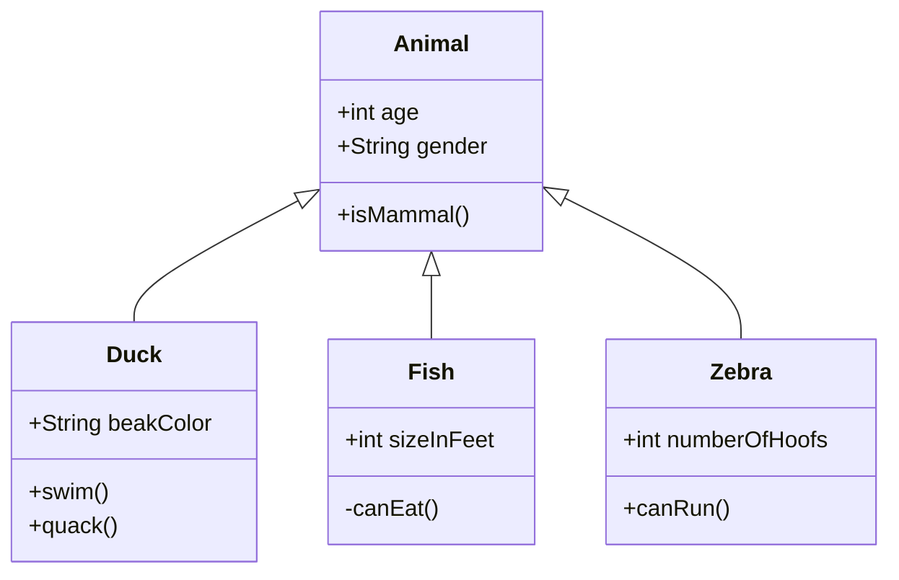
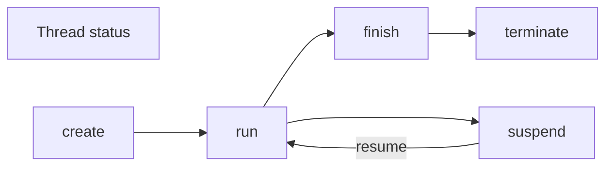

```mermaid
classDiagram
	Animal <|--Duck
  Animal <|--Fish
  Animal <|--Zebra
  Animal:+int age
  Animal:+String gender
  Animal:+isMammal()
  class Duck{
  	+String beakColor
  	+swim()
  	+quack()
  }
  class Fish{
  	+int sizeInFeet
  	-canEat()
  }
  class Zebra{
  	+int numberOfHoofs
  	+canRun()
  }

```

```mermaid
graph LR
Thread[Thread status]
create[create]-->run[run]-->finish[finish]-->terminate[terminate]
run-->suspend[suspend]
suspend--resume--->run
```

