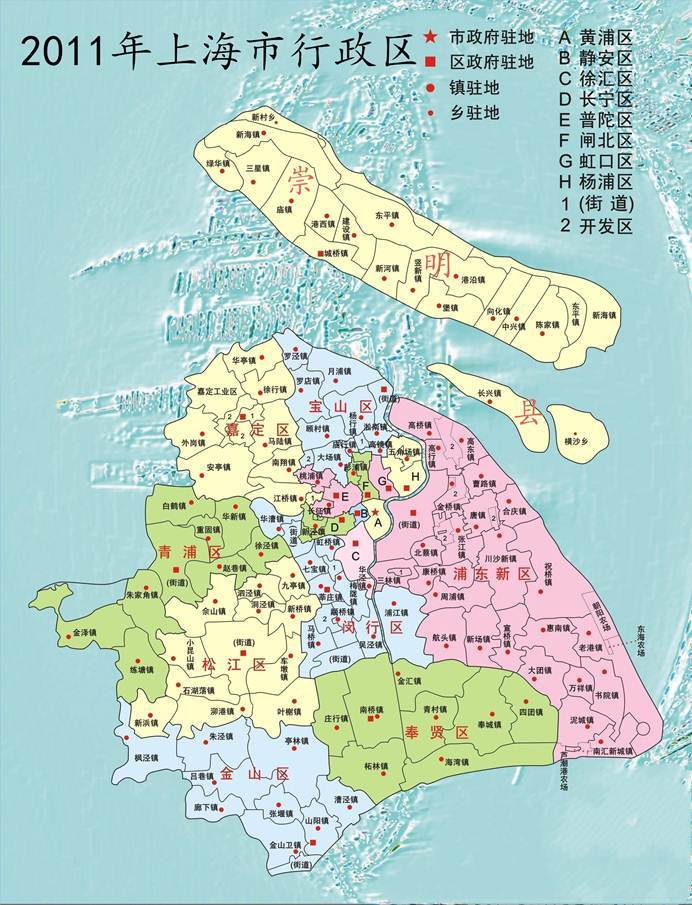

# 上海大区规划

# 政策文件

## 2035规划

推出时间：

 [上海2035城市规划.pdf](买房.assets/2035003.pdf) 

   

摘要：城市副中心——川沙、唐镇、周浦、康桥

## 2021住宅限购政策

推出时间：2021.6

主要内容：限制银行贷款额度，例如：单价6w/m^2^ ，银行指导价为2.5w/m^2^，然后在根据2.5w/m^2^的三成发放贷款

## 房产税试点

推出时间：2021.10

主要内容：城市民用及商用地块征收房产税

## 上海官方租房平台

## 新房发售认筹信息

### 开发商信息调研

#### 融创

# 看房记录

## 花木

房龄普遍在96~98年

## 御桥

## 康桥

### 绿地康桥新苑

房龄：04～06年

优势：距离地铁近，生活配套设施齐全

劣势：没有小学（规划中），幼儿园隔一条大马路，城市界面略差。停车位紧张

### 绿地东上海

### 中邦城市

房价较高，7w+/m^2^ 

### 沔溪苑

小区外立面比较旧，物业整体感官较差，靠近厂区，附近流动人口大

### 康廷苑

## 周浦

## 唐镇

### 保利金色唐城

房龄：08年

地理位置

详情分析

全是楼梯房，商品房小区

优势：有配套幼儿园、小学，周边配套好，城市界面整洁。户型方正。得房率高。停车位充裕

劣势：小区普遍离地铁站1km以上

#### 16号楼3楼

530w，81.9m^2^ 

#### 10号楼5楼

510w，81.9m^2^ 

### 保利金爵

太贵，不考虑

均价7.1w左右

### 绿波城

商品房的建设品质，用于回迁安置

## 周浦东

### 海尚康廷

商品房小区，靠近秀沿路

