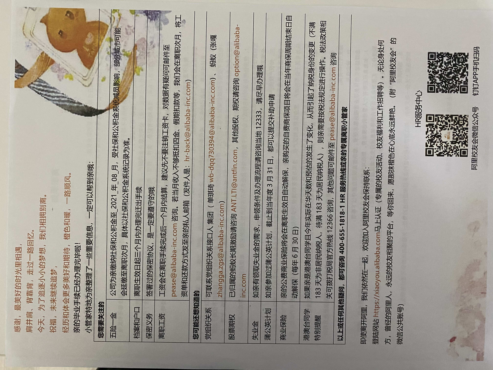
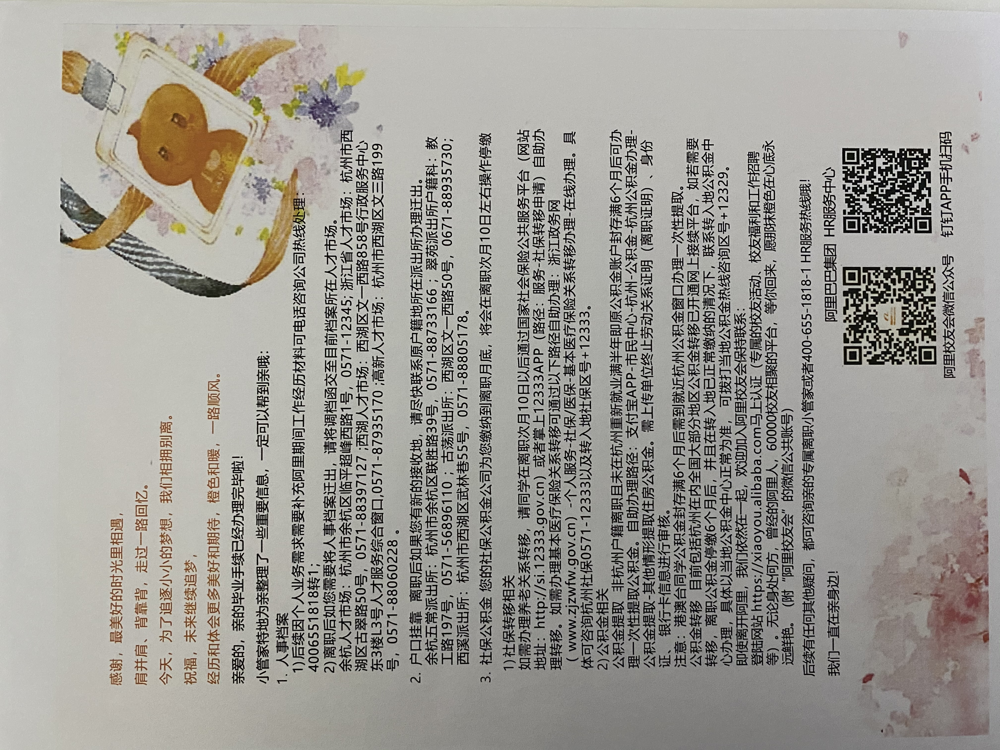
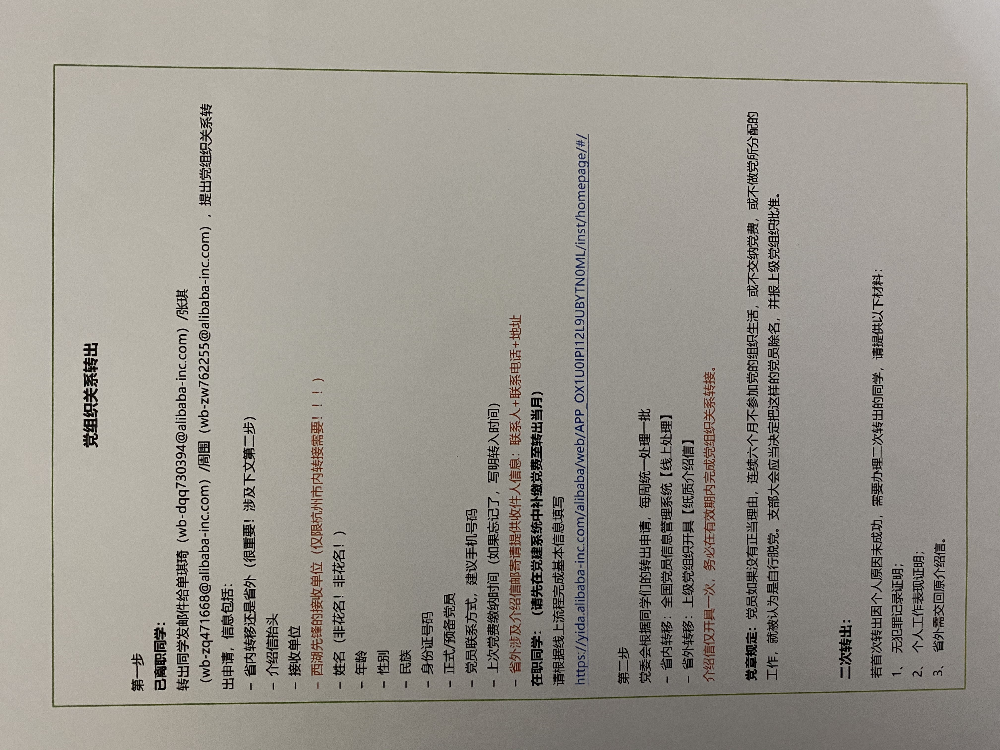

# 总计需要的材料

- [X] 介绍信
- [ ] 五件套齐全证明
- [X] 党费已经交到10月
- [ ] 明确自己去的支部——第一支部

# 组织关系转出

- [X] 介绍信
- [ ] 五件套齐全证明
  - [ ] 联系余杭人才管理办公室——目前电话打不通
- [ ] 找出离职的时候开的党员材料

 

# 党组织关系转入流程

**党组织关系转入流程** **2021.9**

**请确认您劳动合同上的公司名字为美银宝网络信息服务(上海)有限 公司。
请确认您是正式党员**

• **抬头
如原关系在上海:
** 抬头: 中共上海市陆家嘴金融贸易区综合委员会 **如原关系非上海:
** 抬头: 中共上海市浦东新区委员会组织部 去处:
陆家嘴金融贸易区综合党委
**组织代码:
** 001.001.031.014.102.104

**支部书记名录**

总支书记:葛东妮
第一支部16/18F员工:许铝才 第二支部20F员工:何颖边 第三支部19,21,22F员工:丁宁(niding@paypal.com) 第四支部 GFC合规部员工:葛东妮

第五支部 GDS 员工: 沈佳梅

• **转入步骤
** **1.** **联系党委老师**石老师/相老师 50898309 (工作日 9:00-11:30

12:30-17:00)
**2.** **前往陆家嘴金融贸易区综合党委党员组织关系转接点**(地址:陆家

嘴环路717号陆家嘴中心绿地东门健康驿站2楼)

**3.** **携带本人身份证及正反复印件(一页)以及劳动合同，现场办理下 列手续:**

- 现场填写党费缴纳定级单
- 办理党员先锋卡
- 填写党员基本信息表
- 转入党组织名称:中共美银宝网络信息服务(上海)有限公司

  总支委员会第*党支部(支部划分请见上页支部书记名录)

  *原关系非上海的，党委可能会要求额外提供下列文件照片/在档记 录:入党申请、培训材料、政审材料、入党志愿书、转正申请，请依 党委老师要求提供

**4.** **携带综合党委出具的介绍信到对应的美银宝支部书记处报到并提 交介绍信**
