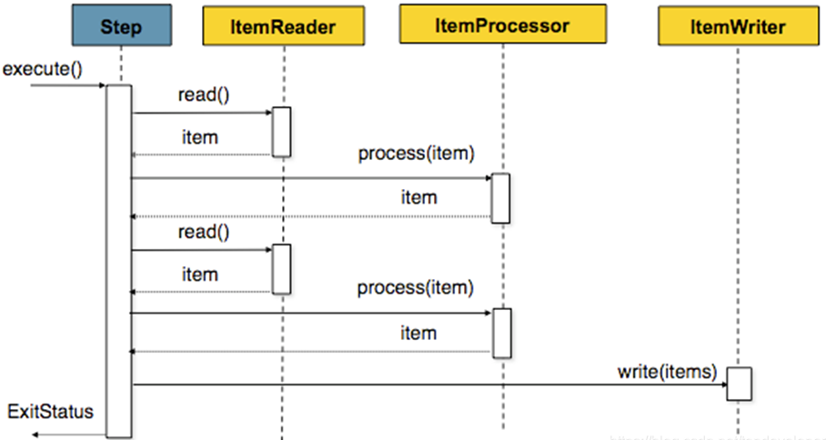

# 简介

## 概述

由spring提供的轻量级、全面的数据批处理框架，

常见输入有数据库、文件、消息

## 架构

典型批处理程序包括

- 从数据库、文件、队列中读取大量记录
- 处理
- 写回数据

示意图如下


Spring Batch执行流程


## 核心概念介绍

Job和Step是SpringBatch执行批处理任务的最核心两个概念

### Job

封装整个批处理，在整个体系中是一个最顶层的抽象概念，在代码中体现为一个最上层接口

```java
public interface Job {
	String getName();
	boolean isRestartable();
	void execute(JobExecution execution);
	JobParametersIncrementer getJobParametersIncrementer();
	JobParametersValidator getJobParametersValidator();
}
```

实现类主要有两种类型，

- simpleJob
- flowJob

除了job外还有JobInstance和JobExecution两个更加底层的抽象

Job是运行基本单位，内部由step组成，可看成step的容器。


SpringBatch以SimpleJob类的形式提供了Job接口的默认简单实现，在Job上创建了一些功能标准，例子如下：

```java
@Bean
public Job footballJob() {
    return this.jobBuilderFactory.get("footballJob")
                     .start(playerLoad())
                     .next(gameLoad())
                     .next(playerSummarization())
                     .end()
                     .build();
}
```

job名称为footballJob，包含3个Step：playerLoad,gameLoad, playerSummarization


### JobInstance

接口定义如下：

```java
public interface JobInstance {
	/**
	 * Get unique id for this JobInstance.
	 * @return instance id
	 */
	public long getInstanceId();
	/**
	 * Get job name.
	 * @return value of 'id' attribute from <job>
	 */
	public String getJobName();	
}
```


### JobParameter

JobParameter对象包含一组用于启动批处理作业的参数，如运行时间等


### JobExecution

JobExecution是指单次尝试运行一个我们定义好的Job的代码层面的概念。一个JobInstance可能会执行失败，因此可以多次运行。

接口定义如下：

```java
public interface JobExecution {
	/**
	 * Get unique id for this JobExecution.
	 * @return execution id
	 */
	public long getExecutionId();
	/**
	 * Get job name.
	 * @return value of 'id' attribute from <job>
	 */
	public String getJobName(); 
	/**
	 * Get batch status of this execution.
	 * @return batch status value.
	 */
	public BatchStatus getBatchStatus();
	/**
	 * Get time execution entered STARTED status. 
	 * @return date (time)
	 */
	public Date getStartTime();
	/**
	 * Get time execution entered end status: COMPLETED, STOPPED, FAILED 
	 * @return date (time)
	 */
	public Date getEndTime();
	/**
	 * Get execution exit status.
	 * @return exit status.
	 */
	public String getExitStatus();
	/**
	 * Get time execution was created.
	 * @return date (time)
	 */
	public Date getCreateTime();
	/**
	 * Get time execution was last updated updated.
	 * @return date (time)
	 */
	public Date getLastUpdatedTime();
	/**
	 * Get job parameters for this execution.
	 * @return job parameters  
	 */
	public Properties getJobParameters();	
}
```


其中方法getBatchStatus用于获取一个job某一次执行的状态。BatchStatus定义如下：

```java
public enum BatchStatus {STARTING, STARTED, STOPPING, 
			STOPPED, FAILED, COMPLETED, ABANDONED }
```

这些属性对Job执行很重要，SpringBatch会将他们持久化到DB，使用过程中会创建一些表用于存储job相关信息


### Step

每个Step对象封装了Job的执行步骤信息。具有和JobExecution类似的StepExecution信息。


### StepExecution

Step运行时创建的执行实例。但是，某个步骤可能由于之前的步骤失败而无法执行。Step实际启动时会创建StepExecution。每个StepExecution包含对应步骤的引用以及JobExecution和事务相关的数据，如提交和回滚计数、开始和结束时间。此外每个步骤执行包含一个ExecutionContext，其中包含开发人员需要在Job中保留的任务数据，如重新启动所需的统计信息和状态信息。


### ExecutionContext

即每一个StepExecution的执行环境，包含一系列键值对，可以用如下代码获取ExecutionContext：

```java
ExecutionContext ecStep = stepExecution.getExecutionContext();
ExecutionContext ecJob = jobExecution.getExecutionContext();
```


### JobRepository

用于将上述Job、Step等概念进行持久化的类，给Job、Step、JobLauncher实现提供CURD操作。

 `EnableBatchProcessing` 注解可以为JobRepository提供自动配置


### JobLauncher

用于启动指定了JobParameters的Job，代码示例如下：

```java
public interface JobLauncher {
 
public JobExecution run(Job job, JobParameters jobParameters)
            throws JobExecutionAlreadyRunningException, JobRestartException,
                   JobInstanceAlreadyCompleteException, JobParametersInvalidException;
}
```

功能：根据传入的Job以及jobParameters从JobRepository获取一个Jobexecution并执行Job。

### Item Reader

读数据抽象，功能：为每个Step提供数据输入。当ItemReader读完数据时，会返回null。实现类有很多，如 `JdbcPagingItemReader , JdbcCursorItemReader` 等等。

支持多种数据源读入：数据库、文件、数据流等等，示例如下：

```java
@Bean
public JdbcPagingItemReader itemReader(DataSource dataSource, PagingQueryProvider queryProvider) {
        Map<String, Object> parameterValues = new HashMap<>();
        parameterValues.put("status", "NEW");
 
        return new JdbcPagingItemReaderBuilder<CustomerCredit>()
                                           .name("creditReader")
                                           .dataSource(dataSource)
                                           .queryProvider(queryProvider)
                                           .parameterValues(parameterValues)
                                           .rowMapper(customerCreditMapper())
                                           .pageSize(1000)
                                           .build();
}
 
@Bean
public SqlPagingQueryProviderFactoryBean queryProvider() {
        SqlPagingQueryProviderFactoryBean provider = new SqlPagingQueryProviderFactoryBean();
 
        provider.setSelectClause("select id, name, credit");
        provider.setFromClause("from customer");
        provider.setWhereClause("where status=:status");
        provider.setSortKey("id");
 
        return provider;
}
```

`JdbcPagingItemReader` 必须制定一个`PagingQueryProvider` 负责提供SQL语句按页返回数据。

`JdbcCursorItemReader` 示例如下：

```java
private JdbcCursorItemReader<Map<String, Object>> buildItemReader(final DataSource dataSource, String tableName, String tenant) {
 
        JdbcCursorItemReader<Map<String, Object>> itemReader = new JdbcCursorItemReader<>();
        itemReader.setDataSource(dataSource);
        itemReader.setSql("sql here");
        itemReader.setRowMapper(new RowMapper());
        return itemReader;
    }
```


### ItemWriter

写数据抽象，可以一次写一条数据，也可以一次写一个`chunk`数据。也有多种实现类

### ItemProcessor

对项目的业务处理的抽象。在读和写之间进行业务逻辑操作


### chunk处理流程




如图所示，chunk处理时会设置chunk size，当处理过的数据一条条累计到阈值时，才会提交commit，用于提高执行效率。


### skip策略和失败处理

一个batch的job的step可能会处理大量数据，因此会有错误的情况。

SpringBatch提供了`skipLimit，skip，noSkip`三个方法


## 批处理操作指南


### 批处理原则

- 尽可能简化逻辑结构
- 将数据保存在处理过程中
- 最大限度减少系统资源使用，如I/O在internal memory中执行尽可能多的操作
- 减少不必要的IO

等等

### 如何默认不启动job

默认在项目启动时会跑定义好的批处理job，可以在application.properties中添加如下属性：

```java
spring.batch.job.enabled=false
```


# 快速上手

简单案例：从csv文件中导入数据到数据库——详见参考文献【2】

引入依赖：

```xml
<dependency>
    <groupId>org.springframework.boot</groupId>
    <artifactId>spring-boot-starter-batch</artifactId>
</dependency>
<dependency>
    <groupId>mysql</groupId>
    <artifactId>mysql-connector-java</artifactId>
    <scope>runtime</scope>
</dependency>
```

在application.properties中配置：

```properties
spring.batch.initialize-schema=always

spring.datasource.url=jdbc:mysql://localhost:3306/mytest
spring.datasource.username=banq
spring.datasource.password=XXX
spring.datasource.driver-class-name=com.mysql.jdbc.Driver
```


下面实现一个批处理关键类@Configuration

1. 定义一个Job

## 配置并运行job


# 参考文献

1.  [Spring Batch 中文参考文档](https://www.wenjiangs.com/docs/spring-batch) 

2.  [**Spring Batch 中文文档**](https://www.docs4dev.com/docs/zh/spring-batch/4.1.x/reference/spring-batch-intro.html#spring-batch-intro) 

3.  [批处理框架spring batch基础知识介绍](https://blog.csdn.net/topdeveloperr/article/details/84337956) 

4.  [Spring Batch批处理](https://www.jdon.com/springbatch.html)——具体操作待实现

   


