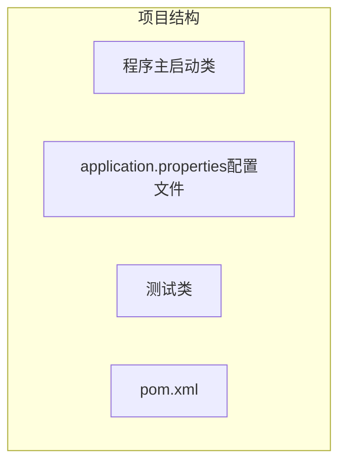
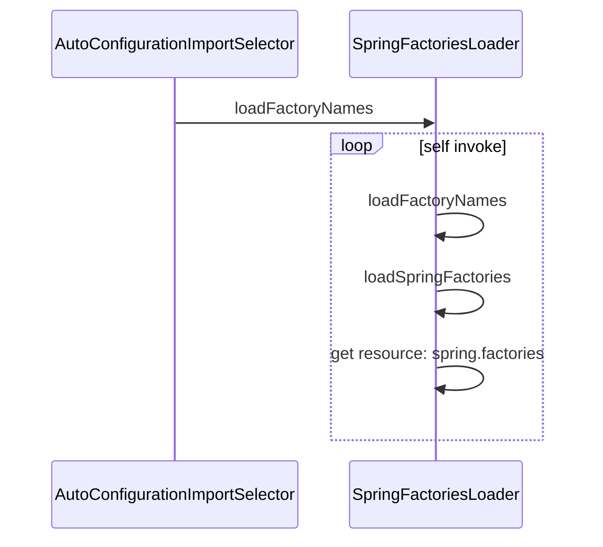
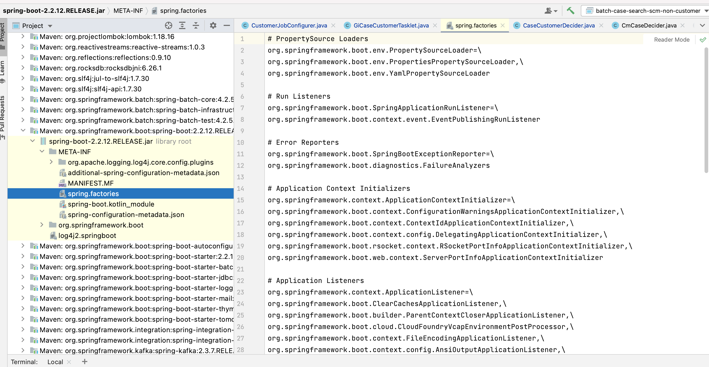

# 基本使用

思想：约定大于配置


## 项目结构分析



## pom分析

```xml
<!-- 父依赖 -->
<parent>
    <groupId>org.springframework.boot</groupId>
    <artifactId>spring-boot-starter-parent</artifactId>
    <version>2.2.5.RELEASE</version>
    <relativePath/>
</parent>

<dependencies>
    <!-- web场景启动器 -->
    <dependency>
        <groupId>org.springframework.boot</groupId>
        <artifactId>spring-boot-starter-web</artifactId>
    </dependency>
    <!-- springboot单元测试 -->
    <dependency>
        <groupId>org.springframework.boot</groupId>
        <artifactId>spring-boot-starter-test</artifactId>
        <scope>test</scope>
        <!-- 剔除依赖 -->
        <exclusions>
            <exclusion>
                <groupId>org.junit.vintage</groupId>
                <artifactId>junit-vintage-engine</artifactId>
            </exclusion>
        </exclusions>
    </dependency>
</dependencies>

<build>
    <plugins>
        <!-- 打包插件 -->
        <plugin>
            <groupId>org.springframework.boot</groupId>
            <artifactId>spring-boot-maven-plugin</artifactId>
        </plugin>
    </plugins>
</build>
```


- 修改banner（spring启动时的文本图案）

  在项目resources目录下新建一个banner.txt即可。

  图案可以到：https://www.bootschool.net/ascii 这个网站生成，然后拷贝到文件中即可！


# 运行原理初探

## pom.xml分析

### 父依赖

管理项目的资源及插件

```xml
<parent>
    <groupId>org.springframework.boot</groupId>
    <artifactId>spring-boot-starter-parent</artifactId>
    <version>2.2.5.RELEASE</version>
    <relativePath/> <!-- lookup parent from repository -->
</parent>
```

点进去以后发现还有个父依赖

```xml
<parent>
    <groupId>org.springframework.boot</groupId>
    <artifactId>spring-boot-dependencies</artifactId>
    <version>2.2.5.RELEASE</version>
    <relativePath>../../spring-boot-dependencies</relativePath>
</parent>
```

这里才是真正管理SpringBoot应用里所有依赖版本的地方。导入依赖默认不需要写版本，依赖管理以外的需要手动配置版本

### 启动器spring-boot-starter

```xml
<dependency>
	<groupId>org.springframework.boot</groupId>
  <artifactId>spring-boot-starter-web</artifactId>
</dependency>
```

**Spring-boot-starter-xxx**: spring-boot的场景启动器

**spring-boot-starter-web**: 导入了web模块正常运行依赖的组件

需要什么功能就导入对应场景启动类即可

## 主启动类

默认的主启动类

```java
@SpringBootApplication
public class SpringBootApplication{
  public static void main(String[] args){
    SpringApplication.run(SpringBootApplication.class , args);
  }
}
```

这些注解作用如下

### @SpringBootApplication

作用：标注在某个类上，说明是SpringBoot的主配置类。

进入这个注解，发现其上还有很多其他注解

```java
@SpringBootConfiguration
@EnableAutoConfiguration
@ComponentScan(
    excludeFilters = {@Filter(
    type = FilterType.CUSTOM,
    classes = {TypeExcludeFilter.class}
), @Filter(
    type = FilterType.CUSTOM,
    classes = {AutoConfigurationExcludeFilter.class}
)}
)
public @interface SpringBootApplication {
    // ......
}
```

### @ComponentScan

作用：自动扫描并加载Bean到IOC容器中

### SpringBootConfiguration

作用：标记SpringBoot的配置类

进一步查看

```java
// 点进去得到下面的 @Component
@Configuration
public @interface SpringBootConfiguration {}

@Component
public @interface Configuration {}
```

`@Configuration`说明是配置类，对应Spring的xml

`@Component`说明启动类本身也是Spring的一个组件

### @EnableAutoConfiguration

`@EnableAutoConfiguration` : 开启自动配置

#### `@AutoConfigurationPackage`自动配置包

```java
@Import({Registrar.class})
public @interface AutoConfigurationPackage {
}
```

`@import`: Spring底层注解，给容器导入一个组件

`Registrar.class`作用：将主启动类所在包及包下面所有子包的所有组件扫描到spring容器

退回到上一步

`@Import({AutoConfigurationImportSelector.class})`：给容器导入组件

AutoConfigurationImportSelector.class：自动配置导入选择器

部分源码如下：

```java
// 获得候选的配置
protected List<String> getCandidateConfigurations(AnnotationMetadata metadata, AnnotationAttributes attributes) {
    //这里的getSpringFactoriesLoaderFactoryClass（）方法
    //返回的就是我们最开始看的启动自动导入配置文件的注解类；EnableAutoConfiguration
    List<String> configurations = SpringFactoriesLoader.loadFactoryNames( this.getSpringFactoriesLoaderFactoryClass(), this.getBeanClassLoader());
    Assert.notEmpty(configurations, "No auto configuration classes found in META-INF/spring.factories. If you are using a custom packaging, make sure that file is correct.");
    return configurations;
}
```



> spring.factories

打开后可以看到很多自动配置的文件，这就是自动配置的根源所在



 

小结

1. SpringBoot启动时从META-INF/spring.factories中获取EnableAutoConfiguration指定的值
2. 这些值作为自动配置类导入容器，自动配置生效
3. J2EE的自动配置都在springboot-autoconfigure的jar包中

## SpringApplication

### 类作用

1. 推断应用是普通项目 or Web项目
2. 查找并加载所有可用的初始化器，设置到initializers属性中
3. 找出所有应用程序监听器，设置到listeners属性中
4. 推断并设置main方法的定义类，找到运行主类

查看构造器

```java

public SpringApplication(ResourceLoader resourceLoader, Class... primarySources) {
    // ......
    this.webApplicationType = WebApplicationType.deduceFromClasspath();
    this.setInitializers(this.getSpringFactoriesInstances();
    this.setListeners(this.getSpringFactoriesInstances(ApplicationListener.class));
    this.mainApplicationClass = this.deduceMainApplicationClass();
}
```


### run方法流程分析


# yaml配置注入

## 配置文件

SpringBoot使用一个全局配置文件，名称固定

- application.properties
  - 语法： key=value
- application.yml
  - 语法： key: 空格 value

## yaml概述

YAML（Yet Another Markup Language，仍是一种标记语言）

语法

1. 空格不可省略
2. 缩进控制层级关系
3. 大小写敏感

注意

- “”双引号不会转译字符串中特殊字符，特殊字符以本身表达含义输出
- ‘’单引号会转译 特殊字符，特殊字符以普通字符形式输出


对象、Map不展开

数组（list，set）：用- 值表示数组中一个元素，如

```yaml
pets:
- cat
- dog
- pig
```

行内写法

```yaml
pets:[cat,dog,pig]
```


## 注入配置文件


需要引入一个依赖

```xml
<!-- 导入配置文件处理器，配置文件进行绑定就会有提示，需要重启 -->
<dependency>
  <groupId>org.springframework.boot</groupId>
  <artifactId>spring-boot-configuration-processor</artifactId>
  <optional>true</optional>
</dependency>
```


### 加载指定配置文件

@PropertySource ： 加载指定配置文件

@ConfigurationProperties： 默认从全局配置文件中获取值

# JSR303数据校验

@Validated可用于校验数据，示例如下

```java
@Component //注册bean
@ConfigurationProperties(prefix = "person")
@Validated  //数据校验
public class Person {
    @Email(message="邮箱格式错误") //name必须是邮箱格式
    private String name;
}
```


常见参数

```java
@NotNull(message="名字不能为空")
private String userName;
@Max(value=120,message="年龄最大不能查过120")
private int age;
@Email(message="邮箱格式错误")
private String email;

空检查
@Null       验证对象是否为null
@NotNull    验证对象是否不为null, 无法查检长度为0的字符串
@NotBlank   检查约束字符串是不是Null还有被Trim的长度是否大于0,只对字符串,且会去掉前后空格.
@NotEmpty   检查约束元素是否为NULL或者是EMPTY.
    
Booelan检查
@AssertTrue     验证 Boolean 对象是否为 true  
@AssertFalse    验证 Boolean 对象是否为 false  
    
长度检查
@Size(min=, max=) 验证对象（Array,Collection,Map,String）长度是否在给定的范围之内  
@Length(min=, max=) string is between min and max included.

日期检查
@Past       验证 Date 和 Calendar 对象是否在当前时间之前  
@Future     验证 Date 和 Calendar 对象是否在当前时间之后  
@Pattern    验证 String 对象是否符合正则表达式的规则

.......等等
除此以外，我们还可以自定义一些数据校验规则
```


# 多环境切换

## 多配置文件

profile是Spring对不同环境提供不同配置功能的支持，可以激活不同版本的环境以实现快速切换环境

在主配置文件编写的时候，文件名可以是application-{profile}.properties/yml，用于指定多个环境版本，如

- applicaiton-test.properties
- application-dev.properties

但是SpringBoot不会直接启动这些配置文件，默认使用application.properties主配置文件，需要通过一个配置来选择激活的环境

```properties
spring.profiles.active=dev
```

## yaml的多文档块

参数不多的情况下，可用以下方式实现多环境

```yaml

server:
  port: 8081
#选择要激活那个环境块
spring:
  profiles:
    active: prod

---
server:
  port: 8083
spring:
  profiles: dev #配置环境的名称


---

server:
  port: 8084
spring:
  profiles: prod  #配置环境的名称
```

**注意：如果yml和properties同时都配置了端口，并且没有激活其他环境 ， 默认会使用properties配置文件的！**

## 配置文件加载位置

springboot 启动会扫描以下位置的application.properties或者application.yml文件作为Spring boot的默认配置文件：1～4从高到低

- 优先级1：项目路径下的config文件夹配置文件
- 优先级2：项目路径下配置文件
- 优先级3：资源路径下的config文件夹配置文件
- 优先级4：资源路径下配置文件

## 指定位置加载配置文件

可通过spring.config.location来改变默认的配置文件位置

项目打包好后，可用以下命令指定配置文件并启动，外部指定的配置文件优先级最高

```bash
java -jar spring-boot-config.jar --spring.config.location=F:/application.properties
```


# 自动配置原理


# 作业

1. 实现yaml注入实体类信息


# 知识体系


核心：自动注解

几个自动注解的类

其中在application.yaml或application.properties中的配置信息，给出提示的都是可以找到对应配置类的

不同配置会有不同的导入条件


# 常用注解

## Value注解

### 使用Value注解注入集合类

我今天要讲的配置注入时基于*.properties文件的，yaml格式可能有点区别。借助@Value注解、SPEL表达式实现，请看以下示例：

- List

```java
    @Value("#{'${list.type}'.split(',')}")
    private List<String> listType;
```

```java
	list.type=1,2,3,4
```


- Set

```java
    @Value("#{'${spring.redis.cluster.nodes}'.split(',')}")
    private Set<String> clusterHostAndPorts;
```

```java
spring.redis.cluster.nodes=10.199.153.166:7001,10.199.153.166:7002
```


- Map

```java
    @Value("#{${map.config}}")
    private ConcurrentHashMap<String,String> map;
```

```java
	map.config={'01':"AA",'02':"BB",'03':"CC",'04':"DD"}
```


注意点：
测试的时候发现，如果key值不加引号，如果配置的key为01，而map中得到的key为1，少了个0，所以将key值加上了引号


# 参考资料

1.  [狂神说SpringBoot学习笔记](https://mp.weixin.qq.com/mp/homepage?__biz=Mzg2NTAzMTExNg==&hid=1&sn=3247dca1433a891523d9e4176c90c499) 
2.  [B站视频教程：狂神说SpringBoot](https://www.bilibili.com/video/BV1PE411i7CV?from=search&seid=1290948065310597538&spm_id_from=333.337.0.0)

