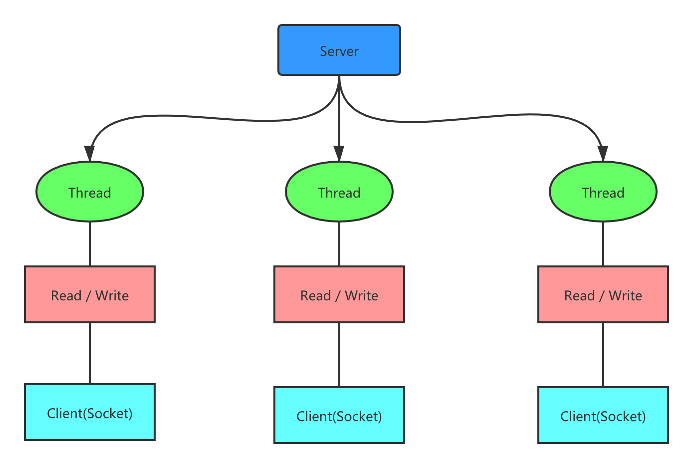
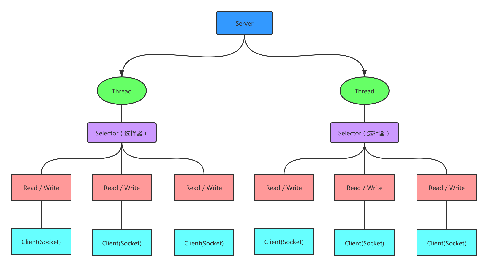
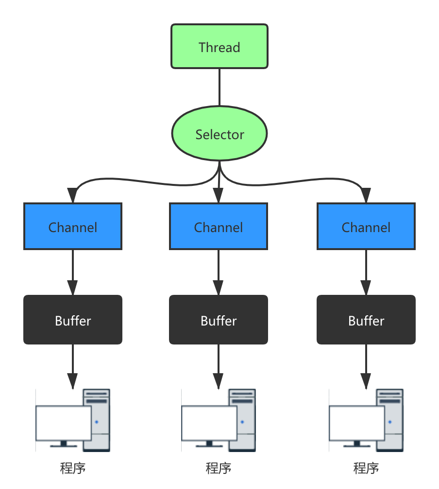
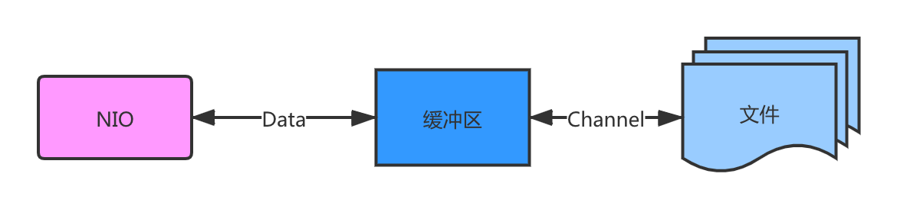
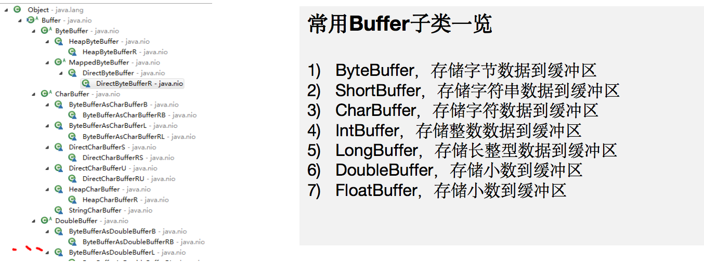
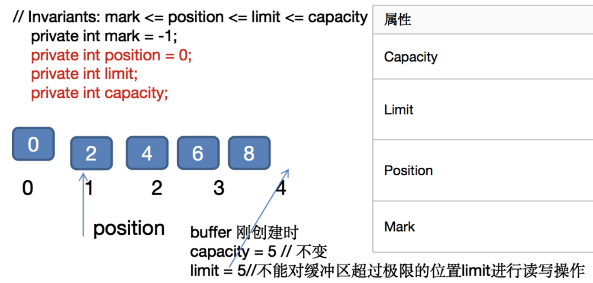

# 概述

## 基本介绍

1. JBOSS提供的java开源框架
2. 异步、事件驱动的网络应用框架
3. 针对TCP协议下，面向client段的高并发应用，或者`peer-to-peer` 场景下大量数据持续创书的应用
4. 本质是一个 `NIO` 框架，适用于服务器通讯相关的多种应用场景

## 应用场景

1. 互联网行业
2. 游戏行业
3. 大数据领域

# IO模型

## 模型基本说明

java支持3种网络IO模型

- BIO：同步阻塞。每个连接都有一个线程

  适用于连接数较小且固定的架构。对服务器资源要求较高，并发局限于应用中

  

- NIO：同步非阻塞。一个线程处理多个请求

  适用于连接数多且**轻操作**的架构，如聊天服务器，弹幕系统，服务器间通信等

  

- AIO：异步非阻塞。引入异步通道的概念，采用proactor模式。先由操作系统完成后才通知服务端程序启动县城去处理，一般适用于连接数较多且链接时间较长的应用。

  适用于连接数据多且**重操作**的架构，如相册服务器，充分调用OS参与并发操作

# NIO

## 基本介绍

相关类在`java.nio`包下，并对原`java.io`包中类进行改写

三大核心部分：

- Channel：通道
- Buffer：缓冲
- Selector：选择器

NIO是面向缓冲区/块编程。

HTTP2.0使用了多路复用技术，实现同一个连接并发处理多个请求

## 核心原理示意图

  

## 缓冲区buffer

本质上是一个可读写数据的内存块，可理解为一个容器对象。channel从网络、文件读取数据需要经过buffer

  

Buffer是一个顶层父类，抽象类，层级关系图：

Buffer类定义了以下四个属性

| 属性     | 描述                                                         |
| -------- | ------------------------------------------------------------ |
| Capacity | 容量。可容纳的最大数据量，缓冲区创建时确定且不可改           |
| Limit    | 缓冲区当前终点。对缓冲区的读写操作不能超过极限位置。极限可修改 |
| Position | 位置。下一个要被读/写元素的索引，每次读写缓冲区数据时都会变，准备下次读写 |
| Mark     | 标记                                                         |

