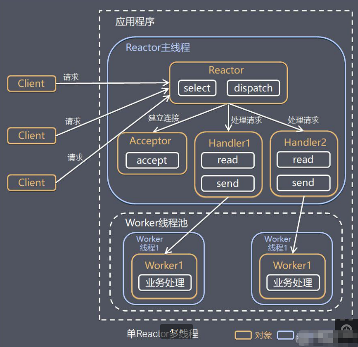

# 概述

**原生NIO存在的问题**

- NIO类库和API繁杂，`Selector`, `ServerSocketChannel`, `SocketChannel`, `ByteBuffer` 等
- 需要额外技能：java多线程编程，因为NIO涉及Reactor模式；必须熟悉网络编程
- 开发工作量和难度较大
- NIO的bug：如 Epoll bug，会导致Selector空轮询，造成CPU100%。


**netty优点**

- 设计优雅：适用于各种类型统一的API阻塞和非阻塞Socket，基于灵活可扩展的时间模型，可定制线程模型
- 使用方便：文档和指南详细
- 高性能，高吞吐
- 安全：完整的`SSL/TLS`和`StartTLS`支持
- 社区活跃


netty由于`netty 5`出现重大bug，已被废弃，目前推荐使用`netty4.x`稳定版

# netty高性能架构设计

netty基于主从Reactor多线程模型做了一定改进，其中主从Reacor多线程模型有多个Reactor

传统BIO模式的缺点

1. 每个连接占用一个线程，当并发数很大，会创建大量线程，占用大量系统资源
2. 连接创建后，如果当前线程没有数据可读，则线程会阻塞在读操作，浪费资源


为了解决上述两个问题，采用以下方案

1. 基于IO复用模型：多个连接共用一个阻塞对象
2. 基于线程池复用线程资源

## Reactor模式

### 概述


说明

1. Reactor模式，通过一个或多个输入，同时传递给服务处理器的模式（基于事件驱动）
2. 服务器端处理多个请求，并分派给处理线程，因此也叫Dispatcher模式
3. Reactor模式使用IO复用监听事件，收到事件后分发给某个线程，是高并发关键


### Reactor模式核心组成

1. Reactor：运行于单独线程中，负责监听和事件分发
2. Handler：被分派任务的实际执行者

### Reactor模式分类

根据Reactor数量和处理资源线程池数量分3类：

1. 单Reactor单线程
2. 单Reactor多线程
3. 主从Reactor多线程


## 单Reactor单线程


说明

1. 如果是建立连接请求事件，则由Acceptor通过accept处理连接请求，然后创建一个handler对象处理连接完成后的后续业务处理
2. 如果不是建立连接事件，则Reactor会分发调用连接对应的Handler来响应
3. Handler会完成 Read—>业务处理–〉Send 的完成业务流程


**分析**

优点

1. 模型简单，没有多线程、进程通信、竞争的问题

缺点

1. 单线程的性能问题
2. 单线程的可靠性问题：如果该Reactor线程意外终止/进入死循环，则整个系统通信模块不可用

使用场景：客户端数量有限，业务处理速度快，如redis在处理时间复杂度O(1)的情况


## 单Reactor多线程



说明

1. handler只负责响应时间，不处理具体业务。通过read读取数据后，分发给worker
2. worker线程池会分配独立线程完成业务，并将结果返回给handler
3. handler收到相应后，通过send将结果返回给client


## 主从Reactor多线程

Reactor单线程运行在高并发场景下容易成为性能瓶颈，因此优化成多线程模式


说明

1. MainReactor通过select监听连接事件，收到事件后，通过acceptor处理连接事件
2. Acceptor处理连接事件后，MainReactor将连接分配给SubReactor
3. SubReactor将连接加入到连接队列进行监听，并创建handler进行各种事件处理


评价

优点

1. 职责明确，父线程只负责接收新连接，子线程完成后续业务处理
2. 数据交互简单：Reactor主线程只需要把新连接传给子线程，子线程无需返回数据

缺点：复杂度高


## Netty模型

netty基于主从Reactor多线程模式，其中有多个Reactor


说明

1. BossGroup线程为辅Selector，只关注Accept
2. 当接收到Accept事件，获取到对应的SocketChannel，封装成NIOSocketChannel并注册到worker线程（事件循环），并进行维护
3. 当worker线程监听到selector中通道发生自己感兴趣的事件后，就由handler处理


- 工作原理图补充说明


说明

1. netty抽象出两组线程池：BossGroup用于负责客户端链接，workerGroup负责网络读写
2. 两者都是NioEventLoopGroup
3. 其中NioEventGroup相当于一个事件循环组，包含多个事件循环，每个事件循环是NioEventLoop
4. NioEventLoop表示一个不断循环的执行处理任务的线程，有一个Selector监听其绑定的Socket通信
5. NioEventLoopGroup可以有多个线程，即可含有多个NioEventLoop
6. 每个BossNioEventLoop循环执行步骤
   1. 轮询accept事件
   2. 处理accept事件，与client建立连接，生成NioSocketChannel，并将其注册到某个worker NioEventLoop上的Selector
   3. 处理任务队列的任务，即runAllTasks

7. 每个Worker NioEventLoop循环执行步骤
   1. 轮询read，write事件
   2. 处理I/O事件，即read/write事件，在对应的NioSocketChannel处理
   3. 处理任务队列的任务，即runAlTasks

8. 每个worker NioEventLoop处理业务时，会使用pipeline，pipeline中包含channel，pipeline中维护很多处理器


代码演示，见 `NettyServer` 


任务队列中的Task有3种典型使用场景

1. 用户程序自定义普通任务
2. 用户自定义定时任务
3. 非当前 `Reactor` 线程调用 `Channel` 的各种方法

## 异步模型

概述

>  Netty中IO操作是异步的，包括Bind，Write，Connect等操作会返回一个ChannelFuture。
>
> 通过Future-Listener机制，用户可以主动获取或通过通知机制获得IO操作结果
>
> Netty异步模型建立在future和callback上。

Future说明

- 表示异步执行结果
- ChannelFuture是一个接口`public interface ChannelFuture extends Future<Void>` 。


工作原理示意图


Future-Listener机制

1. 刚创建的Future对象通常是非完成状态，调用者可以通过返回的ChannelFuture来获取操作执行的状态，注册监听函数来执行完成后的操作
2. 常见操作如下
   - isDone：判断当前操作是否已完成
   - isSuccess：判断已完成的操作是否成功
   - getCause：获取已完成的当前操作的失败原因
   - isCancelled：判断当前操作是否被取消
   - addListener：注册监听器


# 核心模块组件

## Bootstrap，ServerBootstrap

Bootstrap类是客户端的启动引导类，ServerBootstrap是服务端的启动引导类

常用方法

```java
public ServerBootstrap group(EventLoopGroup parentGroup, EventLoopGroup childGroup)	//用于服务端，启动两个EventLoop
public B group(EventLoopGroup group)    //该方法用于客户端，用来设置一个 EventLoop
public B channel(Class<? extends C> channelClass)    //该方法用来设置一个服务器端的通道实现
public <T> B option(ChannelOption<T> option, T value)    //，用来给 ServerChannel 添加配置
public <T> ServerBootstrap childOption(ChannelOption<T> childOption, T value)    //用来给接收到的通道添加配置
public ServerBootstrap childHandler(ChannelHandler childHandler)    //该方法用来设置业务处理类（自定义的handler）
public ChannelFuture bind(int inetPort)    //该方法用于服务器端，用来设置占用的端口号
public ChannelFuture connect(String inetHost, int inetPort)    //该方法用于客户端，用来连接服务器端
  
```

## Future, ChannelFuture

## Channel

网络通信组件，可获得当前网络连接的通道状态、配置参数等

## Selector

## ChannelHandler

## Pipeline和ChannelPipeline


## ChannelHandlerContext

## ChannelOption

## EventLoopGroup及其实现类NioEventLoopGroup

## Unpooled类


# 编解码

## 基本介绍


## netty自身的编解码机制和问题

netty自身提供一些codec（编解码器），如StringEncoder，StringDecoder，ObjectEncoder，ObjectDevoder

由于ObjectEncoder/Decoder使用java自带的序列化技术，存在如下问题

1. 无法跨语言
2. 序列化后体积太大，是二进制编码的5倍多
3. 序列化性能太差

因此引入Google的Protobuf

### Protobuf

全称是 `Google Protocol Buffers` ，


 [protobuf语法指南文档](https://developers.google.com/protocol-buffers/docs/proto) 

# 编解码器和Handler调用机制


# 粘包和拆包及解决方案

TCP协议默认会有粘包和拆包情况发生，在netty中如果没有处理也会发生

解决方案

1. 使用自定义协议+编解码器
2. 关键：解决服务器端每次读取数据长度的问题


# 参考文献

1.  [netty学习手册](https://dongzl.github.io/netty-handbook/#/_content/chapter04) 
2.  [netty官网](https://netty.io/) 

