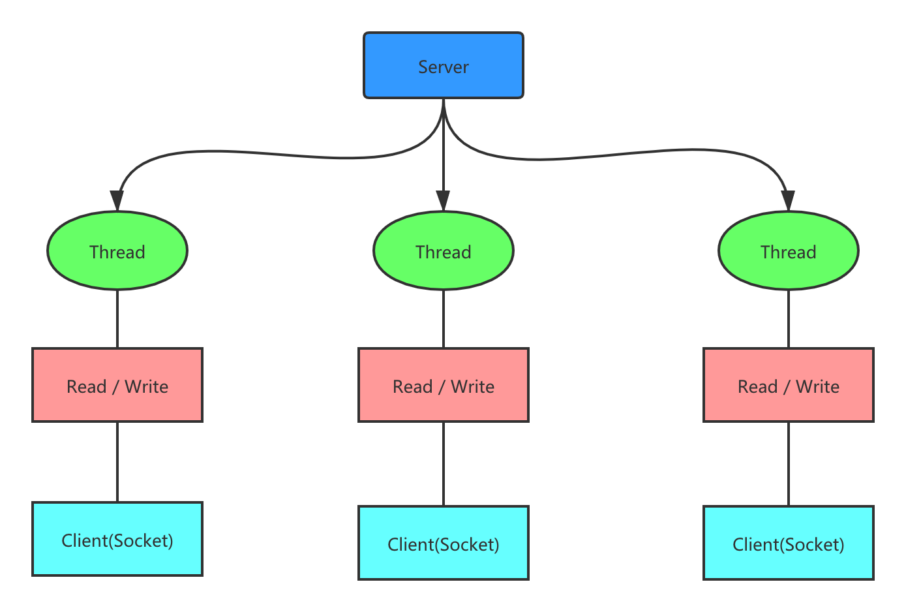
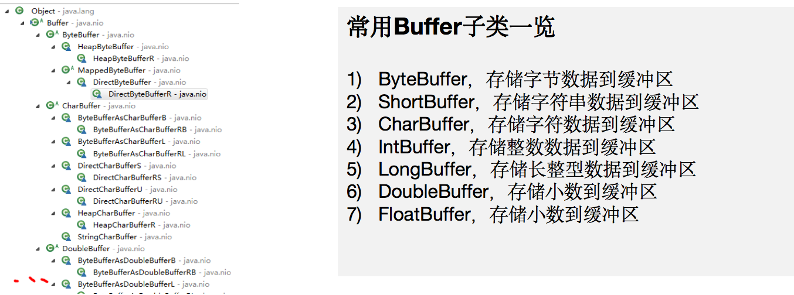

# 概述

## 基本介绍

1. JBOSS提供的java开源框架
2. 异步、事件驱动的网络应用框架
3. 针对TCP协议下，面向client段的高并发应用，或者`peer-to-peer` 场景下大量数据持续创书的应用
4. 本质是一个 `NIO` 框架，适用于服务器通讯相关的多种应用场景

## 应用场景

1. 互联网行业
2. 游戏行业
3. 大数据领域

# IO模型

## 模型基本说明

java支持3种网络IO模型

- BIO：同步阻塞。每个连接都有一个线程

  适用于连接数较小且固定的架构。对服务器资源要求较高，并发局限于应用中

  

- NIO：同步非阻塞。一个线程处理多个请求

  适用于连接数多且**轻操作**的架构，如聊天服务器，弹幕系统，服务器间通信等

  

- AIO：异步非阻塞。引入异步通道的概念，采用proactor模式。先由操作系统完成后才通知服务端程序启动县城去处理，一般适用于连接数较多且链接时间较长的应用。

  适用于连接数据多且**重操作**的架构，如相册服务器，充分调用OS参与并发操作

# NIO

## 基本介绍

相关类在`java.nio`包下，并对原`java.io`包中类进行改写

三大核心部分：

- Channel：通道
- Buffer：缓冲
- Selector：选择器

NIO是面向缓冲区/块编程。

HTTP2.0使用了多路复用技术，实现同一个连接并发处理多个请求


## 核心原理示意图

  

数据读写通过Buffer，双向（不同于BIO）

## 缓冲区Buffer

本质上是一个可读写数据的内存块，可理解为一个容器对象。channel从网络、文件读取数据需要经过buffer。

 

Buffer可以双向操作，即可读可写（不同于BIO的输入/输出流），需要`flip`方法切换。

Channel是双向的，可以返回底层操作系统情况

 

Buffer是一个顶层父类，抽象类，层级关系图：




Buffer类定义了以下四个属性

| 属性     | 描述                                                         |
| -------- | ------------------------------------------------------------ |
| Capacity | 容量。可容纳的最大数据量，缓冲区创建时确定且不可改           |
| Limit    | 缓冲区当前终点。对缓冲区的读写操作不能超过极限位置。极限可修改 |
| Position | 位置。下一个要被读/写元素的索引，每次读写缓冲区数据时都会变，准备下次读写 |
| Mark     | 标记                                                         |


## 通道Channel

### 基本介绍

1. 类似于流，但区别（相比于BIO的流）如下
   1. 通道可以同时进行读写
   2. 通道可以异步读写数据
   3. 通道可以从缓冲中读写数据
2. `Channel` 在NIO中是一个接口 `public interface Channel extends Closable{}` 
3. 常用Channel类：
   1. FileChannel：用于文件读写，类似FileInputStream
   2. DatagramChannel：用于UDP数据读写
   3. ServerSocketChannel和SocketChannel：用于TCP数据读写


#### FileChannel类

主要对本地文件进行IO操作，常见方法如下

```java
public int read(ByteBuffer dst);	//从通道读取数据并放到缓冲区
public int write(Bytebuffer dst);	//把缓冲区数据写到通道中
public long transferFrom(ReadableByteChannel src ,long position, long count);	//从目标通道中复制数据到当前通道
public long transferTo(long position, long count ,WritableByteChannel target);	//把数据从当前通道复制给目标通道
```


`ByteBuffer` 支持类型化的put和get，两者操作的类型需要对应，否则可能有`BufferUnderflowException` 异常


## 选择器Selector


Selector

 

相关方法说明

```java
selector.select(); //阻塞
selector.select(1000); //阻塞 1000 毫秒，在 1000 毫秒后返回
selector.wakeup(); //唤醒 selector
selector.selectNow(); //不阻塞，立马返还
```


### NIO 非阻塞网络编程原理分析图

 `NIO` 非阻塞网络编程相关的（`Selector`、`SelectionKey`、`ServerScoketChannel` 和 `SocketChannel`）关系梳理图


### SelectionKey

1. `SelectionKey`，表示`Selector` ，和网络通道的注册关系，共四种：

   -  `int OP_ACCEPT`：有新的网络连接可以 `accept`，值为 `16``
   -  `int OP_CONNECT`：代表连接已经建立，值为 `8`

   -  `int OP_READ`：代表读操作，值为 `1`

   -  `int OP_WRITE`：代表写操作，值为 `4`

2. SelectionKey相关方法

    

### ServerSocketChannel

ServerSockerChannel在服务器端舰艇新的客户端Socket链接


### SocketChannel

SocketChannel，网络IO通道，负责具体的读写操作。NIO把缓冲区的数据写入通道，或者把通道里的数据读入缓冲区

### 应用实例——群聊系统

具体见代码 `GroupChatServer`  ， `GroupChatClient` 


### NIO与零拷贝

常用的零拷贝有mmap（内存映射）和sendFile，

用户态和内核态的内存拷贝

直接内存拷贝（DMA，direct memory access），不占用CPU

#### mmap优化

【补一个时序图】

- 通过内存映射，将文件映射到内核缓冲区，同时用户控件可以共享内核空间数据

- 适合小数据量读写
- 需要4次上下文切换，3次数据拷贝
- 不能使用DMA方式，必须从内核拷贝到Socket缓冲区

#### sendFile优化

【补一个时序图】

- 数据不经过用户态，直接从内核缓冲区进入SocketBuffer，由于和用户态完全无关，就减少一次上下文切换

- 适合大文件传输
- 需要3次上下文切换，最少两次数据拷贝
- 可利用DMA方式减少CPU拷贝

#### 零拷贝案例

见代码


# 参考文献

1.  [netty 学习](https://dongzl.github.io/netty-handbook/#/_content/chapter02?id=_211-%e6%a8%a1%e5%9e%8b%e5%9f%ba%e6%9c%ac%e8%af%b4%e6%98%8e) 

 
