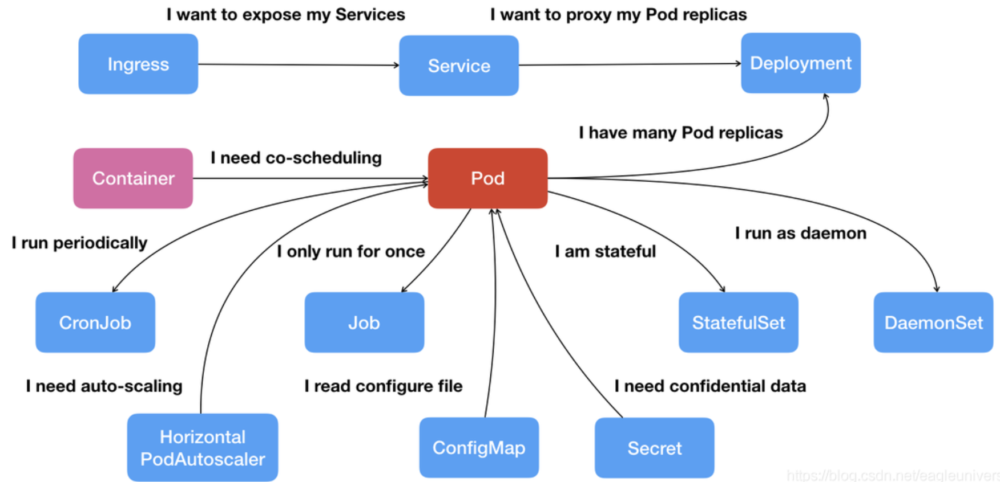
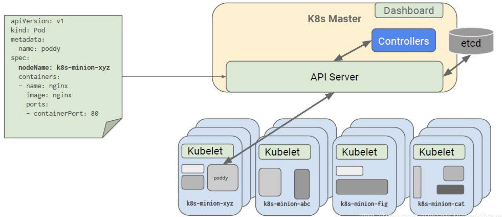

# 基础知识

# 概述

## 背景

google基于Borg进行改进后的容器管理应用。

容器过多带来管理上的问题，需要管理容器的平台，提供可视化界面用于管理

k8s就是一款辅助管理容器的平台，支持管理在分布式环境启动的container。

## 基本概念和架构示意

kubernetes基础架构示意图：

图中概念解释：

-  **Kubernetes Master / Node** ：master节点负责接收用户指令、分配任务以及记录各个node的情况。node节点负责接收master指令，启动相应pod（k8s最小执行单元，是一个container集合）
-  **container** ： 容器。如Docker
-  **pod** ：一组container集合，k8s中最小执行单元。每个pod中所有container共享ip地址和文件系统
-  **ReplicaSet** ：用于指定每个pod的备份数量。为了容灾，每个pod默认被复制成3份，运行在不同node节点上。ReplicaSet就是用来管理pod备份数量， 保证高可靠性的组件
-  **Service** ：用于各种信息抽象。
-  **Label** ：每个pod的唯一标识符，信息会存在etcd数据库中，service通过这个识别各个pod谁是谁的
-  **kubelet** ：每个node节点都有一个，用于启动、管理和检测各个node中pod。不断去数据库查看pod信息，保证其与node中实际运行的情况相同。
-  **kube-proxy** ： 负责每个node与其他node/master通信的枢纽，控制信息的流入流出

## kubernetes中的api

这些Object分别可以完成不同的功能，下表是对他们的分类：

| 名称     | 类别                                                         |
| -------- | ------------------------------------------------------------ |
| 资源对象 | Pod、ReplicaSet、ReplicationController、Deployment、StatefulSet、DaemonSet、Job、CronJob、HorizontalPodAutoscaling、Node、Namespace、Service、Ingress、Label、CustomResourceDefinition |
| 存储对象 | Volume、PersistentVolume、Secret、ConfigMap                  |
| 策略对象 | SecurityContext、ResourceQuota、LimitRange                   |
| 身份对象 | ServiceAccount、Role、ClusterRole                            |

上述对象都可在模板文件中作为一种api类型来配置

## 简单例子：将容器部署到kubernetes集群

向kubernetes集群部署应用需要先在一个.yaml文件中对应用进行配置，设置名称、存储、网络服务等，然后执行命令 `kubectl create -f 文件名.yaml` 

# 参考资料

-  [kubernetes中文官网](https://kubernetes.io/zh/docs/tutorials/kubernetes-basics/) 

