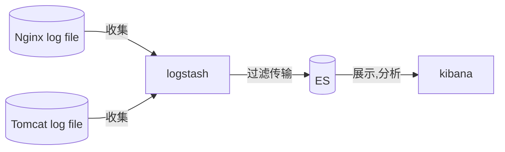
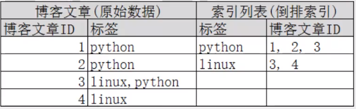
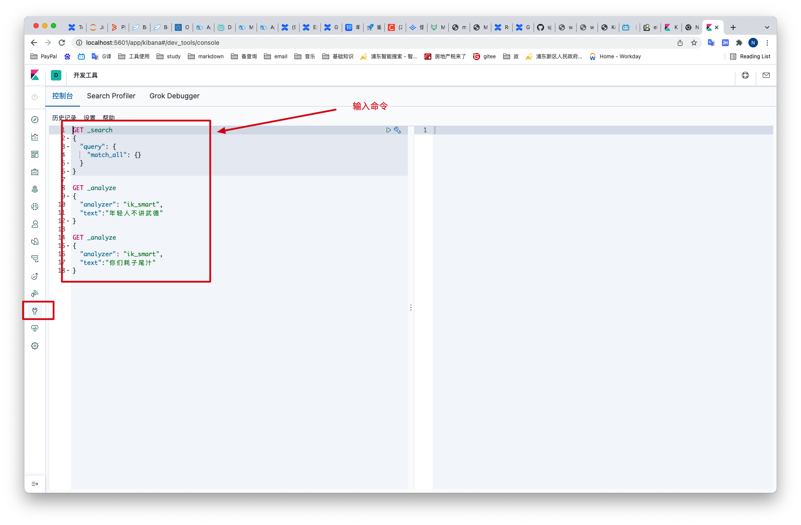
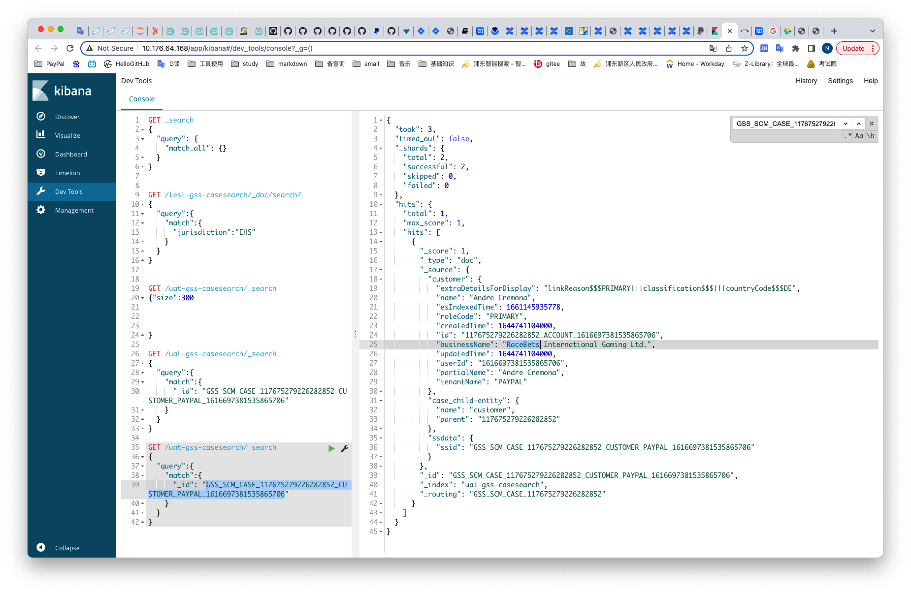

# 1 简介


## 1.1 前言——Lucene

> Lucene简介

- Doug Cutting开发
- apache软件基金会4jakarta项目组的子项目
- 开放源码的全文检索引擎工具包
- 只是全文检索引擎的架构
- 免费java信息检索程序库

> Lucene和ElasticSearch的关系

ES是基于Lucene做了一个封装和增强

---

## 1.2 ElasticSearch概述

ElasticSearch是一个开源的高扩展分布式全文检索引擎，可以近乎实时的存储、检索数据。使用Java开发，以Lucene为核心，目的是通过RESTFul API隐藏Lucene的复杂性

## 1.3 安装

> 安装要求
>
> JDK8，最低要求

组件(ELK)

- ElasticSearch
  - ElasticSearch-head
- Logstash
- Kibana

```text
收集清洗数据(Logstash) ==> 搜索、存储(ElasticSearch) ==> 展示(Kibana)
```




---
# 2 ElasticSearch核心概念

## 2.1 概述

1. 索引

   包含多个分片

2. 字段类型（映射）

   字段类型映射（整型 or 字符型）

3. 文档

4. 分片（Lucene索引，倒排索引）

## 2.2 与关系型数据库对比

| Relational DB      | ElasticSearch     |
| ------------------ | ----------------- |
| 数据库（Database） | 索引（indices）   |
| 表（tables）       | types（逐步弃用） |
| 行（row）          | documents         |
| 字段（columns）    | fields            |

ES集群中可包含多个索引

## 2.3 物理设计

ElasticSearch在后台把每个索引划分成多个分片，每个分片可以在集群中不同服务器间迁移

## 2.4 逻辑设计

一个索引类型中，包含多个文档，当我们索引一篇文档时，可以用这样的方式查找


## 2.5 文档（行）

索引和搜索数据的最小单位是文档

## 2.6 类型（表）

## 2.7 索引（库）


倒排索引

按文章关键字，对应的文档\<0个或多个\>形式建立索引，根据关键字可查询对应文档



# 3 IK分词器（ES插件）

IK提供两个分词算法：`ik_smart`、 `ik_max_work`，分别为最少切分和最细粒度切分

> IK版本要和ES版本对应


添加自定义词到扩展字典中

> ES目录/plugins/ik/config/IKAnalyzer.cfg.xml


创建字典文件，添加字典内容


# 4 Rest风格说明

## 4.1 基本说明

|      method      |                     url地址                     |          描述          |
| :--------------: | :---------------------------------------------: | :--------------------: |
| PUT（创建,修改） |     localhost:9200/索引名称/类型名称/文档id     | 创建文档（指定文档id） |
|   POST（创建）   |        localhost:9200/索引名称/类型名称         | 创建文档（随机文档id） |
|   POST（修改）   | localhost:9200/索引名称/类型名称/文档id/\_update |        修改文档        |
|  DELETE（删除）  |     localhost:9200/索引名称/类型名称/文档id     |        删除文档        |
|   GET（查询）    |     localhost:9200/索引名称/类型名称/文档id     |   查询文档通过文档ID   |
|   POST（查询）   | localhost:9200/索引名称/类型名称/文档id/_search |      查询所有数据      |


## 4.2 ES操作步骤

1. 进入[kibana](http://Localhost:5601)

2. 进入dev tools，进行操作

   

## 4.3 字段数据类型

1. 字符串类型
   1. text: **支持分词**，支持模糊、精确匹配，不支持聚合、排序操作，字符串最大长度无限定，适合大字段存储
   2. **keyword**:  **不分词**，**直接索引**，支持模糊、精确匹配，支持聚合、排序操作，最大长度为32766个UTF-8类型字符，可以通过设置ignore_above指定支持字符长度，超过长度的数据不被索引；无法通过term精确匹配检索返回结果
2. 数值型
   1. long, integer, short, byte, double, float, **haft float, scaled float**
3. 日期类型
   1. date
4. 布尔类型
   1. boolean
5. 二进制类型
   1. binary
6. 其他等等


> 如果自己的文档字段没有指定类型，则ES会设置默认类型

通过`Get _cat/`获取很多ES当前信息

```bash
GET _cat/indices
GET _cat/aliases
GET _cat/allocation
GET _cat/count
GET _cat/fielddata
GET _cat/health
GET _cat/indices
GET _cat/master
GET _cat/nodeattrs
GET _cat/nodes
GET _cat/pending_tasks
GET _cat/plugins
GET _cat/recovery
GET _cat/repositories
GET _cat/segments
GET _cat/shards
GET _cat/snapshots
GET _cat/tasks
GET _cat/templates
GET _cat/thread_pool
```


## 4.4 修改

两种方案

1. 使用put覆盖原值（旧）
   1. 版本+1（\_version）
   2. 未覆盖的字段会丢失
2. 使用post的update（新）
   1. \_version不变
   2. 不丢失字段
   3. 需要注意doc


## 4.5 删除

```text
DELETE /test1
```


## 4.6 查询
### 4.6.1 参考
1. [19 个很有用的 ElasticSearch 查询语句](https://n3xtchen.github.io/n3xtchen/elasticsearch/2017/07/05/elasticsearch-23-useful-query-example) 

### 4.6.2 简单条件

查询name字段包含aa的文档
```text
# 实操发现，_doc不可写在查询语句中
GET /test3/_doc/search?q=name:aa	
```


### 4.6.3 查询命令
1. 查询单条数据
```http
GET /uat-gss-casesearch/_search
{
  "query":{
    "match":{
      "_id": "GSS_SCM_CASE_117675279226282852_CUSTOMER_PAYPAL_1616697381535865706"
    }
  }
}
```

查询结果

2. 查询结构中的指定字段


3. 查询指定数量的数据
```http
GET /uat-gss-casesearch/_search
{
	"size":300
}
```
查出该index中最多300条数据

4. 批量查询
```http
GET /uat-gss-casesearch/_mget
{
   "ids": ["GSS_SCM_CASE_118887769950860661","GSS_SCM_CASE_118888006174061944"]
}
```

注意，此处的`_mget`为关键字，表示批量查询；批量查询中，只支持`ids,docs`等字段

```http
GET /uat-gss-casesearch/_msearch 
{
	"query" : {
		"match_all" : {}
	},
	"from" : 0,
	"size" : 10
}
```


### 4.6.4 复杂查询

#### 4.6.4.1 查询条件

- match：匹配（会使用分词器解析，分析文档后进行查询）
- \_source：过滤字段
- sort：排序
- from，to：分页

```text
  // 查询匹配
  GET /blog/user/_search
  {
    "query":{
      "match":{
        "name":"流"
      }
    }
    ,
    "_source": ["name","desc"]
    ,
    "sort": [
      {
        "age": {
          "order": "asc"
        }
      }
    ]
    ,
    "from": 0
    ,
    "size": 1
  }
```

#### 4.6.4.2 多条件查询

- must——and
- should——or
- must_not——not(…and…)
- filter过滤

#### 4.6.4.3 匹配数组

- 貌似不能和其他字段一起使用
- 可以多关键字查询（空格隔开）
- match会使用分词器
- 搜词

#### 4.6.4.4 精确查询

- `term`直接通过倒排索引指定**词条**查询
- 适合查询number、date、keyword，不适合text

```text
// 精确查询（必须全部都有，而且不可分，即按一个完整的词查询）
// term 直接通过 倒排索引 指定的词条 进行精确查找的
GET /blog/user/_search
{
  "query":{
    "term":{
      "desc":"年 "
    }
  }
}
```


#### 4.6.4.5 text和keyword

- text：
  - **支持分词**，**全文检索**、支持模糊、精确查询,不支持聚合,排序操作;
  - text类型的最大支持的字符长度无限制,适合大字段存储；
- keyword：
  - **不进行分词**，**直接索引**、支持模糊、支持精确匹配，支持聚合、排序操作。
  - keyword类型的最大支持的长度为——32766个UTF-8类型的字符,可以通过设置ignore_above指定自持字符长度，**超过**给定长度后的数据将不被索引，**无法通过term精确匹配检索返回结果**。


#### 4.6.4.6 高亮查询

```text
/// 高亮查询
GET blog/user/_search
{
  "query": {
    "match": {
      "name":"流"
    }
  }
  ,
  "highlight": {
    "fields": {
      "name": {}
    }
  }
}
// 自定义前缀和后缀
GET blog/user/_search
{
  "query": {
    "match": {
      "name":"流"
    }
  }
  ,
  "highlight": {
    "pre_tags": "<p class='key' style='color:red'>",
    "post_tags": "</p>", 
    "fields": {
      "name": {}
    }
  }
}
```


#### 4.6.4.7 聚合查询
聚合操作包括count, max, min , avg等


# 5 SpringBoot整合

## 5.1 导入依赖

依赖版本要和安装的ES版本一致

```xml
<properties>
    <java.version>1.8</java.version>
    <!-- 统一版本 -->
    <elasticsearch.version>7.6.1</elasticsearch.version>
</properties>
<dependency>
    <groupId>org.elasticsearch.client</groupId>
    <artifactId>elasticsearch-rest-high-level-client</artifactId>
    <version>7.6.1</version>
    <scope>compile</scope>
</dependency>
<dependency>
    <groupId>org.springframework.boot</groupId>
    <artifactId>spring-boot-starter-data-elasticsearch</artifactId>
</dependency>
<!--还要导入必要的序列化依赖 -->
```

## 5.2 创建并编写配置类

```java
@Configuration
public class ElasticSearchConfig {
    // 注册 rest高级客户端 
    @Bean
    public RestHighLevelClient restHighLevelClient(){
        RestHighLevelClient client = new RestHighLevelClient(
                RestClient.builder(
                        new HttpHost("127.0.0.1",9200,"http")
                )
        );
        return client;
    }
}
```


## 5.3 创建并编写实体类

```java
@Data
@NoArgsConstructor
@AllArgsConstructor
public class User implements Serializable {
    private static final long serialVersionUID = -3843548915035470817L;
    private String name;
    private Integer age;
}
```


## 5.4 测试


# 6 参考文献

1.  [ElasticSearch7.6入门学习笔记](https://www.kuangstudy.com/bbs/1354069127022583809) 
2.  [【狂神说Java】ElasticSearch7.6.x最新完整教程通俗易懂](https://www.bilibili.com/video/BV17a4y1x7zq?from=search&seid=4820966176885181951&spm_id_from=333.337.0.0) 
3.  [elasticsearch官方文档地址](https://www.elastic.co/guide/cn/elasticsearch/guide/current/running-elasticsearch.html) 
4.  [ES下载地址](https://www.elastic.co/cn/downloads/) 
5.  华为云下载镜像
    1.  ElasticSearch: https://mirrors.huaweicloud.com/elasticsearch/?C=N&O=D
    2.  logstash: https://mirrors.huaweicloud.com/logstash/?C=N&O=D
    3.  kibana: https://mirrors.huaweicloud.com/kibana/?C=N&O=D
    4.  ik: https://github.com/medcl/elasticsearch-analysis-ik/releases

