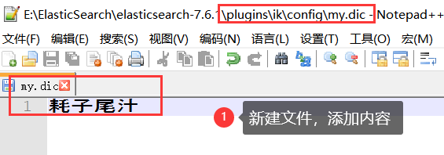

# 简介

## 前言——Lucene

> Lucene简介

- Doug Cutting开发
- apache软件基金会4jakarta项目组的子项目
- 开放源码的全文检索引擎工具包
- 只是全文检索引擎的架构
- 免费java信息检索程序库

> Lucene和ElasticSearch的关系

ES是基于Lucene做了一个封装和增强


## ElasticSearch概述

ElasticSearch是一个开源的高扩展分布式全文检索引擎，可以近乎实时的存储、检索数据。使用Java开发，以Lucene为核心，目的是通过RESTFul API隐藏Lucene的复杂性

## 安装

> 安装要求
>
> JDK8，最低要求

组件(ELK)

- ElasticSearch
  - ElasticSearch-head
- Logstash
- Kibana

```text
收集清洗数据(Logstash) ==> 搜索、存储(ElasticSearch) ==> 展示(Kibana)
```


# ElasticSearch核心概念

## 概述

1. 索引

   包含多个分片

2. 字段类型（映射）

   字段类型映射（整型 or 字符型）

3. 文档

4. 分片（Lucene索引，倒排索引）

## 与关系型数据库对比

| Relational DB      | ElasticSearch     |
| ------------------ | ----------------- |
| 数据库（Database） | 索引（indices）   |
| 表（tables）       | types（逐步弃用） |
| 行（row）          | documents         |
| 字段（columns）    | fields            |

ES集群中可包含多个索引

## 物理设计

ElasticSearch在后台把每个索引划分成多个分片，每个分片可以在集群中不同服务器间迁移

## 逻辑设计

一个索引类型中，包含多个文档，当我们索引一篇文档时，可以用这样的方式查找


## 文档（行）

索引和搜索数据的最小单位是文档

## 类型（表）

## 索引（库）


倒排索引

按文章关键字，对应的文档\<0个或多个\>形式建立索引，根据关键字可查询对应文档


# IK分词器（ES插件）

IK提供两个分词算法：`ik_smart`、 `ik_max_work`，分别为最少切分和最细粒度切分

> IK版本要和ES版本对应


添加自定义词到扩展字典中

> ES目录/plugins/ik/config/IKAnalyzer.cfg.xml


创建字典文件，添加字典内容




# Rest风格说明

基本说明

|      method      |                     url地址                     |          描述          |
| :--------------: | :---------------------------------------------: | :--------------------: |
| PUT（创建,修改） |     localhost:9200/索引名称/类型名称/文档id     | 创建文档（指定文档id） |
|   POST（创建）   |        localhost:9200/索引名称/类型名称         | 创建文档（随机文档id） |
|   POST（修改）   | localhost:9200/索引名称/类型名称/文档id/_update |        修改文档        |
|  DELETE（删除）  |     localhost:9200/索引名称/类型名称/文档id     |        删除文档        |
|   GET（查询）    |     localhost:9200/索引名称/类型名称/文档id     |   查询文档通过文档ID   |
|   POST（查询）   | localhost:9200/索引名称/类型名称/文档id/_search |      查询所有数据      |


----


建立在全文搜索引擎库 Apache Lucene上。elasticsearch使用java编写，隐藏Lucene的复杂性，提供一套简单一致的RESTful API

特征：

1. 分布式实时文档存储，每个字段可被索引和搜索
2. 实时分布式
3. 上百个服务节点扩展，支持PB级别结构化和非结构化数据


启动elasticsearch

1. 切换到ES的目录下
2. 执行bin/elasticsearch

```shell
cd elasticsearch-<version>
./bin/elasticsearch  
```


测试ES是否启动成功

```shell
curl 'http://localhost:9200/?pretty'
```


# 参考文献

1.  [ElasticSearch7.6入门学习笔记](https://www.kuangstudy.com/bbs/1354069127022583809) 
2.  [【狂神说Java】ElasticSearch7.6.x最新完整教程通俗易懂](https://www.bilibili.com/video/BV17a4y1x7zq?from=search&seid=4820966176885181951&spm_id_from=333.337.0.0) 
3.  [elasticsearch官方文档地址](https://www.elastic.co/guide/cn/elasticsearch/guide/current/running-elasticsearch.html) 
3.  [ES下载地址](https://www.elastic.co/cn/downloads/)
