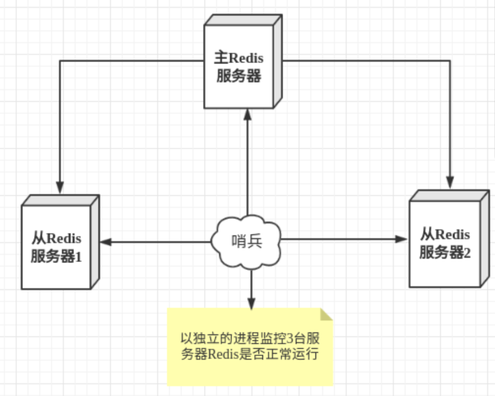

# 概述

>  redis官网
>
> [英文官网](https://redis.io/)
>
> [中文官网](http://www.redis.cn/)

redis（remote dictionary server），远程字典服务

使用ANSI，C语言编写

速度：读11W 次/s，写8W 次/s


> 作用

- 内存存储，持久化
- 效率高，高速缓存
- 发布订阅系统
- 地图信息分析
- 计时器，计数器


> 特性

1. 多样数据类型
2. 持久化
3. 集群
4. 事务


单机多redis集群

> benchmark	压测工具

压测命令：

```shell
redis-benchmark -h 127.0.0.1 -p 6379 -c 50 -n 10000
```


# redis基础知识

默认16个数据库，默认使用第0个

>  切换数据库

```redis
select 3 #切换数据库
DBSIZE	# 查看数据库大小
```

> 清除数据库

```redis
flushdb	# 清除当前数据库
flushall	# 清除所有数据库
```

> redis单线程

redis很快，性能瓶颈不是CPU，而是机器内存和网络带宽

* 为什么单线程这么快？

1. 误区1: 高性能服务器一定是多线程
2. 误区2: 多线程一定比单线程效率高
3. 核心：redis将所有数据放在内存中，所以单线程效率最高。对于内存系统来说，没有上下文切换，效率就是最高的！多次读写都是在一个CPU上


## 数据类型

redis-key

```bash 
ttl KEY    # 查看KEY的剩余有效时间
move KEY 1 	# 移除当前的KEY
expire KEY N	# 在N秒后让KEY过期
```


### 基本类型

#### string	字符串

```bash
setex key3 60	"hello"	# 设置key3的值为"hello"，60s后过期
setnx mykey "redis"	# 设置mykey的值为"redis"，成功（未占用）则返回1，失败则返回0；

mset k1 v1 [k2 v2 k3 v3] # 批量设置多个值
mget k1 [k2 k3]	# 批量获取多个key
mset k1 v1 [k2 v2 k3 v3] # 批量设置多个值，不覆盖，原子化操作

getset db redis # 先获得db的值并返回，然后把db的值设为redis；可用于更新、CAS的操作
```


#### list

列表list命令都是以l开头

```bash
LPUSH list one 	# 向list中从左端添加值one
LPUSH list two
LPUSH list three

LRANGE list 0 -1	# 从左往右获取list中所有的值
LRANGE list 0 1		# 从左往右获取list中下标从0到1的值

LPOP list	# 从左端弹出一个元素
RPOP list	# 从右端弹出一个元素

LINDEX list 1 # 从左端通过下标获取元素

Llen list	# 获取list的长度

Lrem list 2 one # 从左往右移除list中值为one的元素2次

Ltrim list 1 2 # 从左端截取list中从下标从1到2的元素集合——改变list中的内容！

rpoplpush list list1 # 把list中的右端元素弹出，然后从左端将该元素压入list1中；返回该										 # 弹出元素
Lset list 1 item	# 把list中下标为1的元素赋值为item，下标不存在会报err

Linsert list before "world" "other" # 在list列表中的world前插入值"other"
Linsert list after hello new # 在list列表中hello前插入值new
```

队列	lpush，rpop

消息队列	blpush，brpop

栈	lpush，lpop

#### set

集合set中内容无序不重复

```bash
sadd myset hello				 # 向myset中添加值hello
smembers myset					 # 查看myset中的所有元素
sismember myset hello		 # 判断myset中是否包含hello，1/0表示真/假
srem myset hello				 # 移除myset中的hello元素
srandmember myset				 # 从myset中随机查出一个元素
spop myset							 # 随机删除myset中一个元素
smove myset myset2 "hello" # 将myset中的元素hello移动到myset2中

sdiff key1 key2					# 计算在key1中有，在key2中没有的元素（左差集）
sinter key1 key2				# 计算key1，key2的交集
sunion key1 key2				# 计算key1，key2的并集
```


#### hash

Map集合

```bash
hset myhash field1 hello 	# 向hash集合中写入field1-hello的kv对
hget myhash field1 				# 从hash集合中获取k为field1的值
hmset myhash field2 world field3 nihao 	# 批量向myhash中写入多个kv对
hmget myhas field1 field2	# 批量获取多个k的值
hgetall myhash						# 获取myhash所有的kv对（kv打平展示）
hdel myhash field1 				# 删除myhash中k为field1的kv对

hlen myhash								# 获取myhash中kv对个数
hexists myhash field1 		# 判断myhash中field1是否存在

hkeys myhash							# 获取myhash中所有key
hvals myhash							# 获取myhash中所有value

hset myhash field3 5			# 向myhash中写入field3-5的kv对
hincrby myhash field3			# 使myhash中field3的值自增1

hsetnx myhash field4 hello # 向myhash中写入field4-hello的kv对；key占用则失败


```

比string更适合对象的存储

#### zset

有序集合，默认按照score升序

```bash
zadd myset 1 one 2 two					# 向myset集合中添加元素one，score为1；元素two，score为2

# 参数都是闭区间
zrangebyscore salary -inf +inf 	# 获取salary中score从-inf到+inf的所有元素，score升序
zrangebyscore salary -inf 2500 withscores # 查询salary中从-inf到2500的所有元素，带score

zrange salary 0 -1				# 显示salary中所有元素
zrem salary xiaohong			# 移除salary中的元素xiaohong
zcard salary							# 获取salary中的元素个数
zrevange salary 0 -1			# 显示salary中所有元素，降序排序

zcount myset 1 3					# 获取score在1～3的元素个数
```

> 案例

1. 班级成绩排序
2. 排行榜
3. 带权重排序，如普通消息，重要消息等

### 特殊类型

#### geospatial 地理位置

[地理位置官网](https://www.redis.net.cn/order/3685.html)

朋友位置，附近的人，打车距离计算等

只有六个命令

```bash
# 添加地理位置经纬度
# 规则，地球两极无法添加，一般会直接下载城市数据，通过java程序一次导入
# 经度：-180～180 ； 	维度：-85～85
geoadd china:city 116 39 beijing	# 向集合China:city添加地理位置，经度116，纬度39，名beijing

# 获取地址经纬度
geopos china:city beijing	# 获取China:city集合中名称为beijing的经度和纬度

# 计算两地址距离
# 单位如下： 米：m（默认单位）	  km：千米		mi：英里		ft：英尺
geodist china:city beijing shanghai	# 计算集合China:city中，beijing和shanghai的距离
geodist china:city beijing shanghai km	# 计算集合China:city中，beijing和shanghai的公里数

# 找出指定位置某一半径内的元素
georaius china:city 110 30 1000 km # 找出在集合china:city内距离目标点（110，30）1000km内元素
georaius china:city 110 30 1000 km withdist # 找出在集合china:city内距离目标点（110，30）1000km内元素，带距离参数
georaius china:city 110 30 1000 km withcoord # 找出在集合china:city内距离目标点（110，30）1000km内元素，带经纬度参数
georaius china:city 110 30 1000 km count 1	# 找出集合china:city内距离目标点（110，30）1000km内的元素，限定1个

# 找出指定元素周围的其他元素
georadiusbymember china:city beijing 1000 km # 找出集合china:city中距离beijing 1000km内的元素

# 返回11位的hash码
geohash china:city beijing shanghai # 返回集合China:city中元素beijing，shanghai的hash码
```


**geo底层实现原理为zset，可以使用zset命令操作geo**


#### hyperloglog

> 什么是基数？
>
> 不重复的元素


基数统计的算法

**网页的uv（一个人访问一个网站多次，但还是算一个人）**

传统用set来维护的方式需要记录大量用户id，成本高，维护难！我们目的是计数而非保存id

优点：内存占用固定，2^64不同元素的基数，只占用12kB

ps：存在0.81%的错误率

如果不允许容错，则不建议使用

```bash
PFadd mykey a b c d e f g h i j # 向集合mykey中添加若干元素
pfcount mykey									# 统计集合元素个数
pfmerge mykey3 mykey mykey2	  # 求mykey和mykey2的并集，作为mykey3
```


#### bitmaps 位存储

统计用户信息，活跃/不活跃，登录/未登录，打卡/未打卡

```bash
# 使用bitmap记录周一到周日的打卡
setbit sign 0 1
setbit sign 1 0
setbit sign 6 1

getbit sign 3 	# 查看下标位3（周四）的打卡情况
bitcount sign		# 查看sign的1的个数（本周打卡情况）

```

# 事务

redis事务本质：一组命令一起执行，没有隔离级别的概念

所有命令在事务中，没有直接执行，只有发起执行命令时才会执行exec

redis单条命令保证原子性，但是redis事务不保证原子性

- 开启事务  (multi)
- 命令入队  (.......)
- 执行事务  (exec)

> 正常执行事务

```bash
multi
set k1 v1 
set k2 v2
get k2
set k2 v3
exec
```


> 放弃事务

```bash
multi
set k1 v1 
set k2 v2
set k4 v4
discard	# 取消事务
get k4
```


编译型异常，如果队列中存在语法性错误，则队列中所有语句都不会执行

运行时异常，如果队列中存在语法性错误，则其他命令可以正常执行

# 监控

watch

- 悲观锁

  做啥都加锁

- 乐观锁

  - 更新的时候去判断，期间是否有人修改过数据
  - 获取version
  - 更新的时候比较version

> redis监控

使用watch可当作redis乐观锁操作

```bash
watch money		# 加锁money对象，事务提交后自动解除watch
multi					# 事务正常结束，数据期间没有变动则执行成功
decrby money 10
incrby out 10
exec					# 如果在执行前有另一个线程修改了这个值，则会导致事务执行失败
```


```bash
unwatch						# 1. 如果发现事务执行失败，则先解锁
watch money				# 2. 重新获取锁
multi
decrby money 1
incrby money 1
exec							# 3. 比对监视的值是否发生了变化，如果没有变化，则可以执行成功

```

# jedis

使用java来操作redis的连接开发工具


> 事务

# springboot整合


spring2.x之后，原来使用的jedis被替换为了lettuce

jedis采用直连，多线程操作不安全；因此使用jedis pool连接池，BIO

`lettuce`：采用netty，实例中多个线程共享，减少线程数据，线程安全且高效


1. 导入依赖
2. 配置连接
3. 方法调用


```java
//模版操作类
redisTemplate.opsForList().lpush(....);
//常用操作类，如删除key、过期时间等，都单独提出来了
redisTemplate.
```


redisTemplate默认jdk序列化，会使字符串转义


自定义RedisTemplate

关于对象的保存，需要进行序列化

# Redis.conf详解

1. 配置文件unit单位 ，对大小写不敏感

2. 包含include，用于添加多个配置文件

3. 网络 ，

   > bind 127.0.0.1	 绑定ip
   >
   > protected-mode yes # 保护模式
   >
   > port 6379		# 端口

4. 通用GENERAL

   > daemonize yes	# 以守护进程的方式运行，默认是no，需手动改为yes
   >
   > pidfile	/var/run/redis_6379.pid	# 如果以后台的方式运行，需要指定一个pid文件
   >
   > loglevel notice	# 日志，此为生产环境
   >
   > logfile ""	# 日志文件的位置名
   >
   > database 16	# 数据库数量， 默认16
   >
   > always-show-logo yes	# 是否总显示logo

5. 快照

   持久化，在规定时间内执行多少次操作会持久化道文件，.rdb,.aof

   

   

   > save 900 1	# 900s内，如果至少1个key进行修改，则会持久化	
   >
   > save 300 10	
   >
   > save 60 10000
   >
   > 
   >
   > stop-writes-on-bgsave-error- yes	# 持久化如果出错，是否继续工作
   >
   > rdbcompression yes	# 是否压缩rdb文件，代价是CPU资源
   >
   > rdbchecksum yes	# 保存rdb文件的时候，进行检查校验
   >
   > dir ./				# rdb文件保存目录

   6. replication主从复制

   7. security 安全

      设置密码，默认没有密码

      ```bash
      config get requirepass	# 获取redis密码
      config set require pass 123456	# 设置redis密码为123456
      auth 123456	# 以密码123456登录
      ```

   8. 限制CLIENTS

      ```bash
      maxlient 10000 							# 设置能连接上redis的最大客户端的数量
      maxmemory <bytes>						# redis配置最大的内存容量
      maxmemory-policy noeviction # 内存达到上限后的处理策略
      	1. volatile-lru			：只对设置了过期时间的key进行lru（默认）
      	2. allkeys-lru			：删除lru算法的key
      	3. volatile-random	：随即删除即将过期的key
      	4. allkeys-random		：随即删除
      	5. volatile-ttl			：删除即将过期的
      	6. noeviction				：用户过期，返回错误
      ```

   9. append only 模式 aof配置

      ```bash
      appendonly no 									# 默认不开启aof，默认使用rdb
      appendfilename "appendonly.aof"	# 持久化的文件名
      
      # appendfsync always				# 每次修改都写入
      appendfsync everysec				# 每秒执行一次sync
      appendfsync no							# 不执行sync，操作系统自己同步数据
      ```

# redis持久化

## rdb

> 触发机制

1. save规则满足
2. 执行flushall命令
3. 退出redis

以上情况会自动生成一个dump.rdb文件

> 恢复rdb文件

1. 只需要将rdb文件放在redis启动目录即可，redis启动的时候会自动检查dump.rdb文件

2. 查看需要存放的位置

   ```bash
   config get dir
   ```

优点：

1. 适合大规模数据恢复	dump.rdb
2. 如果数据完整性不高

缺点：

1. 需要一定时间间隔进行操作，间隔内的数据有丢失风险
2. fork进程需要一定内存空间

## aof（append only file）

将所有命令记录下来，恢复的时候将所有写命令重新执行一遍

保存的文件： appendonly.aof文件

```bash
appendonly no	# 默认不开启，需手动修改为yes
```

如果aof文件损坏，则redis无法启动。此时可使用`redis-check-aof` 修复该aof文件

```bash
redis-check-aof --fix appendonly.aof
```


> 优点

1. 每次修改都同步，文件完整性较好

> 缺点

1. 相对于数据文件来说，aof远远大于rdb，修复速度也较慢
2. aof运行效率比rdb慢


> 重写规则说明
>
> 如果aof文件大于64m，则redis会fork一个新进程将文件重写

# redis发布订阅

观察者模式，生产者消费者模式


```bash
subscribe kuangshenshuo	# 订阅频道kuangshenshuo
publish kuangshenshuo "hello"	# 发布消息，频道：kuangshenshuo。内容：hello

```


1. 实时消息系统
2. 实时聊天
3. 订阅，关注系统

稍微复杂的系统建议使用消息中间件

# 主从复制

主从复制 Master-Slave，一般是1主2从

数据复制为单向，主机写为主，从机只读

**主从复制主要作用**

1. 数据冗余
2. 故障恢复
3. 负载均衡
4. 高可用（集群）基石

## 环境配置

本地起多机需要多个配置文件redis.conf

```bash
info replication	# 查看当前库的信息（主从关系等）
```


复制3个配置文件，修改对应信息

1. 端口
2. pid名字
3. log文件名
4. dump.rdb文件名

修改完毕后启动3个redis服务进程

```bash
redis-server config/redis80.conf		# 指定配置文件，启动服务端
redis-cli -p 6380										# 指定客户端连接端口，启动客户端
```


每台redis服务器都是主节点，

```bash
slaveof 127.0.0.1 6379	# 使当前进程成为6379端口进程的从机
slaveof no one		# 当前进程自己成为主机
```


主从配置若是从配置文件中写死，则是永久的（实际开发中做法），使用命令是暂时的（下次重启失效）

主机断开连接，从机依旧是连接到主机。此时若主机回来了，则从机依旧可以续上


> 复制原理

- 全量复制

- 增量复制

只要重连master，一次全量复制将会被自动执行

# 哨兵模式

自动选主的模式。

哨兵通过心跳命令监控各主从服务器的运行状态




多哨兵模式

```bash
redis-sentinel 
```


```bash
vim sentinel.conf
# 							被监控的名称。	数字1表示主机挂了，slave投票让谁接替成为主机，票数最多的成为主机
sentinel monitor myredis 127.0.0.1 6379 1 

# 启动哨兵
redis-sentinel config/sentinel.conf
```

1. 


优点：

1. 哨兵集群，基于主从复制模式，
2. 主从可以切换，故障可以转移，高可用性会更好
3. 哨兵模式是主从模式的升级

缺点

1. redis不好在线扩容，集群容量一旦达到上限，在线扩容很麻烦
2. 哨兵模式配置很麻烦

# 缓存穿透和雪崩


