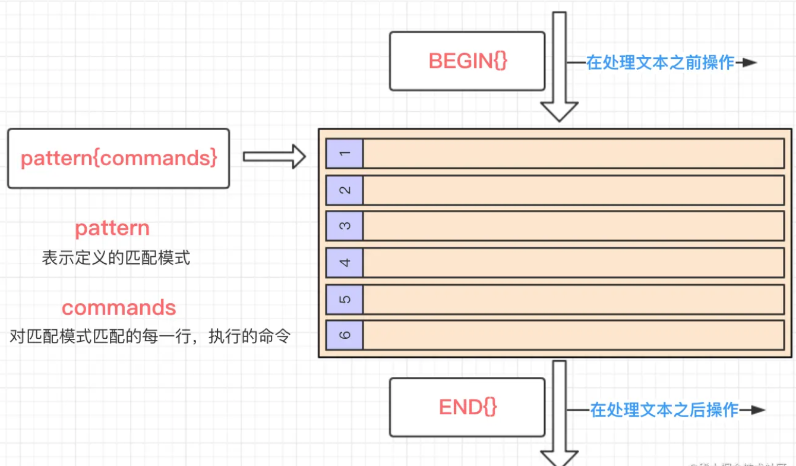

# 进程

## Linux进程被信号杀死后退出状态码（exit code）解析

linux系统下，进程对信号的默认响应方式有5种：

1）  忽略信号，即当做没收到信号一样；

2）  终止进程；

3）  产生核心转储文件，同时进程终止；

4）  停止进程，即暂停进程的执行；

5）  于之前的暂停之后恢复执行；

处理方式2和3都会导致进程终止执行并立即退出，处理方式1、4、5不会造成进程终止执行。因此，可以将信号粗略的分为两类，一类是会导致进程终止并退出的信号；另一类则是不会导致进程终止并退出的信号。

 

当进程因收到信号被终止执行退出后，父进程可以通过调用wait或waitpid得到它的exit code。进程被各信号终止的退出状态码总结如下：

| 信号编号 | 信号名称  | 信号描述         | 默认处理方式     | Exit code |
| -------: | --------- | ---------------- | ---------------- | --------: |
|        1 | SIGHUP    | 挂起             | 终止             |         1 |
|        2 | SIGINT    | 终端中断         | 终止             |         2 |
|        3 | SIGQUIT   | 终端退出         | 终止、core  dump |       131 |
|        4 | SIGILL    | 非法指令         | 终止、core  dump |       132 |
|        5 | SIGTRAP   | 跟踪/断点陷阱    | 终止、core  dump |       133 |
|        6 | SIGABRT   | 终止进程         | 终止、core  dump |       134 |
|        7 | SIGBUS    | Bus  error       | 终止、core  dump |       135 |
|        8 | SIGFPE    | 算术异常         | 终止、core  dump |       136 |
|        9 | SIGKILL   | 杀死进程（必杀） | 终止             |         9 |
|       10 | SIGUSR1   | 用户自定义信号1  | 终止             |        10 |
|       11 | SIGSEGV   | 段错误           | 终止、core  dump |       139 |
|       12 | SIGUSR2   | 用户自定义信号2  | 终止             |        12 |
|       13 | SIGPIPE   | 管道断开         | 终止             |        13 |
|       14 | SIGALRM   | 定时器信号       | 终止             |        14 |
|       15 | SIGTERM   | 终止进程         | 终止             |        15 |
|       16 | SIGSTKFLT | 栈错误           | 终止             |        16 |
|       17 | SIGCHLD   | 子进程退出       | 忽略             |        无 |
|       18 | SIGCONT   | 继续执行         | 若停止则继续执行 |        无 |


 

进一步总结如下：

1.    能使进程被终止执行并产生core dump的信号，它的退出状态码是信号编号+128，比如SIGQUIT信号，它的编号为3，进程收到该信号后会core dump，退出状态码为3+128=131；

2.    只是使进程被终止，而不会产生core dump的信号，它的退出状态码就是信号本身的编号。


# 流程控制

## if else

实例

```bash
a=10
b=20
if [ $a == $b ]
then
	echo "a==b"
elif [ $a -lt $b ]
then
	echo "a<b"
else
	echo "no matching condition"
fi
```

注意， `==` ，`[`  和 ` ]`前后都不与其他符号相连接，中间用空格隔开

或者写成一行

```bash
if [ $(ps -ef | grep -c "ssh") -gt 1 ]; then echo "true"; fi
```


与test命令结合

```bash
num1=$[2*3]
num2=$[1+5]
if test $[num1] -eq $[num2]
then
    echo '两个数字相等!'
else
    echo '两个数字不相等!'
fi
```


## for循环

实例

```bash
for loop in 1 2 3 4 5
do
    echo "The value is: $loop"
done
```


## while循环

```bash
int=1
while(( $int<=5 ))
do
    echo $int
    let "int++"
done
```


可用于读取键盘信息

```bash
echo '按下 <CTRL-D> 退出'
echo -n '输入你最喜欢的网站名: '
while read FILM
do
    echo "是的！$FILM 是一个好网站"
done
```


参考

1.  [Shell 流程控制](https://www.runoob.com/linux/linux-shell-process-control.html) 


## 无限循环

```bash
while :
do 
	command
done
```


## until循环

一般while循环优于until

```bash
a=0

until [ ! $a -lt 10 ]
do
   echo $a
   a=`expr $a + 1`
done
```

## case…esac

多选择语句，类似switch

```bash
echo '输入 1 到 4 之间的数字:'
echo '你输入的数字为:'
read aNum
case $aNum in
    1)  echo '你选择了 1'
    ;;
    2)  echo '你选择了 2'
    ;;
    3)  echo '你选择了 3'
    ;;
    4)  echo '你选择了 4'
    ;;
    *)  echo '你没有输入 1 到 4 之间的数字'
    ;;
esac
```

## break

跳出循环

```bash
while :
do
    echo -n "输入 1 到 5 之间的数字:"
    read aNum
    case $aNum in
        1|2|3|4|5) echo "你输入的数字为 $aNum!"
        ;;
        *) echo "你输入的数字不是 1 到 5 之间的! 游戏结束"
            break
        ;;
    esac
done
```

## continue

类同continue


# 文本操作命令

## 文本文件比对——diff

命令基本格式

```bash
diff [option]... FILES
```

常见参数如

- -b	——忽略一行中空字符的区别
- -B    ——忽略空白行
- -i     ——忽略大小写的不同
- -r    ——如果diff后面接的目录时，会递归比较目录中的文件

diff命令输出格式有三种

1. 正常格式
2. 上下文格式——增加参数 `-c`
3. 合并格式——增加参数 `-u`


- "|"表示前后2个文件内容有不同
- "<"表示后面文件比前面文件少了1行内容
- ">"表示后面文件比前面文件多了1行内容


示例演示如下

| a.txt                                         | b.txt                               |
| --------------------------------------------- | ----------------------------------- |
| 432<br/>31231<br/>111222333<br/>123<br />1234 | 432<br/>31231<br/>111222333<br/>123 |

执行命令

```bash
➜  cmp_text diff text1.txt text2.txt
4,5c4
< 123
< 1234
\ No newline at end of file
---
> 123
\ No newline at end of file
```

解释下其中结果

第一行：4,5c4

​	4,5表示第一个文件4～5行有变化，后面的4表示第一个文件通过变化成为第二个文件的第4行。中间的c见识变化的行为。其中c表示改变（change），d删除（delete），a增加（addition）

第2～3行

​	表示第一个文件去除两行内容，其中`<` 表示去除

第6行： `> 123` 

​	表示第二个文件增加第6行的内容，其中 `>` 表示增加


参考文献

1.  [读懂diff](http://www.ruanyifeng.com/blog/2012/08/how_to_read_diff.html) 
2. 


## cat合并多个文件

```bash
cat db1.sql db2.sql db3.sql > db_all.sql # 当然也可以指定合并哪几个文件 

cat a.txt >> b.txt # 将a.txt的内容输入到b.txt的末尾

```


## 文本排序

1. 字典序

```bash
sort test1.txt
```

2. 去除重复行

   ```bash
   sort -u test1.txt
   ```

3. 保存排序结果

   ```bash
   sort test1.txt -o test1.txt #直接修改源文件
   
   ```


## awk

### 形式

```bash
awk 'BEGIN{}pattern{commands}END{}' file
```


### 原理  

> 其中数字1，2，3…代表是文本中的数据行
>
> BEGIN{} 表示在处理文本数据之前进行一些操作
>
> pattern{commands} 表示从文本中的第一行开始匹配满足pattern规则的行，执行commands命令，直到文本最后一行
>
> END{}    表示在处理文本数据之后进行一些操作

### 内建变量

| 内置变量 | 含义                              |
| -------- | --------------------------------- |
| $0       | 整行内容                          |
| 1-n      | 当前行的第1-n个字段               |
| NF       | 当前行的字段个数，也就是有多少列  |
| NR       | 当前的行号，从1开始计数           |
| FNR      | 各文件分别计数的行号              |
| FS       | 字段分隔符(默认以空格或tab键分割) |
| RS       | 输入行分隔符。默认回车换行        |
| OFS      | 输出字段分隔符。默认为空格        |
| ORS      | 输出行分隔符。默认为回车换行      |
| FILENAME | 当前文件名                        |


### 常用选项

| 选项 | 含义            |
| ---- | --------------- |
| -v   | 参数传递        |
| -V   | 查看awk的版本号 |
| -f   | 指定脚本文件    |
| -F   | 指定分隔符      |


### 使用条件/循环语句

实例

```bash
awk -F: '{if($3>100 && $3<1000) print $0}' /etc/passwd
```


参考

1.  [awk命令使用详解](https://juejin.cn/post/6844903782359253005)

# 查看文件命令

1. `ls`——查看文件名列表

2. `ll`——查看文件列表详情，包含修改时间，文件大小等参数

3. `ll -lrt` ——按时间顺序排序展示文件列表详情

   


常用命令整理


1. scp 

   用于 Linux 之间复制文件和目录。

   scp 是 secure copy 的缩写, scp 是 linux 系统下基于 ssh 登陆进行安全的远程文件拷贝命令。

   scp 是加密的，[rcp](https://www.runoob.com/linux/linux-comm-rcp.html) 是不加密的，scp 是 rcp 的加强版。

2. f_print_dash

   打印短横？

3. eval

   重新计算


> 练习：
>
> 定时提交指定目录下的文件到git


# OS命令

1. df -h 	# 查看磁盘占用率
2. top   # 实时查看进程，类似任务管理器 
3. ps -ef # 查看当前运行的进程


# 网络命令

1. nsloopup 【目标网址】		# 查看目标网址的dns

   


参考

- [shell学习笔记](https://www.cnblogs.com/maybe2030/p/5022595.html#_label0)
- [菜鸟教程-Linux](https://www.runoob.com/linux/linux-comm-scp.html)


参考：

1. [教你一招实现Linux中的文本比对](https://www.jb51.net/article/150038.htm)
