# typora标题自动编号

方案：修改css

步骤：

1. 打开typora的theme文件夹，创建base.user.css文件
2. 写入内容如下：

```css
.sidebar-content {
    counter-reset: h1
}

.outline-h1 {
    counter-reset: h2
}

.outline-h2 {
    counter-reset: h3
}

.outline-h3 {
    counter-reset: h4
}

.outline-h4 {
    counter-reset: h5
}

.outline-h5 {
    counter-reset: h6
}

.outline-h1>.outline-item>.outline-label:before {
    counter-increment: h1;
    content: counter(h1) ". "
}

.outline-h2>.outline-item>.outline-label:before {
    counter-increment: h2;
    content: counter(h1) "." counter(h2) ". "
}

.outline-h3>.outline-item>.outline-label:before {
    counter-increment: h3;
    content: counter(h1) "." counter(h2) "." counter(h3) ". "
}

.outline-h4>.outline-item>.outline-label:before {
    counter-increment: h4;
    content: counter(h1) "." counter(h2) "." counter(h3) "." counter(h4) ". "
}

.outline-h5>.outline-item>.outline-label:before {
    counter-increment: h5;
    content: counter(h1) "." counter(h2) "." counter(h3) "." counter(h4) "." counter(h5) ". "
}

.outline-h6>.outline-item>.outline-label:before {
    counter-increment: h6;
    content: counter(h1) "." counter(h2) "." counter(h3) "." counter(h4) "." counter(h5) "." counter(h6) ". "
}

/** initialize css counter */
#write {
    counter-reset: h1
}
 
h1 {
    counter-reset: h2
}
 
h2 {
    counter-reset: h3
}
 
h3 {
    counter-reset: h4
}
 
h4 {
    counter-reset: h5
}
 
h5 {
    counter-reset: h6
}
 
/** put counter result into headings */
#write h1:before {
    counter-increment: h1;
    content: counter(h1) ". "
}
 
#write h2:before {
    counter-increment: h2;
    content: counter(h1) "." counter(h2) ". "
}
 
#write h3:before,
h3.md-focus.md-heading:before /** override the default style for focused headings */ {
    counter-increment: h3;
    content: counter(h1) "." counter(h2) "." counter(h3) ". "
}
 
#write h4:before,
h4.md-focus.md-heading:before {
    counter-increment: h4;
    content: counter(h1) "." counter(h2) "." counter(h3) "." counter(h4) ". "
}
 
#write h5:before,
h5.md-focus.md-heading:before {
    counter-increment: h5;
    content: counter(h1) "." counter(h2) "." counter(h3) "." counter(h4) "." counter(h5) ". "
}
 
#write h6:before,
h6.md-focus.md-heading:before {
    counter-increment: h6;
    content: counter(h1) "." counter(h2) "." counter(h3) "." counter(h4) "." counter(h5) "." counter(h6) ". "
}
 
/** override the default style for focused headings */
#write>h3.md-focus:before,
#write>h4.md-focus:before,
#write>h5.md-focus:before,
#write>h6.md-focus:before,
h3.md-focus:before,
h4.md-focus:before,
h5.md-focus:before,
h6.md-focus:before {
    color: inherit;
    border: inherit;
    border-radius: inherit;
    position: inherit;
    left:initial;
    float: none;
    top:initial;
    font-size: inherit;
    padding-left: inherit;
    padding-right: inherit;
    vertical-align: inherit;
    font-weight: inherit;
    line-height: inherit;
}
```


# 可折叠的代码栏

方案：使用detail标签

这个效果一般

```
<details>
  <summary>折叠代码块</summary>
  <pre><code> 
     System.out.println("虽然可以折叠代码块");
     System.out.println("但是代码无法高亮");
  </code></pre>
</details>

解读

details：折叠语法标签
summary：折叠语法展示的摘要
pre：以原有格式显示元素内的文字是已经格式化的文本
code：指定代码块
```

 **效果演示** 


<details>
  <summary>折叠代码块</summary>
  <pre><code> 
     System.out.println("虽然可以折叠代码块");
     System.out.println("但是代码无法高亮");
  </code></pre>
</details>


# 有序列表多重编号

```css
/**  自定义有序列表  **/
ol ol {
    list-style-type: lower-roman;
}

ol ol ol {
    list-style-type: lower-latin;
}
```

# mermaid

>  [官网](https://mermaidjs.github.io/) 
>
>  [github项目地址](https://github.com/knsv/mermaid) 
>
>  [文档](https://mermaid-js.github.io/mermaid/#/)

## 图标方向

语法如下

```text
graph 方向描述
	其他语句
```

其中方向描述为

| 用词 |   含义   |
| :--: | :------: |
|  TB  | 从上到下 |
|  BT  | 从下到上 |
|  RL  | 从右到左 |
|  LR  | 从左到右 |


## 节点定义

|      语法      |      说明      |
| :------------: | :------------: |
|  start[start]  |    直角矩形    |
|  start(start)  |    圆角矩形    |
| start([start]) |    体育场形    |
| start[[start]] |    长灯光形    |
| start[(start)] |    圆柱体形    |
| start((start)) |     正圆形     |
|  start>start]  |     标签形     |
|  start{start}  |      菱形      |
| start{{start}} |     六角形     |
| start[/start/] |   平行四边形   |
| start[\start]  | 反向平行四边行 |
| start[/start\] |      梯形      |
| start[\start/] |     倒梯形     |

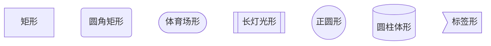


需要注意的是，如果节点的文字中包含标点符号，需要时用双引号包裹起来。
另外如果希望在文字中使用换行，请使用  `<br/>`  替换换行

## 节点间的连线

|    长度    |  1   |   2   |   3    |
| :--------: | :--: | :---: | :----: |
|    正常    | ---  | ----  | -----  |
| 普通带箭头 | -->  | --->  | ---->  |
|     粗     | ===  | ====  | =====  |
|  粗带箭头  | ==>  | ===>  | ====>  |
|    点缀    | -.-  | -..-  | -...-  |
| 点缀带箭头 | -.-> | -..-> | -...-> |


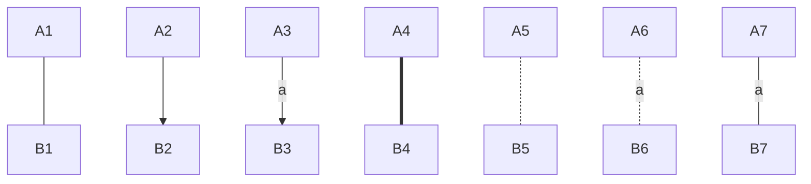

特殊连线

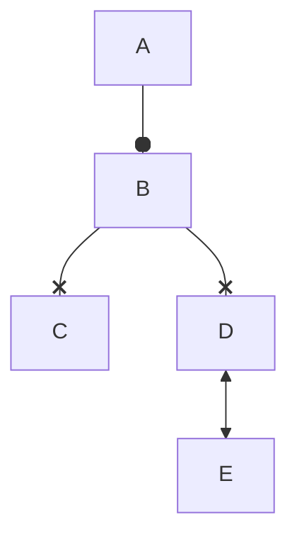


## 子图表

使用以下语法添加子图表

```text
subgraph 子图表名称
	子图表中的描述语句。。。
end
```


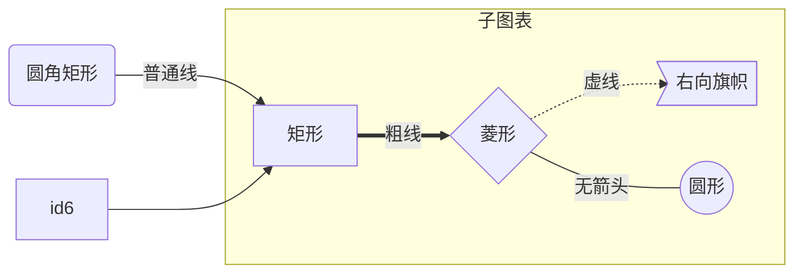


## 图表类型及示例

目前typora支持以下类型

### sequence——sequenceDiagram

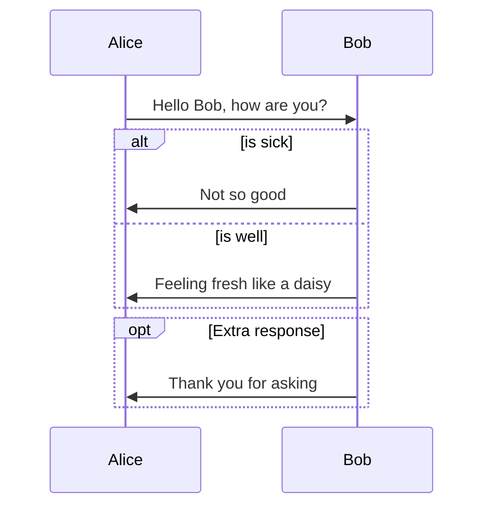

| Type | Description                                      |
| ---- | ------------------------------------------------ |
| ->   | Solid line without arrow                         |
| -->  | Dotted line without arrow                        |
| ->>  | Solid line with arrowhead                        |
| -->> | Dotted line with arrowhead                       |
| -x   | Solid line with a cross at the end               |
| --x  | Dotted line with a cross at the end.             |
| -)   | Solid line with an open arrow at the end (async) |
| --)  | Dotted line with a open arrow at the end (async) |

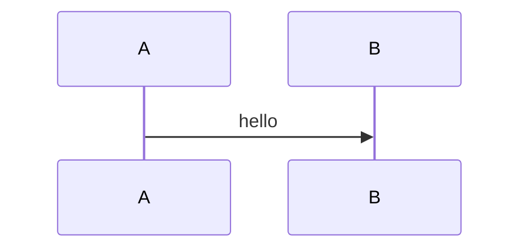


### flowchart

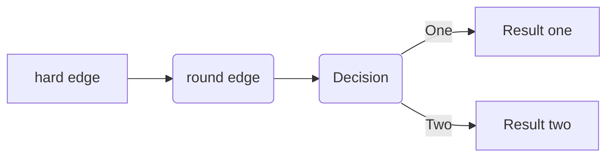


### Gantt

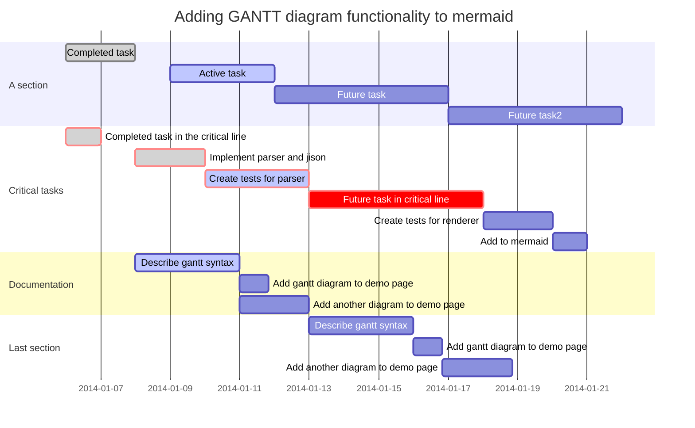


### class Diagrams——classDiagram

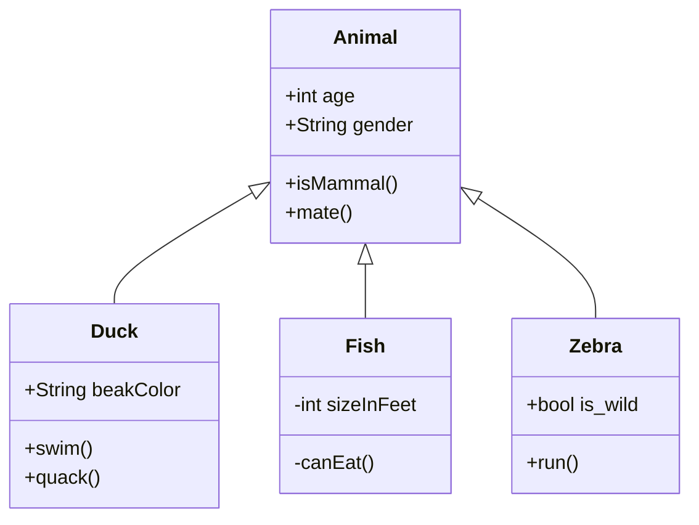

### State Diagrams——stateDiagram

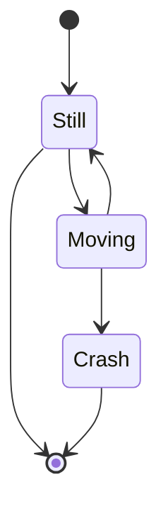


### Pie Charts

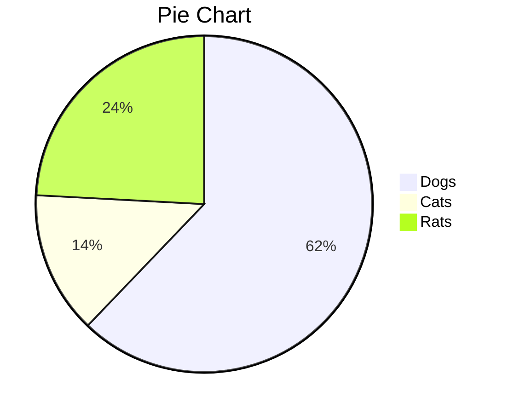


### Entity relationship diagrams

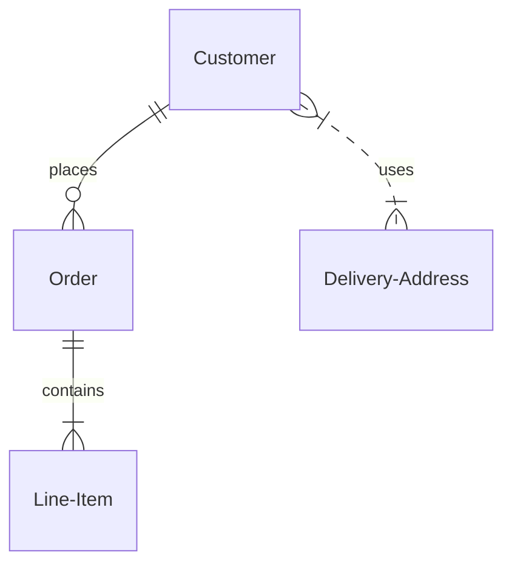


## 更新typora集成的mermaid版本

```mermaid
info
```

参看链接： [Typora不支持最新Mermaid语法的解决办法](https://qzy.im/blog/2020/05/typora-integrate-the-latest-version-of-mermaid/#%E6%9B%BF%E6%8D%A2mermaid%E5%8E%9F%E5%85%88%E5%BC%95%E7%94%A8%E7%9A%84js%E6%96%87%E4%BB%B6) 


# typora下载地址

typora开始发行正式版并收费了，因此保存beta版下载地址以防意外

 [mac beta版最后的安装包](typora.assets/Typora-0.11.18.dmg) 

 [win beta版最后的安装包](typora.assets/typora-update-x64-1117.exe) 

 [mac release下载地址](https://typora.io/dev_release.html) 

 [win release下载地址](https://typora.io/windows/dev_release.html) 

