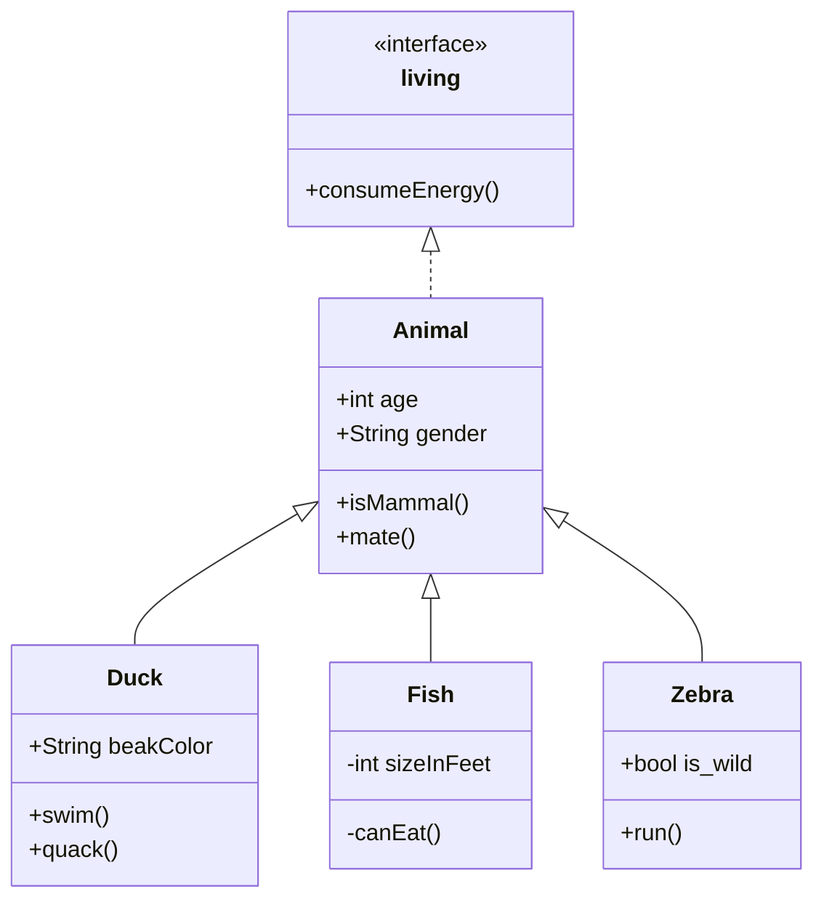
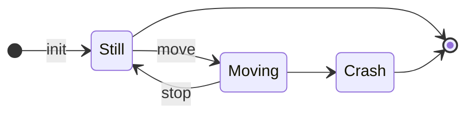
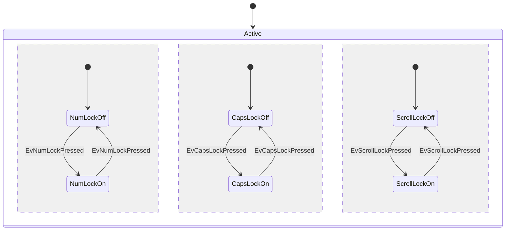
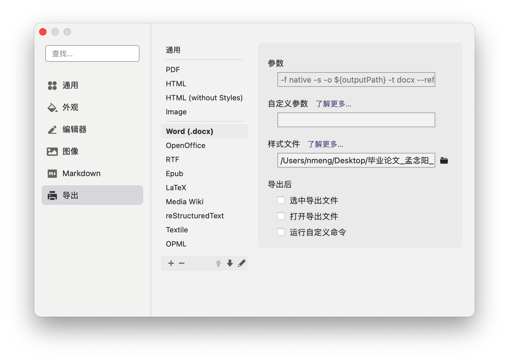

# 1 typora标题自动编号

方案：修改css

步骤：

1. 打开typora的theme文件夹，创建base.user.css文件
2. 写入内容如下：

```css
.sidebar-content {
    counter-reset: h1
}

.outline-h1 {
    counter-reset: h2
}

.outline-h2 {
    counter-reset: h3
}

.outline-h3 {
    counter-reset: h4
}

.outline-h4 {
    counter-reset: h5
}

.outline-h5 {
    counter-reset: h6
}

.outline-h1>.outline-item>.outline-label:before {
    counter-increment: h1;
    content: counter(h1) ". "
}

.outline-h2>.outline-item>.outline-label:before {
    counter-increment: h2;
    content: counter(h1) "." counter(h2) ". "
}

.outline-h3>.outline-item>.outline-label:before {
    counter-increment: h3;
    content: counter(h1) "." counter(h2) "." counter(h3) ". "
}

.outline-h4>.outline-item>.outline-label:before {
    counter-increment: h4;
    content: counter(h1) "." counter(h2) "." counter(h3) "." counter(h4) ". "
}

.outline-h5>.outline-item>.outline-label:before {
    counter-increment: h5;
    content: counter(h1) "." counter(h2) "." counter(h3) "." counter(h4) "." counter(h5) ". "
}

.outline-h6>.outline-item>.outline-label:before {
    counter-increment: h6;
    content: counter(h1) "." counter(h2) "." counter(h3) "." counter(h4) "." counter(h5) "." counter(h6) ". "
}

/** initialize css counter */
#write {
    counter-reset: h1
}
 
h1 {
    counter-reset: h2
}
 
h2 {
    counter-reset: h3
}
 
h3 {
    counter-reset: h4
}
 
h4 {
    counter-reset: h5
}
 
h5 {
    counter-reset: h6
}
 
/** put counter result into headings */
#write h1:before {
    counter-increment: h1;
    content: counter(h1) ". "
}
 
#write h2:before {
    counter-increment: h2;
    content: counter(h1) "." counter(h2) ". "
}
 
#write h3:before,
h3.md-focus.md-heading:before /** override the default style for focused headings */ {
    counter-increment: h3;
    content: counter(h1) "." counter(h2) "." counter(h3) ". "
}
 
#write h4:before,
h4.md-focus.md-heading:before {
    counter-increment: h4;
    content: counter(h1) "." counter(h2) "." counter(h3) "." counter(h4) ". "
}
 
#write h5:before,
h5.md-focus.md-heading:before {
    counter-increment: h5;
    content: counter(h1) "." counter(h2) "." counter(h3) "." counter(h4) "." counter(h5) ". "
}
 
#write h6:before,
h6.md-focus.md-heading:before {
    counter-increment: h6;
    content: counter(h1) "." counter(h2) "." counter(h3) "." counter(h4) "." counter(h5) "." counter(h6) ". "
}
 
/** override the default style for focused headings */
#write>h3.md-focus:before,
#write>h4.md-focus:before,
#write>h5.md-focus:before,
#write>h6.md-focus:before,
h3.md-focus:before,
h4.md-focus:before,
h5.md-focus:before,
h6.md-focus:before {
    color: inherit;
    border: inherit;
    border-radius: inherit;
    position: inherit;
    left:initial;
    float: none;
    top:initial;
    font-size: inherit;
    padding-left: inherit;
    padding-right: inherit;
    vertical-align: inherit;
    font-weight: inherit;
    line-height: inherit;
}
```


# 2 可折叠的代码栏

方案：使用detail标签

这个效果一般

```
<details>
  <summary>折叠代码块</summary>
  <pre><code> 
     System.out.println("虽然可以折叠代码块");
     System.out.println("但是代码无法高亮");
  </code></pre>
</details>

解读

details：折叠语法标签
summary：折叠语法展示的摘要
pre：以原有格式显示元素内的文字是已经格式化的文本
code：指定代码块
```

 **效果演示** 


<details>
  <summary>折叠代码块</summary>
  <pre><code> 
     System.out.println("虽然可以折叠代码块");
     System.out.println("但是代码无法高亮");
  </code></pre>
</details>


# 3 有序列表多重编号

```css
/**  自定义有序列表  **/
ol ol {
    list-style-type: lower-roman;
}

ol ol ol {
    list-style-type: lower-latin;
}
```

# 4 mermaid

## 4.1 资料链接💾

>  [官网](https://mermaidjs.github.io/) 
>
>  [github项目地址](https://github.com/knsv/mermaid) 
>
>  [文档](https://mermaid-js.github.io/mermaid/#/)

## 4.2 图标方向

语法如下

```text
graph 方向描述
	其他语句
```

其中方向描述为

| 用词 |   含义   |
| :--: | :------: |
|  TB  | 从上到下 |
|  BT  | 从下到上 |
|  RL  | 从右到左 |
|  LR  | 从左到右 |


## 4.3 节点定义

|      语法      |      说明      |
| :------------: | :------------: |
|  start[start]  |    直角矩形    |
|  start(start)  |    圆角矩形    |
| start([start]) |    体育场形    |
| start[[start]] |    长灯光形    |
| start[(start)] |    圆柱体形    |
| start((start)) |     正圆形     |
|  start>start]  |     标签形     |
|  start{start}  |      菱形      |
| start{{start}} |     六角形     |
| start[/start/] |   平行四边形   |
| start[\start]  | 反向平行四边行 |
| start[/start\] |      梯形      |
| start[\start/] |     倒梯形     |

```mermaid
graph TB
矩形[矩形]
圆角矩形(圆角矩形)
体育场型([体育场形])
长灯光形[[长灯光形]]
正圆形((正圆形))
圆柱体形[(圆柱体形)]
标签形>标签形]
```

```mermaid
flowchart
菱形{菱形}
六角形{{六角形}}
平行四边形[/平行四边形/]
反向平行四边形[\反向平行四边形\]
梯形[/梯形\]
倒梯形[\倒梯形/]
```


需要注意的是，如果节点的文字中包含标点符号，需要时用双引号包裹起来。
另外如果希望在文字中使用换行，请使用  `<br/>`  替换换行

## 4.4 节点间的连线

|    长度    |  1   |   2   |   3    |
| :--------: | :--: | :---: | :----: |
|    正常    | ---  | ----  | -----  |
| 普通带箭头 | -->  | --->  | ---->  |
|     粗     | ===  | ====  | =====  |
|  粗带箭头  | ==>  | ===>  | ====>  |
|    点缀    | -.-  | -..-  | -...-  |
| 点缀带箭头 | -.-> | -..-> | -...-> |


特殊连线


## 4.5 子图表

使用以下语法添加子图表

```text
subgraph 子图表名称
	子图表中的描述语句。。。
end
```


```mermaid
graph LR
    id1(圆角矩形)--普通线-->id2[矩形]
    subgraph 子图表
        id2==粗线==>id3{菱形}
        id3-.虚线.->id4>右向旗帜]
        id3--无箭头---id5((圆形))
    end
    id6[id6]-->id2
```


## 4.6 图表类型及示例

目前typora支持以下类型

### 4.6.1 时序图——sequenceDiagram


| Type | Description                                      |
| ---- | ------------------------------------------------ |
| ->   | Solid line without arrow                         |
| -->  | Dotted line without arrow                        |
| ->>  | Solid line with arrowhead                        |
| -->> | Dotted line with arrowhead                       |
| -x   | Solid line with a cross at the end               |
| --x  | Dotted line with a cross at the end.             |
| -)   | Solid line with an open arrow at the end (async) |
| --)  | Dotted line with a open arrow at the end (async) |


### 4.6.2 流程图——flowchart


### 4.6.3 Gantt


### 4.6.4 类图——classDiagram




relationship

| Type  | Description   |
| ----- | ------------- |
| <\|-- | Inheritance   |
| *--   | Composition   |
| o--   | Aggregation   |
| -->   | Association   |
| --    | Link (Solid)  |
| ..>   | Dependency    |
| ..\|> | Realization   |
| ..    | Link (Dashed) |


### 4.6.5 状态图——stateDiagram







### 4.6.6 饼图——pie


### 4.6.7 实体关系图——erDiagram


## 4.7 更新typora集成的mermaid版本

### 4.7.1 当前版本

```mermaid
info
```

### 4.7.2 升级typora自带的mermaid版本方法

参看链接： [Typora不支持最新Mermaid语法的解决办法](https://qzy.im/blog/2020/05/typora-integrate-the-latest-version-of-mermaid/#%E6%9B%BF%E6%8D%A2mermaid%E5%8E%9F%E5%85%88%E5%BC%95%E7%94%A8%E7%9A%84js%E6%96%87%E4%BB%B6) 

 [mermaid git repo]( https://github.com/mermaid-js/mermaid.git) 

操作方法：

1. 打开package.json，发现其中的scripts中有build命令
2. 使用yarn build命令，用于生成编译后的js文件，一般生成在根目录下
3. 将这个新生成的js文件替换到typora的mermaid目录下


### 4.7.3 mermaid仓库的编译方法

1. 安装`npm`或`yarn`，此处以npm`为`例

1. execute  `npm install -g npm` to upgrade npm to the latest version

2. 运行命令`npm run install`，安装必要的依赖

3. 打开工程目录下package.json文件，关键参数都写在里面，如当前版本version，输出目录exports，运行命令等。查看script等命令

   

4. 运行`npm run build`命令，生成工程文件。

5. 生成完成后在工程根目录下得到一个dist文件夹，其中`mermaid.min.js`文件就是目标文件，执行文件替换即可


# 5 SliDev

[SliDev使用指南](https://cn.sli.dev/guide/)

# 6 pandoc

## 6.1 资料链接💾

>  [github-pandoc](https://github.com/jgm/pandoc) 

这是[Pandoc官方网站上的说明](http://pandoc.org/installing.html)：

> 如果以后要卸载软件包，可以通过下载 [此脚本](https://raw.githubusercontent.com/jgm/pandoc/master/osx/uninstall-pandoc.pl) 并使用来运行它 `perl uninstall-pandoc.pl`。
>
> 安装使用brew install pandoc即可

## 6.2 基础使用

```bash
# 读取文件
pandoc -f 输入格式 -t 输出格式 -o 输出文件名 输入文件

# 读取网页
pandoc -f html -t 输出格式 -o 输出文件名 --request-header User-Agent:"Mozilla/5.0" \
  https://www.fsf.org
```


## 6.3 常见的输入 / 输出格式

|          格式          |   参数   |
| :--------------------: | :------: |
|        CSV 表格        |   csv    |
|       Word 文档        |   docx   |
|      EPUB 电子书       |   epub   |
|       HTML 网页        |   html   |
|     Markdown 文档      | markdown |
| PDF 文档（仅支持输出） |   pdf    |
| PPt 文档（仅支持输出） |   pptx   |
|       JSON 数据        |   json   |

## 6.4 word导出



```bash
--toc # 生成目录
--toc-depth=NUMBER # 生成的目录深度
--wrap=auto|none|preserve # 文字换行方式
--reference-doc=FILE # 指定模板（word模板）
```


默认word模板可用以下命令查看

```bash
pandoc --print-default-data-file reference.docx > custom-reference.docx
```

修改完成后，可以通过 `--reference-doc=custom-reference.docx` 来指定模板。 也可以将模板文件放置到 Pandoc 的数据文件夹下，并命名为 `reference.docx`，后续 Pandoc 将把这个文件作为默认模板进行使用。 这里的数据文件夹，可以在 `pandoc -v` 指令的打印信息中，通过 `data-dir` 字段来获取。


## 6.5 参考链接

1.  [Pandoc 实用教程](http://www.atdevin.com/3582.html)  

# 7 公式

## 7.1 常用公式代码

### 7.1.1 上下标

| 算式   | Markdown |
| ------ | -------- |
| $x^2 $ | x^2      |
| $y_1 $ | y_1      |

### 7.1.2 分式

| 算式          | markdown      |
| ------------- | ------------- |
| $1/2$         | `1/2`         |
| $\frac{1}{2}$ | `\frac{1}{2}` |


### 7.1.3 省略号

| 省略号   | Markdown |
| -------- | -------- |
| $\cdots$ | `\cdots` |

### 7.1.4 开根号

| 算式          | markdown   |
| ------------- | ---------- |
| $\sqrt{2}$    | `\sqrt{2}` |
| $\sqrt[3]{5}$ |            |


### 7.1.5 矢量

| 算式              | markdown  |
| ----------------- | --------- |
| $\vec{a}$         | `\vec{a}` |
| $\lVert a \rVert$ |           |

### 7.1.6 积分

| 算式                  | md                  |
| --------------------- | ------------------- |
| $\int{x}dx$           | `\int{x}dx`         |
| $\int_{1}^{2}{x}dx$   | `\int_{1}^{2}{x}dx` |
| $\intop_{1}^{2}{x}dx$ |                     |
| $\iint{x}dx$          |                     |
| $\oint{x}dx$          |                     |
| $\oiint{x}dx$         |                     |


### 7.1.7 导数与微分

| eq                                 | md   |
| ---------------------------------- | ---- |
| $a'$                               |      |
| $a''$                              |      |
| $a^{\prime}$                       |      |
| $\frac {\partial f}{ \partial x} $ |      |


### 7.1.8 极限

| 算式                         | md                           |
| ---------------------------- | ---------------------------- |
| $\lim{a+b}$                  | `\lim{a+b}`                  |
| $\lim_{n\rightarrow+\infty}$ | `\lim_{n\rightarrow+\infty}` |

### 7.1.9 累加

| 算式                    | md                      |
| ----------------------- | ----------------------- |
| $\sum{a}$               | `\sum{a}`               |
| $\sum_{n=1}^{100}{a_n}$ | `\sum_{n=1}^{100}{a_n}` |

### 7.1.10 累乘

| 算式                    | md                      |
| ----------------------- | ----------------------- |
| $\prod{x}$              | `\prod{x}`              |
| $\prod_{n=1}^{99}{x_n}$ | `\prod_{n=1}^{99}{x_n}` |

### 7.1.11 希腊字母

| 大写       | md       | 小写          | md          |
| ---------- | -------- | ------------- | ----------- |
| $\Alpha$   | A        | $\alpha$      | \alpha      |
| B          | B        | $\beta$       | \beta       |
| $\Gamma$   | \Gamma   | $\gamma$      | \gamma      |
| $\Delta$   | \Delta   | $\delta$      | \delta      |
| $\Epsilon$ | \Epsilon | $\epsilon$    | \epsilon    |
|            |          | $\varepsilon$ | \varepsilon |
| $\Zeta$    | Z        | $\zeta$       | \zeta       |
| $\Eta$     | H        | $\eta$        | \eta        |
| $\Theta$   | \Theta   | $\theta$      | \theta      |
| $\Iota$    | \Iota    | $\iota$       | \iota       |
| $\Kappa$   | \kappa   | $\kappa$      | \kappa      |
| $\Lambda$  | \Lambda  | $\lambda$     | \lambda     |
| $\Mu$      | M        | $\mu$         | \mu         |
| $\Nu$      | N        | $\nu$         | \nu         |
| $\Xi$      | \Xi      | $\xi$         | \xi         |
| $\Omicron$ | O        | $\omicron$    | \omicron    |
| $\Pi$      | \Pi      | $\pi$         | \pi         |
| $\Rho$     | P        | $\rho$        | \rho        |
| $\Sigma$   | \Sigma   | $\sigma$      | \sigma      |
| $\Tau$     | T        | $\tau$        | \tau        |
| $\Upsilon$ | \Upsilon | $\upsilon$    | \upsilon    |
| $\Phi$     | \Phi     | $\phi$        | \phi        |
|            |          | $\varphi$     |             |
| $\Chi$     | X        | $\chi$        | \chi        |
| $\Psi$     | \Psi     | $\psi$        | \psi        |
| $\Omega$   | \Omega   | $\omega$      | \omega      |


### 7.1.12 三角函数

| eq     | md   |
| ------ | ---- |
| $\sin$ | \sin |
| $\cos$ |      |
| $\tan$ |      |
| $\cot$ |      |
| $\sec$ |      |
| $\csc$ |      |

### 7.1.13 对数函数

| eq          | md        |
| ----------- | --------- |
| $\ln2$      | \ln2      |
| $\log_2{8}$ | \log_2{8} |
| $\lg10$     | \lg10     |

### 7.1.14 运算符

| eq       | md     |
| -------- | ------ |
| $\pm$    | \pm    |
| $\times$ | \times |
| $\cdot$  | \cdot  |
| $\div$   | \div   |
| $\neq$   | \neq   |
| $\equiv$ | \equiv |
| $\leq$   | \leq   |
| $\geq$   | \geq   |

### 7.1.15 其他特殊字符

| eq           | md   |
| ------------ | ---- |
| $\forall$    |      |
| $\infty$     |      |
| $\emptyset$  |      |
| $\exists$    |      |
| $\nabla$     |      |
| $\bot$       |      |
| $\angle$     |      |
| $\because$   |      |
| $\therefore$ |      |

### 7.1.16 分段函数

$$
c(u)=
  \begin{cases} 
    \sqrt\frac{1}{n} , u=0\\
    \sqrt\frac{2}{N} , u\neq0
  \end{cases}
$$

### 7.1.17 方程组

$$
\left\{
	\begin{array}{c}
		a_1x+b_1y+c_1z=d_1\\
		a_2x+b_2y+c_2z=d_2\\
		a_3x+b_3y+c_3z=d_3
	\end{array}
\right.
$$


### 7.1.18 空格

$$
a \quad b
$$

### 7.1.19 矩阵

$$
a=\left[
  \matrix{
    \alpha_1 & \beta1\\
    \alpha_2 & \beta2\\
    \alpha_3 & \beta3
  }
\right]
$$

### 7.1.20 行列式

$$
X_{n \times n} =
\left|
	\begin{matrix}
		x_{11} & x_{12} & \cdots & x_{1n} \\
		x_{21} & x_{22} & \cdots & x_{2n}	\\
		\vdots & \vdots & \ddots & \vdots \\
		x_{n1} & x_{n2} & \cdots & x_{nn} \\
	\end{matrix}
\right|
$$

### 7.1.21 推导过程

$$
\begin{align}
	\frac{\partial J(\theta)}{\partial\theta_j}
	& = -\frac1m\sum_{i=0}^m(y^i - h_\theta(x^i)) \frac{\partial}{\partial\theta_j}(y^i-h_\theta(x^i))\\
	& = -\frac1m\sum_{i=0}^m(y^i-h_\theta(x^i)) \frac{\partial}{\partial\theta_j}(\sum_{j=0}^n\theta_j x^i_j-y^i)\\
	&=-\frac1m\sum_{i=0}^m(y^i -h_\theta(x^i)) x^i_j
\end{align}
$$


### 7.1.22 参考资料

1.  [typora常用的数学公式编辑语法](https://www.cnblogs.com/wreng/articles/13514391.html) 


# 8 typora下载地址

typora开始发行正式版并收费了，因此保存beta版下载地址以防意外

 [mac beta版最后的安装包](typora.assets/Typora-0.11.18.dmg) 

 [win beta版最后的安装包](typora.assets/typora-update-x64-1117.exe) 

 [mac release下载地址](https://typora.io/dev_release.html) 

 [win release下载地址](https://typora.io/windows/dev_release.html) 

