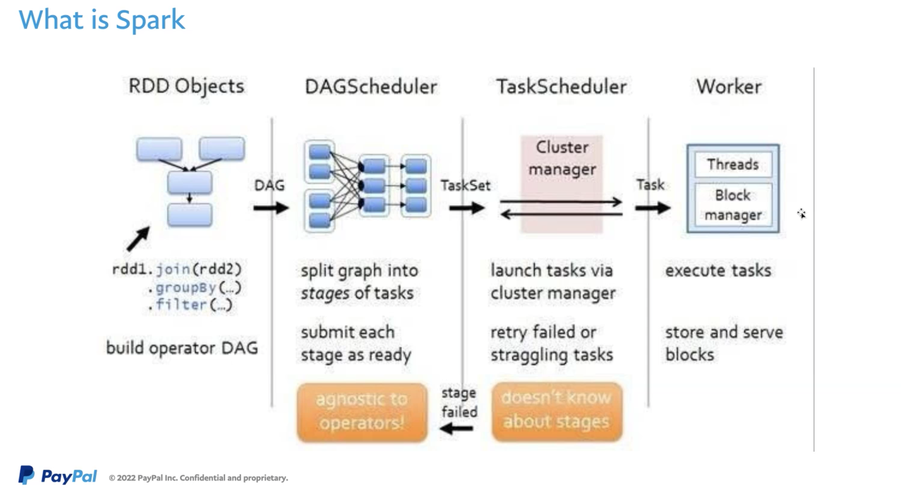
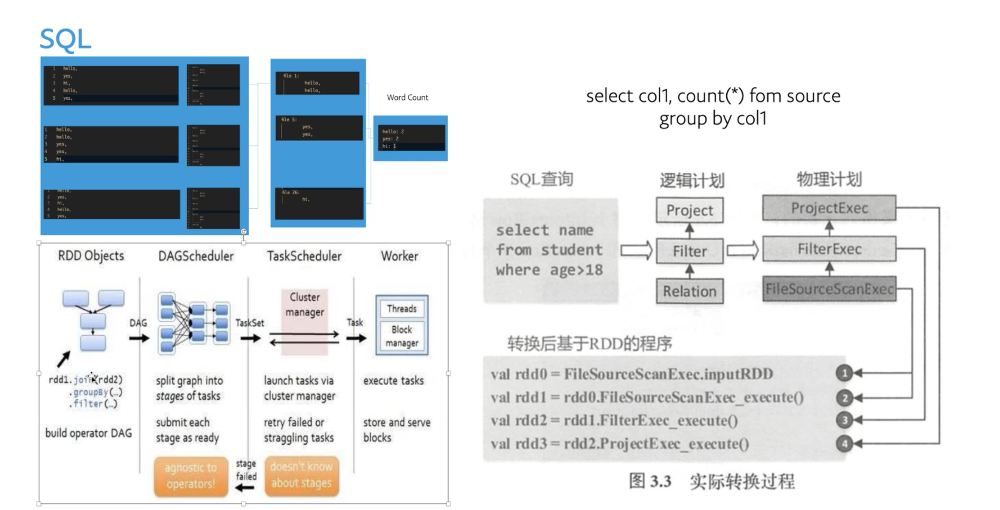
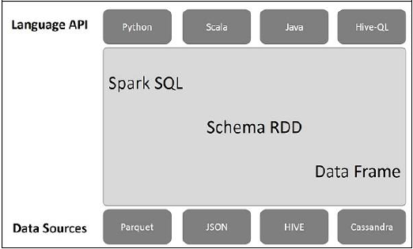

# 1 概述

一个重要的抽象模型是RDD（resilient distributed dataset，弹性分布式数据集）。

性能：在内存中比hadoop MapReduce快100倍，磁盘中快10倍

库：提供SQL库，机器学习库MLlib，图形处理GraphX和流处理Spark Streaming

运行：可以运行在Hadoop、Mesos、standalone和cloud，可以访问不同数据源，如：HDFS，Cassandra，HBase，S3

hadoop

- hdfs
- map-reduce

spark

- 基于内存数据操作

# 2 from share
王尧share
1. data process
场景： word count，统计文件中每个单词出现的次数

2. spark是什么

yarn集群

3. spark趋势

spark SQL 
语法树（编译原理部分）

spark推荐学习spark3.0版本

# 3 spark 基础
## 3.1 SparkContext
Spark应用程序执行的入口。可使Spark应用程序通过资源管理器访问Spark集群。
其中资源管理器可以是：
1. Spark Standalone
2. Yarn
3. Apache Mesos

### 3.1.1 创建方式
通过创建SparkConf，配置参数后，Spakr驱动程序（Driver）会将参数传递给SparkContext
创建SparkContext后，可用过它调用spark函数，如textFile、sequenceFile、parallelize等。也可用其创建RDD、广播变量和作为累加器，进入Spark服务和运行作业

### 3.1.2 关闭方式
一个JVM只能运行一个SparkContext，
调用SparkContext的`stop()`函数

## 3.2 spark stage

## 3.3 spark RDD
RDD（Resilient Distributed Dataset），即弹性分布式数据集，是Spark的基础数据结构，具有以下特性
-   **Resilient（弹性）**：RDD之间会形成有向无环图（DAG），如果RDD丢失了或者失效了，可以从父RDD重新计算得到。即容错性。
-   **Distributed（分布式）**：RDD的数据是以逻辑分区的形式分布在集群的不同节点的。
-   **Dataset（数据集）**：即RDD存储的数据记录，可以从外部数据生成RDD，例如Json文件，CSV文件，文本文件，数据库等。

# 4 spark SQL
架构图

# 5 参考文献

1.   [Spark 学习笔记](https://blog.einverne.info/post/2017/01/spark.html) 
2.   [Apache Spark 2.2.0 官方文档中文版](https://blog.csdn.net/u012185296/article/details/76855770) 
3. 🌟 大象教程—— [Spark教程](https://www.hadoopdoc.com/spark/spark-sparkcontext) 
4.  [Spark学习笔记之入门篇一](http://lousama.com/2016/01/11/Spark%E5%85%A5%E9%97%A8%E7%AF%87/) ——该文完成度很低

