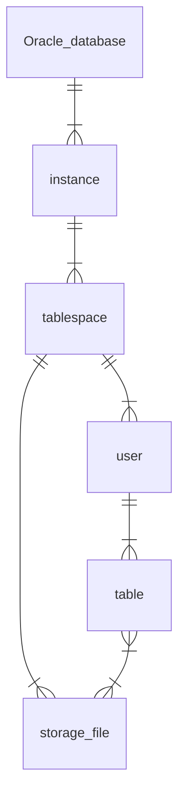
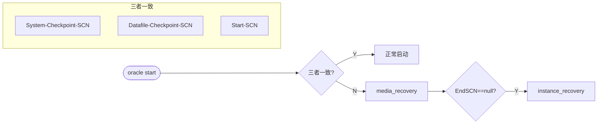

# 基本概念

## 实例和数据库之间的关系

每个DB可包含多个Instance ， 每个Instance可包含多个Tablespace和User等（授予USER读写TABLESPACE的权限），每个TABLESPACE可包含多个DBF文件，常用的TABLE或VIEW等都存储在TABLESPACE里


基础概念：Oracle数据库、实例、用户、表空间、表之间的关系

### 数据库

oracle数据库是数据的物理存储，包括ORA或DBF，控制文件，联机日志，参数文件。

oracle数据库概念不同于其他数据库，这里数据库是一个操作系统只有一个库。

可看作Oracle只有一个大数据库

### 实例

一个Oracle实例有一系列后台进程和内存结构组成。

一个数据库可有多个实例


### 用户

用户在实例下构建，不同实例间可以用户可同名

### 表空间

一个用来管理数据库存储逻辑的概念，表空间只和数据文件（ORA或DBF文件）发生关系，数据文件是物理的。

一个表空间可以包含多个数据文件，一个数据文件只属于一个表空间

### 数据文件（dbf，ora）

数据文件是数据库的物理存储单位，数据库的数据存储于表空间中。

一个表空间可包括一个到多个数据文件。

一旦数据文件被加入某表空间后，该文件就不可删除。若要删除该文件，至善删除其所属表空间





参考文献： 

1.  [oracle里实例和数据库之间的关系](https://blog.csdn.net/G15738290530/article/details/51859048) 

# oracle快照机制

oracle生成快照需要导出为文件，有一定的系统开销


# oracle底层隐藏参数

## SCN

### 简介

SCN即系统改变号（System Change Number）

1. 是DB已提交版本的时间戳，其值是DB更改的逻辑时间点
2. 每个已提交事务有唯一SCN
3. 多处存储，如数据文件头、控制文件、数据块头、日志文件等都标记SCN
4. 功能重要，可用于维护DB一致性、数据备份、数据恢复等等。

6字节（48bit）数字

### 四种重要SCN

oracle事务中数据变化写入数据文件流程

> 1. 事务开始
> 2. 在buffer cache / 数据文件 中找到数据块
> 3. 事务修改buffer cache的数据块，被标识为"脏数据"，写入log buffer中
> 4. 事务提交，LGWR进程奖log buffer中“脏数据”的日志条目写入redo log file中
> 5. 当发生checkpoint时，CKPT进程更新所有数据文件的文件头信息，DBWn进程奖buffer cache中脏数据写入数据文件

SCN总共分为四种

> 1. 系统检查点（System Checkpoint）SCN
>
> 2. 数据文件检查点（Datafile Checkpoint）SCN
>
> 3. 开始SCN（Start SCN）
>
>    用于检查数据库启动过程中是否要做media recovery
>
> 4. 结束SCN（Stop SCN）
>
>    用于检查数据库启动过程是否要做instance recovery

### SCN与数据库启动

在数据库启动过程中，当System Checkpoint SCN、Datafile Checkpoint SCN和Start SCN都相同时，数据库可以正常启动，不需要做media recovery。三者当中有一个不同时，则需要做media recovery.如果在启动的过程中，End SCN为NULL，则需要做instance recovery。Oracle在启动过程中首先检查是否需要media recovery，然后再检查是否需要instance recovery。




### SCN与数据库关闭

如果数据库的正常关闭的话，将会触发一个checkpoint，同时将数据文件的END SCN设置为相应数据文件的Start SCN。当数据库启动时，发现它们是一致的，则不需要做instance recovery。在数据库正常启动后，ORACLE会将END SCN设置为NULL.如果数据库异常关闭的话，则END SCN将为NULL。


# oracle事务

一样也分为四种隔离级别，和mysql一样


使用可重复读的事务隔离？


## 可重复读的实现


参考

- https://www.zhihu.com/question/434734816/answer/1625842017
-  [高性能MySQL-如何实现可重复读？](https://zhuanlan.zhihu.com/p/161933980) 


# 基础语法

## 查询语句顺序

```sql
SELECT
    col_a /(*) /(聚合函数)
FROM
    tb
WHERE
    条件
GROUP BY
    col_a
HAVING
    COUNT(*) > 5
ORDER BY
    sum DESC
LIMIT
    10;
```


## 常见命令

查看索引

```sql
-- 查看单个表中索引
SHOW keys FROM table_name;
```


## tuple

可以使用多个条件进行如下的查询

```sql
SELECT *
FROM mytable
WHERE (group_id, group_type) IN (("1234-567", 2), ("4321-765", 3), ("1111-222", 5))
```

参考：[Using tuples in SQL "IN" clause](https://stackoverflow.com/questions/8006901/using-tuples-in-sql-in-clause) 

# oracle分库分表


# DB连接

目前GG表采用的JDBC直连

其他表会采用_compdb   连接池的方式连接


```sql
SELECT
    GG_CM_CASE_ENTITY_INFO.GG_COMMIT_TIMESTAMP,
    TO_NUMBER(
        CONCAT(
            GG_CM_CASE_ENTITY_INFO.GG_TRAIL_SEQ,
            LPAD(GG_CM_CASE_ENTITY_INFO.GG_TRAIL_RBA, 10, 0)
        )
    ) AS GG_RBA,
    GG_CM_CASE_ENTITY_INFO.CASE_TID,
    GG_CM_CASE_ENTITY_INFO.ENTITY_TYPE,
    GG_CM_CASE_ENTITY_INFO.ENTITY_ID,
    GG_CM_CASE_ENTITY_INFO.ENTITY_ROLE,
    GG_CM_CASE_ENTITY_INFO.ADJACENCY_ID,
    GG_CM_CASE_ENTITY_INFO.LINK_REASON,
    GG_CM_CASE_ENTITY_INFO.CLASSIFICATION,
    GG_CM_CASE_ENTITY_INFO.TIME_CREATED,
    GG_CM_CASE_ENTITY_INFO.TIME_UPDATED
FROM
    GG_CM_CASE_ENTITY_INFO
WHERE
    GG_CM_CASE_ENTITY_INFO.ENTITY_TYPE = 'ACCOUNT'
    AND GG_CM_CASE_ENTITY_INFO.GG_OP_TYPE <> 'DELETE'
    AND GG_CM_CASE_ENTITY_INFO.GG_BEFORE_AFTER = 'AFTER'
    AND GG_CM_CASE_ENTITY_INFO.GG_COMMIT_TIMESTAMP >= TO_DATE(
        '$$MAX_TIME_gg_cm_case_entity_gi',
        'mm/dd/yyyy hh24:mi:ss'
    ) - 1 / 96
    AND GG_CM_CASE_ENTITY_INFO.GG_COMMIT_TIMESTAMP <= TO_DATE('$$PARAM_UPPER_TIME', 'yyyymmddhh24miss')
```


# 常用函数

## 数学计算类

### mod

【功能】返回x除以y的余数

【语法】

```sql
mod(number , number)
```


【参数】x,y，数字型表达式

【返回】数字

 

【示例】

```sql
 select mod(23,8),mod(24,8) from dual;
```

返回：7,0

### LPAD

【功能】左填充

lpad函数是[Oracle](https://baike.baidu.com/item/Oracle)[数据库函数](https://baike.baidu.com/item/数据库函数)，lpad函数从左边对[字符](https://baike.baidu.com/item/字符)串使用指定的字符进行填充。从其字面意思也可以理解，l是left的简写，pad是填充的意思，所以lpad就是从左边填充的意思。

【语法】

```
lpad( string, padded_length, [ pad_string ] )
```

**string**

准备被填充的字符串；

**padded_length**

填充之后的字符串长度，也就是该函数返回的字符串长度，如果这个数量比原字符串的长度要短，lpad函数将会把字符串截取成从左到右的n个字符;

**pad_string**

填充字符串，是个可选参数，这个字符串是要粘贴到string的左边，如果这个参数未写，lpad函数将会在string的左边粘贴空格。 

【示例】

```sql
LPAD(12345, 10, 0)
```

返回

```sql
0000012345
```


