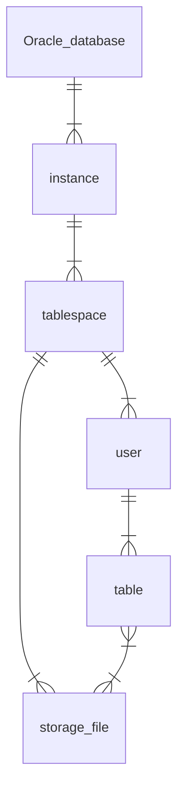
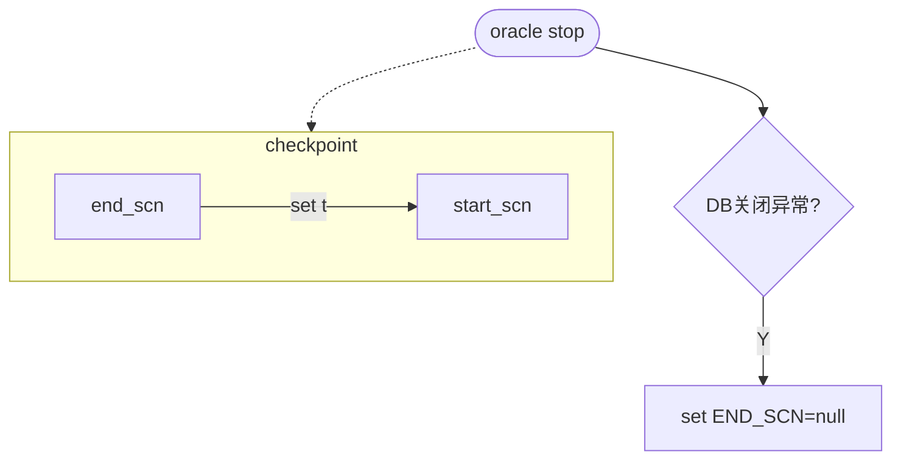
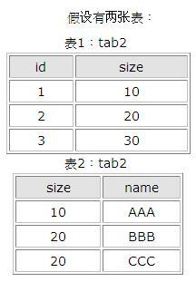
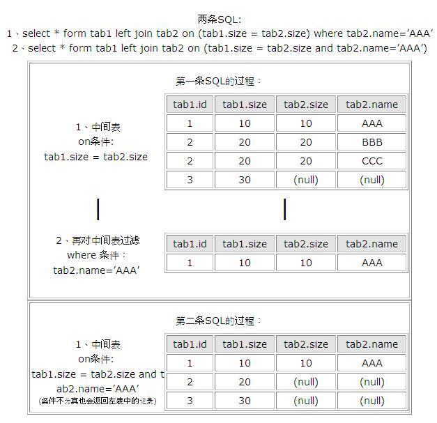

# 1 基本概念

## 1.1 实例和数据库之间的关系

每个DB可包含多个Instance ， 每个Instance可包含多个Tablespace和User等（授予USER读写TABLESPACE的权限），每个TABLESPACE可包含多个DBF文件，常用的TABLE或VIEW等都存储在TABLESPACE里


基础概念：Oracle数据库、实例、用户、表空间、表之间的关系

### 1.1.1 数据库

oracle数据库是数据的物理存储，包括ORA或DBF，控制文件，联机日志，参数文件。

oracle数据库概念不同于其他数据库，这里数据库是一个操作系统只有一个库。

可看作Oracle只有一个大数据库

### 1.1.2 实例

一个Oracle实例有一系列后台进程和内存结构组成。

一个数据库可有多个实例


### 1.1.3 用户

用户在实例下构建，不同实例间可以用户可同名

### 1.1.4 表空间

一个用来管理数据库存储逻辑的概念，表空间只和数据文件（ORA或DBF文件）发生关系，数据文件是物理的。

一个表空间可以包含多个数据文件，一个数据文件只属于一个表空间

### 1.1.5 数据文件（dbf，ora）

数据文件是数据库的物理存储单位，数据库的数据存储于表空间中。

一个表空间可包括一个到多个数据文件。

一旦数据文件被加入某表空间后，该文件就不可删除。若要删除该文件，至善删除其所属表空间





参考文献： 

1.  [oracle里实例和数据库之间的关系](https://blog.csdn.net/G15738290530/article/details/51859048) 

# 2 oracle快照机制

oracle生成快照需要导出为文件，有一定的系统开销


# 3 oracle底层隐藏参数

## 3.1 SCN

### 3.1.1 简介

SCN即系统改变号（System Change Number）

1. 是DB已提交版本的时间戳，其值是DB更改的逻辑时间点
2. 每个已提交事务有唯一SCN
3. 多处存储，如数据文件头、控制文件、数据块头、日志文件等都标记SCN
4. 功能重要，可用于维护DB一致性、数据备份、数据恢复等等。

6字节（48bit）数字

### 3.1.2 四种重要SCN

oracle事务中数据变化写入数据文件流程

> 1. 事务开始
> 2. 在buffer cache / 数据文件 中找到数据块
> 3. 事务修改buffer cache的数据块，被标识为"脏数据"，写入log buffer中
> 4. 事务提交，LGWR进程奖log buffer中“脏数据”的日志条目写入redo log file中
> 5. 当发生checkpoint时，CKPT进程更新所有数据文件的文件头信息，DBWn进程奖buffer cache中脏数据写入数据文件

SCN总共分为四种

> 1. 系统检查点（System Checkpoint）SCN
>
> 2. 数据文件检查点（Datafile Checkpoint）SCN
>
> 3. 开始SCN（Start SCN）
>
>    用于检查数据库启动过程中是否要做media recovery
>
> 4. 结束SCN（Stop SCN）
>
>    用于检查数据库启动过程是否要做instance recovery

### 3.1.3 SCN与数据库启动

在数据库启动过程中，当System Checkpoint SCN、Datafile Checkpoint SCN和Start SCN都相同时，数据库可以正常启动，不需要做media recovery。三者当中有一个不同时，则需要做media recovery.如果在启动的过程中，End SCN为NULL，则需要做instance recovery。Oracle在启动过程中首先检查是否需要media recovery，然后再检查是否需要instance recovery。


### 3.1.4 SCN与数据库关闭

如果数据库的正常关闭的话，将会触发一个checkpoint，同时将数据文件的END SCN设置为相应数据文件的Start SCN。当数据库启动时，发现它们是一致的，则不需要做instance recovery。在数据库正常启动后，ORACLE会将END SCN设置为NULL.如果数据库异常关闭的话，则END SCN将为NULL。




# 4 oracle事务

一样也分为四种隔离级别，和mysql一样


使用可重复读的事务隔离？


## 4.1 可重复读的实现


参考

- https://www.zhihu.com/question/434734816/answer/1625842017
-  [高性能MySQL-如何实现可重复读？](https://zhuanlan.zhihu.com/p/161933980) 


# 5 基础语法

## 5.1 查询语句顺序

```sql
SELECT
    col_a /(*) /(聚合函数)
FROM
    tb
WHERE
    条件
GROUP BY
    col_a
HAVING
    COUNT(*) > 5
ORDER BY
    sum DESC
LIMIT
    10;
```


## 5.2 常见命令

查看索引

```sql
-- 查看单个表中索引
SHOW keys FROM table_name;
```


## 5.3 tuple

可以使用多个条件进行如下的查询

```sql
SELECT *
FROM mytable
WHERE (group_id, group_type) IN (("1234-567", 2), ("4321-765", 3), ("1111-222", 5))
```

参考：[Using tuples in SQL "IN" clause](https://stackoverflow.com/questions/8006901/using-tuples-in-sql-in-clause) 


## 5.4 行转列

多行合并为一行

LISTAGG WITHIN GROUP


## 5.5 时间戳和日期

```sql
select sysdate,to_date('20190103','yyyy-mm-dd hh24:mi:ss') from dual;
```


### 5.5.1 时间戳转date

```sql
SELECT TO_CHAR(时间戳的那一列 / (1000 * 60 * 60 * 24) +
TO_DATE('1970-01-01 08:00:00', 'YYYY-MM-DD HH24:MI:SS'), 'YYYY-MM-DD HH24:MI:SS')
AS createTime FROM tbl_name ;
```

### 5.5.2 date转时间戳

```sql
select sysdate,to_char(sysdate, 'yyyy-mm-dd') from dual;
```

### 5.5.3 按照gg_commit_timestamp分组

```sql
```


## 5.6 判断字符串是否是数值

```sql
select * from table where trim(translate(column,'0123456789',' ')) is NULL
```

或

```sql
select * from table where regexp_like(column,'^[0-9]+[0-9]$');
```


# 6 join

## 6.1 join中on和where的区别

- 考虑如下场景：

  

  

其实以上结果的关键原因就是**left join,right join,full join**的特殊性，不管on上的条件是否为真都会返回left或right表中的记录，full则具有left和right的特性的并集。 _而inner join没这个特殊性，则条件放在on中和where中，返回的结果集是相同的_。on为了反映外连接中一方的全连接，而where没有这个功能，内连接配对是可以的。

---

**说明**

- on、where、having的区别

on、where、having这三个都可以加条件的子句中，on是最先执行，where次之，having最后。有时候如果这先后顺序不影响中间结果的话，那最终结果是相同的。但因为on是先把不符合条件的记录过滤后才进行统计，它就可以减少中间运算要处理的数据，按理说应该速度是最快的。

  根据上面的分析，可以知道where也应该比having快点的，因为它过滤数据后才进行sum，所以having是最慢的。但也不是说having没用，因为有时在步骤3还没出来都不知道那个记录才符合要求时，就要用having了。

  在两个表联接时才用on的，所以在一个表的时候，就剩下where跟having比较了。在这单表查询统计的情况下，如果要过滤的条件没有涉及到要计算字段，那它们的结果是一样的，只是where可以使用rushmore技术，而having就不能，在速度上后者要慢。

  如果要涉及到计算的字段，就表示在没计算之前，这个字段的值是不确定的，根据上篇写的工作流程，where的作用时间是在计算之前就完成的，而having就是在计算后才起作用的，所以在这种情况下，两者的结果会不同。

  在多表联接查询时，on比where更早起作用。系统首先根据各个表之间的联接条件，把多个表合成一个临时表后，再由where进行过滤，然后再计算，计算完后再由having进行过滤。由此可见，要想过滤条件起到正确的作用，首先要明白这个条件应该在什幺时候起作用，然后再决定放在那里


参考资料

1.  [SQL中ON和WHERE的区别](https://www.cnblogs.com/ajianbeyourself/p/9836954.html) 


# 7 oracle分库分表


# 8 DB连接

目前GG表采用的JDBC直连

其他表会采用_compdb   连接池的方式连接


```sql
SELECT
    GG_CM_CASE_ENTITY_INFO.GG_COMMIT_TIMESTAMP,
    TO_NUMBER(
        CONCAT(
            GG_CM_CASE_ENTITY_INFO.GG_TRAIL_SEQ,
            LPAD(GG_CM_CASE_ENTITY_INFO.GG_TRAIL_RBA, 10, 0)
        )
    ) AS GG_RBA,
    GG_CM_CASE_ENTITY_INFO.CASE_TID,
    GG_CM_CASE_ENTITY_INFO.ENTITY_TYPE,
    GG_CM_CASE_ENTITY_INFO.ENTITY_ID,
    GG_CM_CASE_ENTITY_INFO.ENTITY_ROLE,
    GG_CM_CASE_ENTITY_INFO.ADJACENCY_ID,
    GG_CM_CASE_ENTITY_INFO.LINK_REASON,
    GG_CM_CASE_ENTITY_INFO.CLASSIFICATION,
    GG_CM_CASE_ENTITY_INFO.TIME_CREATED,
    GG_CM_CASE_ENTITY_INFO.TIME_UPDATED
FROM
    GG_CM_CASE_ENTITY_INFO
WHERE
    GG_CM_CASE_ENTITY_INFO.ENTITY_TYPE = 'ACCOUNT'
    AND GG_CM_CASE_ENTITY_INFO.GG_OP_TYPE <> 'DELETE'
    AND GG_CM_CASE_ENTITY_INFO.GG_BEFORE_AFTER = 'AFTER'
    AND GG_CM_CASE_ENTITY_INFO.GG_COMMIT_TIMESTAMP >= TO_DATE(
        '$$MAX_TIME_gg_cm_case_entity_gi',
        'mm/dd/yyyy hh24:mi:ss'
    ) - 1 / 96
    AND GG_CM_CASE_ENTITY_INFO.GG_COMMIT_TIMESTAMP <= TO_DATE('$$PARAM_UPPER_TIME', 'yyyymmddhh24miss')
```


# 9 常用函数

## 9.1 数学计算类

### 9.1.1 mod

【功能】返回x除以y的余数

【语法】

```sql
mod(number , number)
```


【参数】x,y，数字型表达式

【返回】数字

 

【示例】

```sql
 select mod(23,8),mod(24,8) from dual;
```

返回：7,0

### 9.1.2 LPAD

【功能】左填充

lpad函数是[Oracle](https://baike.baidu.com/item/Oracle)[数据库函数](https://baike.baidu.com/item/数据库函数)，lpad函数从左边对[字符](https://baike.baidu.com/item/字符)串使用指定的字符进行填充。从其字面意思也可以理解，l是left的简写，pad是填充的意思，所以lpad就是从左边填充的意思。

【语法】

```
lpad( string, padded_length, [ pad_string ] )
```

**string**

准备被填充的字符串；

**padded_length**

填充之后的字符串长度，也就是该函数返回的字符串长度，如果这个数量比原字符串的长度要短，lpad函数将会把字符串截取成从左到右的n个字符;

**pad_string**

填充字符串，是个可选参数，这个字符串是要粘贴到string的左边，如果这个参数未写，lpad函数将会在string的左边粘贴空格。 

【示例】

```sql
LPAD(12345, 10, 0)
```

返回

```sql
0000012345
```


