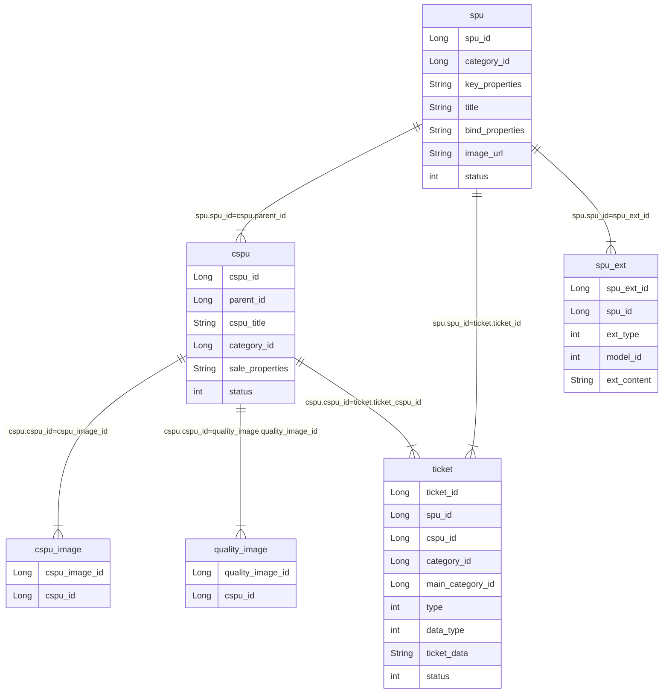
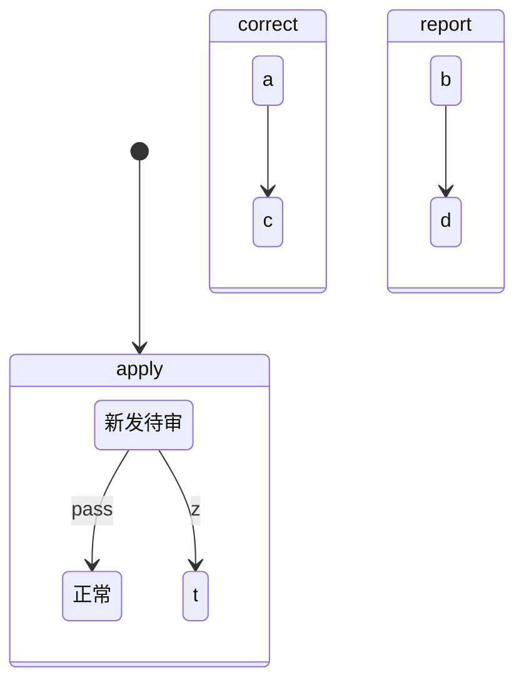

# E-R模型

```mermaid
erDiagram
spu{
	Long spu_id
	Long category_id
	String key_properties
	String title
  String bind_properties
	String image_url
	int status
}
cspu{
	Long cspu_id
	Long parent_id
	String cspu_title
	Long category_id
	String sale_properties
	int status
}
ticket{
	Long ticket_id
	Long spu_id
	Long cspu_id
	Long category_id
	Long main_category_id
	int type
	int data_type
	String ticket_data
	int status
}
cspu_image{
	Long cspu_image_id
	Long cspu_id
}
quality_image{
	Long quality_image_id
	Long cspu_id
}
spu_ext{
	Long spu_ext_id
	Long spu_id
	int ext_type
	int model_id
	String ext_content
}
spu||--|{cspu:"spu.spu_id=cspu.parent_id"
cspu||--|{cspu_image:"cspu.cspu_id=cspu_image_id"
cspu||--|{quality_image:"cspu.cspu_id=quality_image.quality_image_id"
spu||--|{ticket:"spu.spu_id=ticket.ticket_id"
cspu||--|{ticket:"cspu.cspu_id=ticket.ticket_cspu_id"
spu||--|{spu_ext:"spu.spu_id=spu_ext_id"
```

# 状态机

```mermaid
stateDiagram-v2
	[*]-->apply
	
	state apply{
		新发待审-->正常:pass
		新发待审-->t:z
	}
	state correct{
		a-->c
	}
	state report{
		b-->d
	}
	

```

