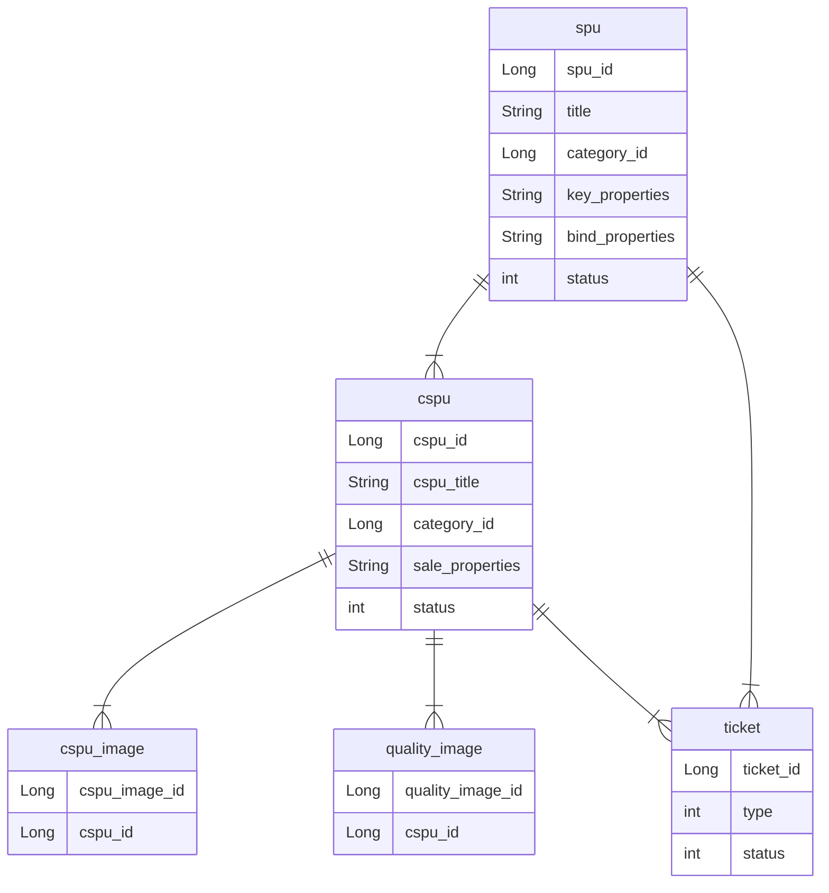
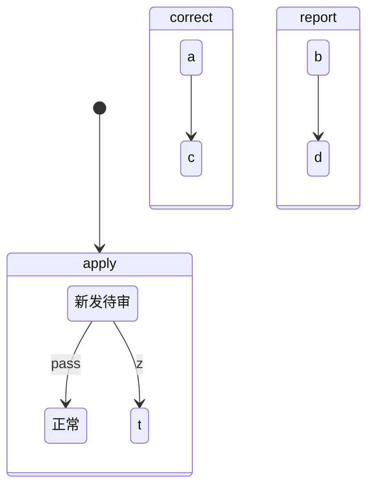

# E-R模型

```mermaid
erDiagram
spu{
	Long spu_id
	String title
	Long category_id
	String key_properties
	String bind_properties
	int status
}
cspu{
	Long cspu_id
	String cspu_title
	Long category_id
	String sale_properties
	int status
}
ticket{
	Long ticket_id
	int type
	int status
}
cspu_image{
	Long cspu_image_id
	Long cspu_id
}
quality_image{
	Long quality_image_id
	Long cspu_id
}
spu||--|{cspu:""
cspu||--|{cspu_image:""
cspu||--|{quality_image:""
spu||--|{ticket:""
cspu||--|{ticket:""

```

# 状态机

```mermaid
stateDiagram-v2
	[*]-->apply
	
	state apply{
		新发待审-->正常:pass
		新发待审-->t:z
	}
	state correct{
		a-->c
	}
	state report{
		b-->d
	}
	

```

