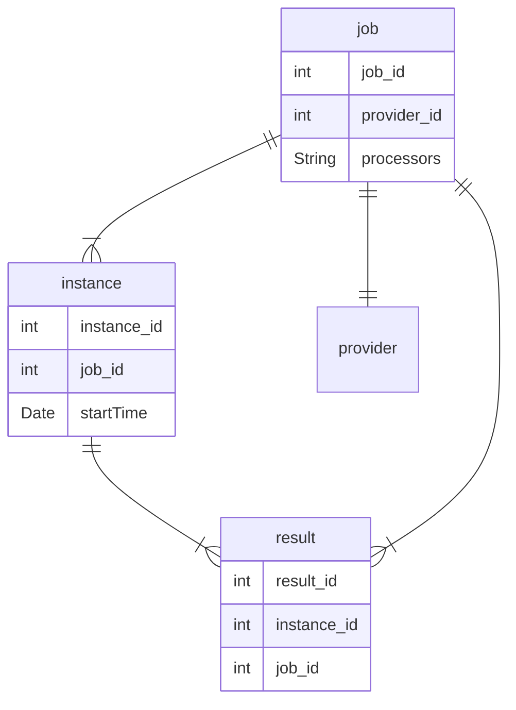
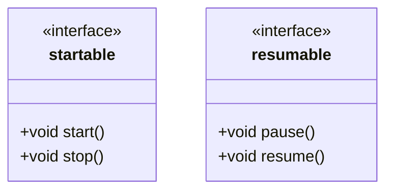

# E-R

```mermaid
erDiagram
job{
	int job_id
	int provider_id
	String processors
}
instance{
	int instance_id
	int job_id
	Date startTime
}
result{
	int result_id
	int instance_id
	int job_id
}
provider{}
job||--|{instance:""
instance||--|{result:""
job||--|{result:""
job||--||provider:""
```

# class

```mermaid
classDiagram
class startable{
  	<<interface>>
  	+void start()
  	+void stop()
}
class resumable{
	<<interface>>
	+void pause()
	+void resume()
}

```

