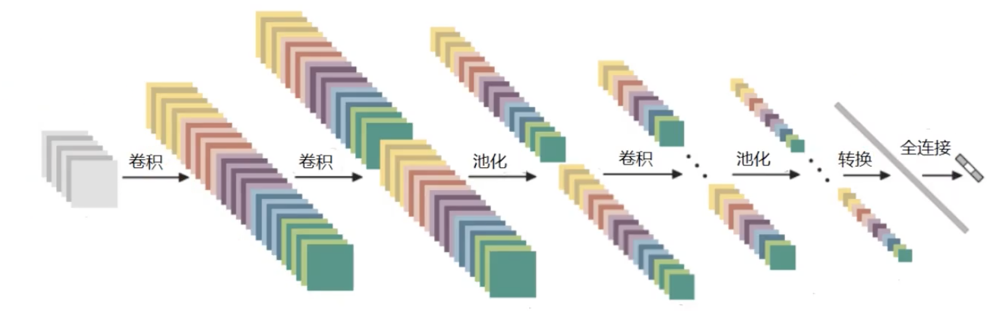
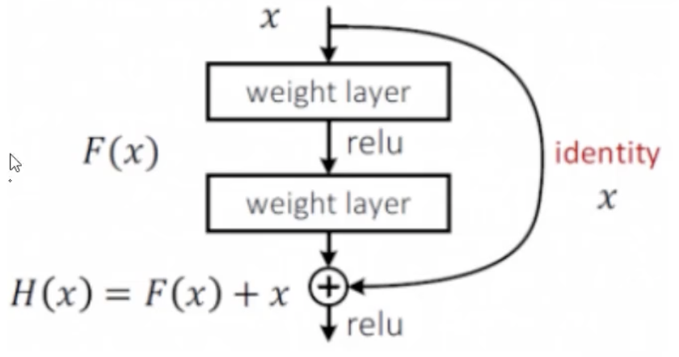

# 1 概述
## 1.1 机器学习流程
- 数据获取
- **特征工程**
- 建立模型
- 评估与应用

## 1.2 特征工程的作用
- 数据特征决定模型上限
- 预处理和特征提取是最合性的
- 算法和参数选择决定了如何逼近这个上限

## 1.3 计算机视觉面临的挑战
- 角度变化
- 形态变化
- 部分遮蔽
- 背景混入

## 1.4 激活函数
将随机生成的数值映射到[0,1]的范围内，从而能够用概率来描述

### 1.4.1 sigmoid函数

$$\sigma(x)=\frac{1}{1+e^{-x}}$$
> 梯度消失问题
### 1.4.2 Relu

$$\sigma(x)=max(0,x)$$
### 1.4.3 Tanh

## 1.5 损失函数

损失函数 = 数据损失+ 正则化惩罚项

> 交叉熵

## 1.6 反向传播

梯度下降

## 1.7 整体架构
- 层次结构
- 神经元
- 全连接
- 非线性

## 1.8 数据预处理

数据标准化

参数初始化

## 1.9 过拟合问题

方案1: 
### 1.9.1 drop-out
为了防止网络太过复杂，每次训练随机选择一部分神经元不参与训练

# 2 卷积神经网络-CNN
## 2.1 应用领域
1. 计算机视觉
	1. 个体检测任务
	2. 分类与检索
		1. 检索：以图搜图
	3. 图像超分辨率重构
	4. 医学任务（细胞、病理识别）
	5. OCR
	6. 路标识别
	7. 无人驾驶
	8. 人脸识别

## 2.2 卷积的作用

### 2.2.1 整体架构
- 输入层
- 卷积层------提取特征
- 池化层------压缩特征
- 全连接层

### 2.2.2 图像颜色通道
RGB颜色通道，则每个颜色的通道各计算一次，得到的结果全部加起来，再加上bias

### 2.2.3 卷积层涉及参数
- 滑动窗口步长
- 卷积核尺寸
- 边缘填充
- 卷积核个数

卷积结果计算公式
- 长度
$$
H_2=\frac{H_1-F_H+2P}{S}+1
$$
- 宽度
$$
W_2=\frac{W_1-F_W+2P}{S}+1
$$
其中H1、W1表示输入高度、宽度；H2、W2表示输出特征图高度、宽度，F表示卷积核长和宽的大小；S表示步长；P表示边界填充（加几圈0）

卷积参数共享

### 2.2.4 池化层
作用：压缩

池化方法
- 最大池化
- 平均池化

### 2.2.5 特征图变化

### 2.2.6 经典网络
1. Alexnet
2. VGG
   缺点： 训练消耗极大
3. Resnet——残差网络
   取空白对照组，对效果不好的网络选择性放弃（置单位阵）
   

   
   
