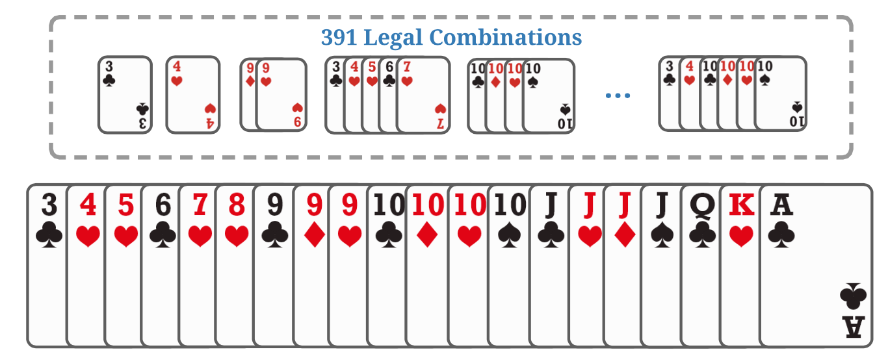

# 1 摘要
游戏是现实世界的抽象，人工代理在其中学习与其他代理竞争和合作。尽管在各种完美信息和不完美信息游戏中取得了显著成绩，但三人卡牌游戏斗地主（又名斗地主）仍未解决。斗地主是一个非常具有挑战性的领域，具有竞争、协作、不完善的信息、大的状态空间，尤其是大量可能的行为，其中法律行为在各个回合之间存在显着差异。不幸的是，现代强化学习算法主要集中在简单和小的动作空间上，不足为奇的是，在斗地主中没有取得令人满意的进展。在这项工作中，我们提出了一个概念上简单但有效的斗地主人工智能系统，即 DouZero，它增强了传统的蒙特卡罗方法
具有深度神经网络、动作编码和并行参与者。从零开始，在具有四个 GPU 的单个服务器上，DouZero 在几天的训练中超越了所有现有的 DouDizhu AI 程序，并在 Botzone 排行榜中排名 344 个 AI 代理的第一名。通过构建 DouZero，我们展示了经典的 Monte-Carlo 方法可以在具有复杂动作空间的硬域中提供强大的结果。代码和在线演示已发布1，希望这种见解可以激发未来的工作。

# 2 引言
游戏通常作为人工智能的基准，因为它们是许多现实世界问题的抽象。在完全信息博弈中取得了显著成就。例如，AlphaGo (Silver et al., 2016)、AlphaZero (Silver et al., 2018) 和 MuZero (Schrittwieser et al., 2020) 在围棋游戏中建立了最先进的性能。最近的研究已经发展到更具挑战性的不完全信息博弈，其中代理在部分可观察的环境中与他人竞争或合作。两人游戏取得了令人鼓舞的进展，例如简单的 Leduc Hold'em 和有限/无限德州 Hold'em (Zinkevich et al., 2008; Heinrich & Silver, 2016; Moravcˇ́ık et al., 2017; Brown & Sandholm, 2018)，多人游戏，例如多人德州扑克 (Brown & Sandholm, 2019b)、星际争霸 (Vinyals et al., 2019)、DOTA (Berner et al., 2019) )、Hanabi (Lerer et al., 2020)、麻将 (Li et al., 2020a)、王者荣耀 (Ye et al., 2020b;a) 和无压力外交 (Gray et al., 2020)。
这项工作旨在为斗地主2（又名斗地主）构建人工智能程序，这是中国最受欢迎的纸牌游戏，拥有数亿日活跃玩家。斗地主有两个有趣的特性
人工智能系统面临的挑战。首先，DouDizhu 中的玩家需要在一个部分可观察的环境中与他人竞争和合作，沟通有限。具体来说，两名农民玩家将组队对抗地主玩家。流行的扑克游戏算法，例如反事实遗憾最小化 (CFR) (Zinkevich et al., 2008)）及其变体，在这种复杂的三人游戏环境中通常并不可靠。其次，斗地主拥有大量平均规模非常大的信息集，并且由于卡片的组合而具有多达 104 个可能的动作的非常复杂和大的动作空间（Zha 等，2019a）。与德州扑克不同，斗地注中的动作不能轻易抽象，这使得搜索计算量大，常用的强化学习算法效率低下。由于高估问题，深度 Q-Learning (DQN) (Mnih et al., 2015) 在非常大的动作空间中存在问题 (Zahaviy et al., 2018)；策略梯度方法，例如 A3C (Mnih et al., 2016)，不能利用 DouDizhu 中的动作特征，因此不能像 DQN 那样自然地泛化看不见的动作 (Dulac-Arnold et al., 2015)。毫不奇怪，之前的工作表明DQN和A3C在斗地主方面并不能取得令人满意的进展。在 (You et al., 2019) 中，即使经过 20 天的训练，DQN 和 A3C 对简单的基于规则的代理的胜率也低于 20%； (Zha et al., 2019a) 中的 DQN 仅略好于对合法移动进行均匀采样的随机代理。

之前已经做出了一些努力，通过将人类启发式与学习和搜索相结合来构建斗地主 AI。组合 Q-Network (CQN) (You et al., 2019) 提出通过将动作解耦为分解选择和最终移动选择来减少动作空间。然而，分解依赖于人类的启发式方法并且非常缓慢。在实践中，经过 20 天的训练，CQN 甚至无法击败简单的启发式规则。 DeltaDou (Jiang et al., 2019) 是第一个与顶级人类玩家相比达到人类水平性能的 AI 程序。它通过使用贝叶斯方法来推断隐藏信息并根据他们自己的策略网络对其他玩家的行为进行采样，从而实现了类似于 AlphaZero 的算法。为了抽象动作空间，DeltaDou 基于启发式规则预训练了一个 kicker 网络。然而，踢球者在斗地注中起着重要的作用，不能轻易抽象。踢球者选择不当可能会直接导致输掉比赛，因为它可能会破坏其他一些卡牌类别，例如单人链。此外，贝叶斯推理和搜索在计算上是昂贵的。即使使用启发式的监督回归初始化网络，训练 DeltaDou 也需要两个多月的时间（Jiang et al., 2019）。因此，现有的斗地主 AI 程序在计算上非常昂贵，并且可能不是最优的，因为它们高度依赖于人类知识的抽象。
在这项工作中，我们介绍了 DouZero，这是一个概念上简单但有效的用于 DouDizhu 的 AI 系统，无需抽象状态/动作空间或任何人类知识。 DouZero 通过深度神经网络、动作编码和并行参与者增强了传统的 Monte-Carlo 方法 (Sutton & Barto, 2018)。 DouZero 有两个理想的属性。首先，与 DQN 不同，它不易受到过度估计偏差的影响。其次，通过将动作编码成卡片矩阵，它可以自然地泛化在整个训练过程中不常见的动作。这两个属性对于处理斗地主庞大而复杂的动作空间至关重要。与许多树搜索算法不同，DouZero 是基于采样的，它允许我们使用复杂的神经架构并在相同的计算资源的情况下每秒生成更多的数据。与许多依赖领域特定抽象的先前扑克 AI 研究不同，DouZero 不需要任何领域知识或底层动态知识。在只有 48 个内核和 4 个 1080Ti GPU 的单台服务器上从头开始训练，DouZero 在半天的时间内超过了 CQN 和启发式规则，在两天内击败了我们的内部监督代理，在十天内超过了 DeltaDou。广泛的评估表明，斗零是迄今为止最强的斗地主人工智能系统。

图 1. 一手牌及其相应的合法移动。

通过构建 DouZero 系统，我们证明了经典的 Monte-Carlo 方法可以在需要对巨大状态和动作空间的竞争和合作进行推理的大型复杂纸牌游戏中提供强大的结果。我们注意到，一些工作还发现蒙特卡罗方法可以实现有竞争力的表现（Mania 等人，2018；Zha 等人，2021a）并有助于稀疏奖励设置（Guo 等人，2018；Zha 等人， 2021b)。与这些专注于简单和小型环境的研究不同，我们展示了蒙特卡洛方法在大型纸牌游戏中的强大性能。希望这种见解可以促进未来关于解决多智能体学习、稀疏奖励、复杂动作空间和不完善信息的研究，我们发布了我们的环境和训练代码。与许多需要数千个 CPU 进行训练的扑克 AI 系统不同，例如 DeepStack (Moravcˇ ́ık et al., 2017) 和 Libratus (Brown & Sandholm, 2018)，DouZero 实现了合理的实验流程，只需要在大多数研究实验室都负担得起的单 GPU 服务器。我们希望它可以激发该领域的未来研究，并作为一个强有力的基线。

# 3 斗地主的背景
斗地主是一款易学难精的流行三人卡牌游戏。它在中国吸引了数亿玩家，每年举办许多比赛。这是一个脱落类型的游戏，玩家的目标是在其他玩家之前清空自己手中的所有牌。两名农民玩家组队对抗另一位地主玩家。如果农民中的任何一个玩家是第一个没有剩余牌的玩家，则农民获胜。每场比赛都有一个叫牌阶段，玩家根据手牌的强度竞标地主，还有一个打牌阶段，玩家轮流打牌。我们在附录 A 中提供了详细介绍。
DouDizhu 仍然是多智能体强化学习的未解决基准（Zha et al., 2019a; Terry et al., 2020）。两个有趣的属性使斗地主特别难以解决。首先，农民需要合作对抗地主。例如，图 10 显示了一个典型的情况，底部的农民可以选择玩一个小 Solo 来帮助右手边的农民获胜。其次，斗地主由于卡牌的组合，动作空间复杂而大。有 27、472 种可能的组合，其中这些组合的不同子集对于不同的手牌是合法的。图 1 是一手牌的例子，它有 391 种合法组合，包括 Solo、Pair、Trio、Bomb、Plane、Quad 等。动作空间不容易抽象，因为不正确的打牌可能会破坏其他类别并直接导致结果在输掉一场比赛。因此，构建斗地主 AI 具有挑战性，因为斗地主的玩家需要在一个巨大的行动空间中对竞争和合作进行推理。

# 4 深度Monte-Carlo
在本节中，我们重新审视蒙特卡洛 (MC) 方法并介绍深度蒙特卡洛 (DMC)，该方法将 MC 与深度神经网络进行泛化以进行函数逼近。然后我们讨论并比较了 DMC 与策略梯度方法（例如，A3C）和 DQN，这些方法在豆滴注中被证明是失败的（You et al., 2019; Zha et al., 2019a）。
## 4.1 具有深度神经网络的蒙特卡罗方法
Monte-Carlo (MC) 方法是基于平均样本回报的传统强化学习算法 (Sutton & Barto, 2018)。 MC 方法是为情节任务设计的，其中经验可以分为情节，所有情节最终都会终止。为了优化策略 π，每次访问 MC 可用于通过迭代执行以下过程来估计 Q-table Q(s, a)：
1. 使用 π 生成情节。
2. 对于每个 s, a 在情节中出现，计算和更新 Q(s, a)，其回报是关于 s, a 的所有样本的平均。
3. 对于情节中的每个 s，π(s) ← arg maxa Q(s, a)。
第 2 步的平均回报通常是通过贴现累积奖励获得的。与依赖自举的 Q 学习不同，MC 方法直接逼近目标 Q 值。在第 1 步中，我们可以使用 epsilon-greedy 来平衡探索和利用。上述过程可以自然地与深度神经网络相结合，从而产生深度蒙特卡洛（DMC）。具体来说，我们可以用神经网络替换 Q 表，并在步骤 2 中使用均方误差 (MSE) 来更新 Q 网络。
虽然 MC 方法被批评不能处理不完整的情节，并且由于高方差而被认为效率低下（Sutton & Barto，2018），但 DMC 非常适合斗地主。首先，斗地主是一个情节任务，因此我们不需要处理不完整的情节。其次，DMC 可以很容易地并行化，以每秒有效地生成许多样本，以缓解高方差问题。

3.2.与策略梯度方法的比较
策略梯度方法，例如 REINFORCE (Williams, 1992)、A3C (Mnih et al., 2016)、PPO (Schulman et al., 2017) 和 IMPALA (Espeholt et al., 2018)，非常流行强化学习。他们的目标是直接使用梯度下降建模和优化策略。在策略梯度方法中，我们经常使用类似分类器的函数逼近器，其中输出随动作的数量线性缩放。虽然策略梯度方法在大动作空间中运行良好，但它们不能使用动作特征来推理以前看不见的动作（Dulac-Arnold 等人，2015）。在实践中，DouDizhu 中的动作可以自然地编码成卡片矩阵，这对于推理至关重要。例如，如果代理因为选择了一个不错的踢球者而受到动作 3KKK 的奖励，它也可以将此知识推广到未来看不见的动作，例如 3JJJ。此属性对于处理非常大的动作空间和加速学习至关重要，因为许多动作在模拟数据中并不常见。
DMC 可以通过将动作特征作为输入来自然地利用动作特征来概括看不见的动作。虽然如果动作规模很大，执行复杂度可能很高，但在斗地主的大多数状态下，只有一部分动作是合法的，因此我们不需要遍历所有动作。因此，DMC 总体上是一种有效的斗地主算法。虽然可以将动作特征引入到 actor-critic 框架中（例如，通过使用 Q-network 作为critic），但类分类器仍然会受到大动作空间的影响。我们的初步实验证实，这种策略不是很有效（见图 7）。
3.3.与深度 Q 学习的比较
最流行的基于值的算法是深度 Q 学习 (DQN) (Mnih et al., 2015)，它是一种引导方法，在下一步根据 Q 值更新 Q 值。虽然 DMC 和 DQN 都近似于 Q 值，但 DMC 在斗地主中具有几个优势。
首先，在使用函数逼近时，由逼近 DQN 中的最大动作值引起的高估偏差难以控制 (Thrun & Schwartz, 1993; Hasselt, 2010)，并且在非常大的动作空间中变得更加明显 (Zahaviy et al., 2018) .虽然一些技术，例如双 Q 学习 (van Hasselt et al., 2016) 和经验回放 (Lin, 1992)，可能会缓解这个问题，但我们在实践中发现 DQN 非常不稳定，并且在斗地主中经常出现分歧。然而，蒙特卡洛估计不易受偏差影响，因为它直接逼近真实值而无需自举（Sutton & Barto，2018）。
其次，DouDizhu 是一项具有长视野和稀疏奖励的任务，即智能体需要在没有反馈的情况下经历一长串状态，并且唯一产生非零奖励的时间是在游戏结束时。这可能会减慢 Q 学习的收敛速度，因为在当前状态下估计 Q 值需要等到下一个状态下的值接近其真实值（Szepesvári, 2009; Beleznay et al., 1999）。与 DQN 不同，Monte-Carlo 估计的收敛性不受情节长度的影响，因为它直接逼近真实目标值。
第三，由于动作空间大且多变，不方便在斗地主中高效实现 DQN。具体来说，DQN 在每个更新步骤中的最大操作将导致高计算成本，因为它需要在非常昂贵的深度 Q 网络上遍历所有合法行为。此外，不同州的合法动作不同，这使得批量学习不方便。结果，我们发现 DQN 在挂钟时间方面太慢了。虽然 Monte-Carlo 方法可能存在高方差（Sutton & Barto, 2018），这意味着它可能需要更多样本才能收敛，但它可以很容易地并行化以每秒生成数千个样本，以缓解高方差问题并加速训练。我们发现 DMC 的高方差远远超过了它提供的可扩展性，并且 DMC 在挂钟时间方面非常有效。

# 5 DouZero系统
在本节中，我们通过首先描述状态/动作表示和神经架构来介绍 DouZero 系统，然后详细说明我们如何将 DMC 与多个进程并行化以稳定和加速训练。
4.1。卡片表示和神经架构
我们使用 one-hot 4 × 15 矩阵对每个卡片组合进行编码（图 2）。由于花色在豆地注中无关紧要，我们使用每一行来表示特定等级或百搭牌的数量。图 3 显示了 Q 网络的架构。对于状态，我们提取了几个卡片矩阵来表示手牌，其他玩家手牌的并集和最近的移动，以及一些 one-hot 向量来表示其他玩家的卡片数量和数量炸弹玩到此为止。同样，我们使用一个卡片矩阵来编码动作。对于神经架构，LSTM 用于编码历史动作，输出与其他状态/动作特征连接。最后，我们使用隐藏大小为 512 的六层 MLP 来生成 Q 值。我们在附录 C.1 中提供了更多详细信息。
4.2.平行演员
我们将 Landlord 表示为 L，在 Landlord 之前移动的玩家为 U，在 Landlord 之后移动的玩家为 D。我们将 DMC 与多个参与者进程和一个学习者进程并行化，分别在算法 1 和算法 2 中进行了总结.学习器为三个位置维护三个全局 Q 网络，并根据参与者进程提供的数据更新具有 MSE 损失的网络以逼近目标值。每个参与者维护三个局部 Q 网络，它们定期与全局网络同步。 Actor 将重复从游戏引擎中采样轨迹，并计算每个状态-动作对的累积奖励。学习者和参与者的通信是通过三个共享缓冲区实现的。每个缓冲区分为几个条目，其中每个条目由几个数据实例组成。

5. 实验
这些实验旨在回答以下研究问题。 RQ1：斗零与现有的斗地主程序相比如何，例如基于规则的策略、监督学习、基于 RL 的方法和基于 MCTS 的解决方案（第 5.2 节）？ RQ2：如果我们考虑投标阶段（第 5.3 节），DouZero 的表现如何？ RQ3：DouZero 的训练效率如何（第 5.4 节）？ RQ4：DouZero 与 bootstrapping 和 actorcritic 方法相比如何（第 5.5 节）？ RQ5：DouZero 学习的纸牌策略是否与人类知识一致（第 5.6 节）？ RQ6：与现有程序相比，DouZero 在推理方面的计算效率高吗（第 5.7 节）？ RQ7：斗零的两个农民能否学会相互合作（5.8节）？