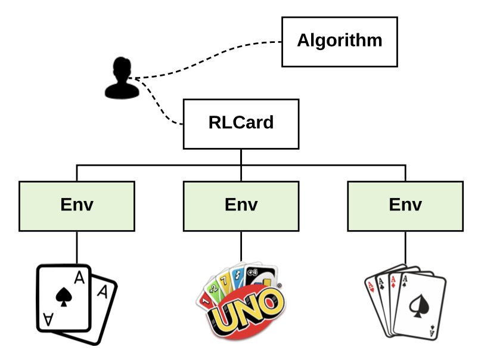
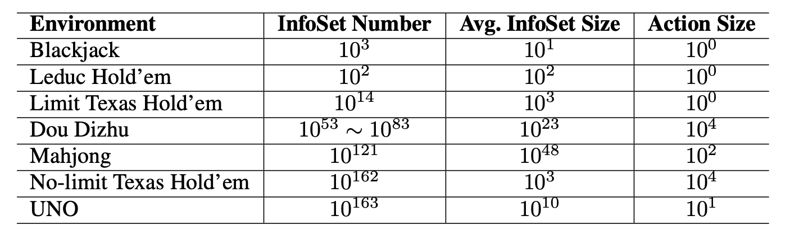
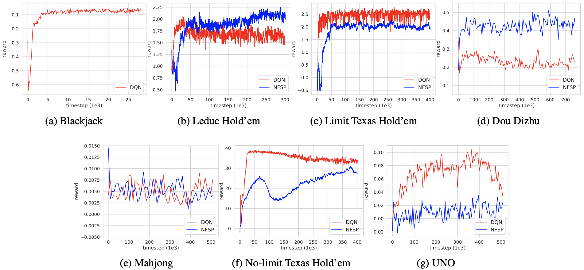
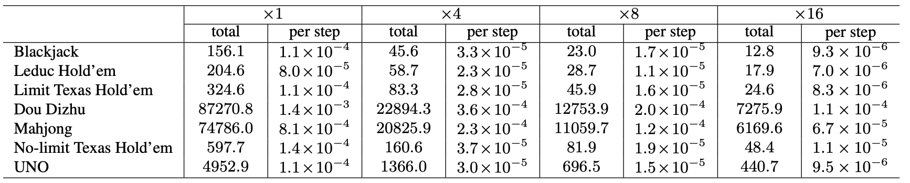
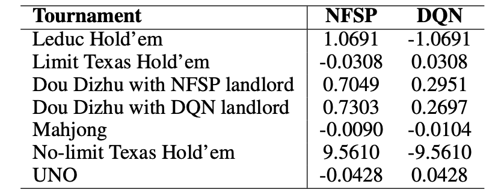

# 1 摘要
我们介绍了 RLCard，一个用于纸牌游戏强化学习研究的开源工具包。 它以易于使用的界面支持各种卡片环境，包括 Blackjack、Leduc Hold'em、Texas Hold'em、UNO、Dou Dizhu 和 Mahjong。 RLCard 的目标是架起强化学习和不完美信息博弈的桥梁，推动强化学习在多智能体、大状态和动作空间以及稀疏奖励领域的研究。 在本文中，我们概述了 RLCard 中的关键组件，讨论了设计原则，简要介绍了接口，并对环境进行了综合评估。 代码和文档可在 https://github.com/datamllab/rlcard 获得。

# 2 引言
强化学习 (RL) 是人工智能中一种很有前途的范式，用于学习面向目标的任务。通过与环境的交互，强化学习代理学会以试错的方式在每个状态下做出决策。随着神经网络作为函数逼近器，深度强化学习最近在各个领域取得了突破：Atari 游戏 (Mnih et al. 2015)、围棋游戏 (Silver et al. 2017)、连续控制 (Lillicrap et al. 2015) ) 和神经架构搜索 (Zoph and Le 2016)，仅举几例。然而，在这些成就中，强化学习在具有多个代理、大决策空间或稀疏奖励的应用中仍然不成熟且不稳定。

在本文中，我们介绍了用于强化学习研究的各种风格的卡片环境。纸牌游戏是具有多种挑战的理想测试平台。首先，纸牌游戏由多个代理人玩，他们必须学会相互竞争或合作。例如，在斗地主中，农民需要齐心协力对抗地主才能赢得比赛。其次，卡牌游戏拥有巨大的状态空间。例如，UNO 中的状态数可以达到 $10^{163}$。每个玩家的牌对其他玩家都是隐藏的。玩家不仅需要考虑自己的手牌，还必须从其他玩家的行动信号中推断出其他玩家的牌。第三，卡牌游戏可能有较大的动作空间。例如，斗地主中可能的动作数可以达到$10^4$个，并伴随着卡牌组合的爆炸式增长。最后，纸牌游戏可能会受到稀疏奖励的影响。例如，在麻将中，获胜的手牌很少。如果随机玩，我们每五百场比赛就会观察到一手获胜的手牌。此外，纸牌游戏很容易理解，非常受欢迎。德州扑克、UNO、斗地主等游戏有数亿人在玩。我们通常不需要花精力去学习规则，然后我们就可以深入算法开发。


图 1：RLCard 概览。 它支持各种风格的纸牌游戏，如投注游戏、中国扑克和棋盘游戏，由易于使用的界面包装。

开发具有易于使用的界面的卡片环境是一项具有挑战性的任务。首先，这些界面必须可供可能具有或不具有博弈论背景的 RL 研究人员访问。在扩展型游戏中，玩家在采取行动后不会立即观察到她的下一个状态。只有在所有其他玩家都选择了他们的行动之后，下一个状态才会暴露给玩家。这使得设计环境接口变得困难。其次，环境需要是可配置的。出于研究目的，状态表示、动作抽象、奖励设计甚至游戏规则都应该很容易调整。

我们介绍了 RLCard，这是一个为纸牌游戏中的强化学习而设计的开源工具包。 它支持各种卡片环境，如表 1 所示。这些界面对于强化学习来说很简单。 在多智能体设置中的完整游戏之后，每个玩家的转换和收集和组织良好。 我们还提供了一个单一代理界面，使用预先训练的模型模拟其他玩家。 状态和动作编码可以很容易地配置。 游戏在相同的结构下实现，逻辑清晰。 提供了评估工具来衡量比赛的获胜率。 未来版本将扩展工具包以包含更多环境。 RLCard 的目标是架起强化学习和不完美信息博弈的桥梁，推动强化学习在多智能体、大状态空间、大动作空间和稀疏奖励领域的研究。



表 1：RLCard 中的游戏摘要。 InfoSet Number：信息集的个数； 平均 InforSet Size：单个信息集中的平均状态数； Action Size：动作空间的大小（没有抽象）。 请注意，对于某些游戏，我们只能提供一定范围的复杂度估计。 例如，斗地主允许大量合法的牌组合，这使得估计状态空间的大小变得具有挑战性。


# 3 综述
在本节中，我们将概述 RLCard，并介绍接口。更多介绍可以在附录中找到。图 1 显示了 RLCard 的概述。每个游戏都由一个具有易于使用的界面的环境类包装。使用 RLCard，我们可以专注于算法开发，而不是游戏的工程工作。在开发工具包时，我们采用以下设计原则：
• 可重现。环境下的结果可以重现。在不同的运行中使用相同的随机种子应该获得相同的结果。
• 无障碍。每场比赛结束后，经验都会被收集并组织得井井有条，界面简洁。状态表示、动作编码、奖励设计，甚至游戏规则，都可以方便地配置。
• 可扩展。使用上述设计原则，可以方便地将新的卡片环境添加到工具包中。我们尽量减少工具包中的依赖关系，以便可以轻松维护代码。
可用环境
该工具包提供了多种风格的纸牌游戏，深受亿万人喜爱，包括博彩游戏、中国扑克和一些棋盘游戏。表 1 总结了 RLCard 中的纸牌游戏，并估计了每个游戏的复杂性。游戏规模可以通过信息集的数量来衡量，这些信息集是从一个玩家的角度观察到的状态。信息集的平均大小定义为每个信息集中可能的游戏状态的平均数量。例如，从德州扑克中一位玩家的观察来看，其他玩家可能有很多可能的牌。每个可能的手对应于该信息集中的一个游戏状态。还提供了动作空间的大小，因为大的动作空间会大大增加难度。
由于大多数游戏都有非常大的状态空间，因此很难立即解决这些人类大小的游戏。因此，我们还实现了一些大型游戏的一些较小版本。例如，RLCard 还实现了一个更小的版本的斗地主，我们只保留卡片 8、9、10、J、Q、K 和 A。这个变体保留了斗地主的关键特性，但状态空间要小得多。

## 3.1 基本接口
我们提供了一个快速上手的运行功能。 它直接生成收益和游戏数据，这些数据被组织为转换，即（状态、动作、奖励、下一个状态、完成）。 这个接口是为不需要遍历博弈树的算法设计的。 用三个随机代理运行斗地主的例子如下：
```python
import rlcard import RandomAgent

# 4 Initialize the environment

env = rlcard.make(’doudizhu’)

# Initialize random agents

agent = RandomAgent ()  
env . set agents ([ agent , agent , agent ])

while

True :

# Generate data from the environment

trajectories , payoffs = env.run()

# Train agent here
```

对于不需要在博弈树中向后遍历的基于采样的算法（Heinrich、Lanctot 和 Silver 2015；Heinrich 和 Silver 2016；Lanctot 等人 2017），基本接口可能是首选，因为我们不需要关心 穿越的细节。

## 3.2 进阶接口
我们还提供了一些在游戏树上运行的高级接口。 遵循其他 RL 工具包（Brockman 等人 2016；Lanctot 等人 2019），我们定义了一个阶梯函数，在给定当前动作的情况下将环境移动到下一个状态。 为了能够向后遍历，我们提供了一个后退函数，它可以遍历到之前的状态。 注意当前玩家的动作会导致下一个玩家的观察，而当前玩家只有在所有其他玩家都选择了他们的动作后才能观察她的下一个状态。 因此，由于下一个状态是“延迟的”，因此用户需要小心步进和后退。

图 2：就针对随机代理的性能而言，卡片环境的学习曲线。 X 轴表示与随机代理对抗。
在环境中采取的总步骤。 Y轴是获得的奖励


请注意，step and step back 的设计类似于传统的基于树的界面。 具体来说， step 对应于访问子节点， step 将访问父节点。 这种设计实现了博弈树的灵活节点访问策略，例如外部采样 MC-CFR (Lanctot et al. 2009)。
# 4 评估
本节进行实验以评估工具包。 我们主要关注以下两个问题：（1）最先进的强化学习算法如何在引入的环境中执行？ (2) 生成游戏数据需要多少计算资源？
## 4.1 在环境中训练代理
我们将 Deep Q-Network (DQN) (Silver et al. 2016)、Neural Fictitious Self-Play (NFSP) (Heinrich and Silver 2016) 和 Counterfactual Regret Minimization (CFR) (Zinkevich et al. 2008) 应用于环境。这些算法属于不同的类别。 DQN 是一种标准的单智能体强化学习算法，NFSP 是一种针对不完美信息博弈的深度强化学习方法，CFR 是针对广泛不完美信息博弈的标准后悔最小化方法。对于 DQN，我们将其他玩家固定为随机代理，以便可以在单代理设置中训练 DQN 代理。我们只在 Leduc Hold’em 上测试 CFR，因为它的计算成本很高，需要完全遍历游戏树。 Blackjack 仅由 DQN 测试，因为它是单代理环境。评估代理并非易事。不完美信息博弈的表现通常通过可利用性来衡量（Zinkevich et al. 2008; Johanson et al. 2011），它寻找针对训练策略的最佳响应。然而，在工具包中为大型环境获得最佳响应的计算成本很高，因为它依赖于博弈树的遍历。因此，我们根据获胜率评估性能。在本文中，我们采用两种方法对性能进行实证评估。首先，我们报告了代理人对随机代理人的获胜率。其次，我们将代理与锦标赛进行比较。在我们的实验中，对超参数进行了轻微调整。对于 DQN，内存大小选择在 {2000, 100000}，折扣因子设置为 0.99，应用 Adam 优化器，学习率为 0.00005，网络结构为 MLP，大小为 10-10 128-128, 512 -512 或 512-1024-2048-1024-512 基于状态和动作空间的大小。对于 NFSP，预期参数从 {0.1, 0.5} 中选择。监督学习和强化学习的内存大小分别为 106 和 3×104。

### 4.1.1 针对随机代理的结果。
与随机代理的性能方面的学习曲线如图 2 所示。代理的奖励是通过与随机代理的竞争获得的。具体来说，投注游戏（Leduc Hold'em、Limit Texas Hold'em、No-limit Texas Holdem）的回报被定义为每手赢得大盲注的平均数。其他游戏的奖励直接从获胜率中获得。在斗地主中，玩家扮演着不同的角色（地主和农民）。我们在评估中确定代理人作为房东的角色。
我们做了两个观察。首先，所有算法对随机代理都有相似的结果。 DQN 在德州扑克和 UNO 上略好于 NFSP，而 NFSP 在 Leduc Hold'em 和斗地主上略好于 DQN。 DQN 实现这个结果是合理的，因为 DQN 被训练来利用随机代理。其次，NFSP 和 DQN 在大型游戏中高度不稳定。具体来说，他们在 UNO、麻将和斗地主的学习过程中只取得了微小的进步。这些游戏具有挑战性，因为它们的状态/动作空间大且奖励稀少。我们相信还有很大的改进空间。需要更多的努力来研究我们如何在这些大型环境中稳定地训练强化学习代理。

表 2：1、000、000 场随机代理的游戏在一个进程和多个进程下的运行时间（以秒为单位）。 每步：运行时间除以执行的时间步数。



表 3：NFSP 和 DQN 通过玩 10, 000 场游戏的平均收益。 对于斗地主，我们将地主和农民的角色互换，分别报告结果。 对于麻将，每局游戏中两个 DQN 代理和两个 NFSP 代理随机选择座位，并报告平均结果。


### 4.1.2 比赛结果。
我们报告了代理人在相互对抗时获得的平均收益。 NFSP 和 DQN 之间的结果如表 3 所示。我们观察到 NFSP 在大多数环境中都比 DQN 强。我们还在 Leduc Hold’em 上将 CFR 与 NFSP 和 DQN 进行了比较。 CRF 取得了更好的性能，分别比 NFSP 和 DQN 赢得了 0.0776 和 1.2493。
### 4.1.3 讨论
我们进一步分析训练有素的代理。我们发现 DQN 代理在博彩游戏中表现得非常激进。例如，在 Leduc Hold'em 环境中，DQN 代理几乎在每个决策中都倾向于选择“加注”或“跟注”。有趣的是，当对手是随机代理时，这种简单的策略很有效，因为随机代理可能很容易选择“弃牌”，这样 DQN 策略就可以获胜。然而，DQN 策略可能具有高度可利用性，因为人们很容易发现它的弱点。因此，针对随机代理的性能只能是一种了解代理是否在环境上有所改善的方法，但不足以用于评估算法。对于大型游戏，我们建议通过与现有模型对战来评估算法。为了对评估进行基准测试，我们将在未来开发基于规则的代理和更强大的预训练模型。

## 4.2 运行时间分析
我们通过使用随机代理在游戏上运行自我游戏来评估实施环境的效率。 具体来说，我们报告了使用单个进程和多个进程的 1、000、000 个游戏的运行时间（以秒为单位）。 由于斗地主、UNO 和麻将在一个游戏中具有长序列，我们另外报告了运行时间的归一化版本，即每个时间步的平均运行时间。 我们的实验在具有 24 个 Intel(R) Xeon(R) Silver 4116 CPU @2.10GHz 处理器和 64.0 GB 内存的服务器上进行。 每个实验使用不同的随机种子运行 3 次。 表 2 中报告了以秒为单位的平均运行时间。我们观察到，所有环境都可以通过更多处理器实现更高的吞吐量。

# 5 相关工作
有一些开源强化学习库，其中大部分专注于单智能体环境（Brockman et al. 2016; Duan et al. 2016; Shi et al. 2019）。最近，有一些项目支持多智能体环境（Vinyals et al. 2017; Zheng et al. 2018; Juliani et al. 2018; Suarez et al. 2019）。但是，它们不支持纸牌游戏环境。一个当代框架 OpenSpiel (Lanctot et al. 2019) 提供了大量游戏，包括几个简单的纸牌游戏。我们的工具包专为具有简单界面的纸牌游戏而设计，支持现有工具包中未包含的各种风格的纸牌游戏。
文学中最流行的解决扑克游戏的技术是反事实遗憾最小化 (CFR) (Zinkevich et al. 2008) 及其变体 (Brown et al. 2018)。德州扑克等博彩游戏已经取得了成就（Moravcˇ́ık et al. 2017; Brown and Sandholm 2017）。然而，CFR 的计算成本很高，因为它依赖于博弈树的完全遍历，对于斗地主等状态空间较大的博弈是不可行的（Jiang et al. 2019）。
最近的研究表明，强化学习策略可以在博彩游戏中表现良好（Heinrich, Lanctot, and Silver 2015；Heinrich and Silver 2016；Lanctot et al. 2017），并在斗地主中取得令人满意的表现（Jiang et al. 2019）。 RL 的鼓舞人心的结果和灵活性提供了在具有大状态和动作空间的更困难的纸牌游戏中探索深度强化学习的机会。


# 6 结论及未来方向
在本文中，我们介绍了 RLCard，一个用于纸牌游戏强化学习研究的开源工具包。 RLCard 支持多种具有挑战性的卡片环境，并带有通用且易于使用的界面。 未来，我们计划在几个方面增强工具包。 首先，为了对评估进行基准测试，我们希望设计基于规则的代理并提供更多预训练模型进行评估。 其次，我们计划为环境开发可视化和分析工具。 第三，我们将通过更高效的实施进一步加速环境。 最后，我们将包括更多有趣的游戏和更多的算法来丰富工具包。

# 7 参考文献
（略）

# 8 附录

## 8.1 游戏设计
纸牌游戏通常按照类似的程序进行。我们设计了几个在特定游戏中实现的抽象基类。在工具包中，对一些常见的概念进行了抽象和定义如下：
- 玩家。玩游戏的人。每个游戏通常由多个玩家玩。
- 游戏。游戏是从一个非终结状态开始到终结状态的完整序列。在游戏结束时，每个玩家都会收到一笔奖金。
- 游戏轮。一轮是游戏序列的一部分。大多数纸牌游戏可以自然地分为多个回合。例如，德州扑克由四轮投注组成。在斗地主比赛中，当两名球员连续传球时，一轮结束。
- 发牌员。纸牌游戏通常需要洗牌并将一副纸牌分配给玩家。经销商负责甲板管理。
- 法官。裁判负责在一轮或比赛结束时做出重大决定。例如，UNO 中的下一个玩家是根据最后一张牌的类型决定的。在德州扑克中，收益是在游戏结束时确定的。
工具包中的游戏是通过将一个类与上述每个概念相关联来实现的。通用设计原则使游戏逻辑易于遵循和理解。其他纸牌游戏通常都兼容上述结构，以便可以轻松添加到工具包中。


## 8.2 环境接口
本节简要介绍工具包的接口。我们描述了状态表示、动作编码，以及我们如何修改它们来定制环境。之后，我们展示了如何通过多个进程生成数据。最后，我们引入了一个单代理接口，其中其他玩家通过预先训练或基于规则的模型进行模拟。更多文档和示例可以在 Github 存储库中找到。
### 8.2.1 状态表示
状态被定义为在游戏的特定时间步长中从一个玩家的角度可以观察到的所有信息。在工具包中，每个状态都是一个由两个值组成的字典。第一个值是法律行动列表。第二个价值是观察。有多种方法可以对观察进行编码。对于二十一点，我们直接使用玩家的分数和庄家的分数作为表示。对于工具包中的其他游戏，我们将观察到的卡片编码为几个卡片平面。例如，在斗地主中，策略的输入是一个6张牌面的矩阵，包括当前手牌、另外两名玩家手牌的联合、最近三个动作以及所有出牌的联合。
### 8.2.2 动作编码 
游戏中的具体动作都被编码成动作索引，动作索引是从 0 开始的正整数。每个动作索引对应游戏中的一个动作。法律行动也表示为行动索引列表。在每一步，代理人应该在合法行为中选择一个行为指数（即整数值），而不是特定行为（例如二十一点中的“击中”或“站立”）。
对于一些大型游戏，采用动作抽象来减少动作空间。例如，斗地主遭受了动作空间的组合爆炸，有超过 3 × 104 个动作，其中任何三人、平面或四人都可以与任何单独的牌或对子（踢球者）组合。为了减少动作空间，我们只对组合的主要部分进行编码，并使用规则来决定踢球者。这样，斗地主的动作空间就缩小到了309。
### 8.2.3 定制
除了默认状态和动作编码之外，我们的设计还支持定制状态表示、动作编码、奖励设计，甚至游戏规则。
每个游戏都由一个 Env 类包装，我们可以在其中重写一些关键函数来自定义环境。提取状态的作用是将原始游戏状态转换为表示。解码动作的功能是将动作索引映射到动作。可以通过修改这个函数来实现他自己的动作抽象。 get payoffs 函数将在游戏结束时返回玩家的收益。对于每个游戏，我们为上述每个组件提供默认设置。鼓励用户自定义这些设置以获得更好的性能。
每个游戏的参数也可以调整。例如，可以通过修改 LimitholdemGame 类的 init 函数来更改有限德州扑克中的玩家人数或固定加注。这样，我们就可以根据自己的目的调整游戏的难度，逐步设计算法。
### 8.2.4 并行训练
该工具包支持多进程生成游戏数据。并行运行将大大加速大型环境中的训练。具体来说，我们在初始化时创建了重复的环境。然后每个worker将从主进程复制模型参数，在环境副本中生成游戏数据，并将数据发送到主进程。主进程将收集所有数据以在 CPU 或 GPU 上训练代理。可以在 Github 存储库中找到具有多个进程的训练代理的示例实现。
### 8.2.5 单代理接口
我们提供接口来探索在纸牌游戏中训练单代理强化学习代理。具体来说，我们开发了预训练或基于规则的模型来模拟其他玩家，以便从一个玩家的角度来看，游戏基本上变成了单智能体环境。这些单智能体环境也具有挑战性，因为它们具有大的状态和动作空间以及稀疏的奖励。未来，我们计划使用不同级别的模拟模型来创建具有各种难度的环境。单代理接口遵循 OpenAI Gym (Brockman et al. 2016)。具体来说，在单智能体模式下，给定一个动作，step 函数将返回下一个状态、奖励以及游戏是否完成。重置功能将重置游戏并返回初始状态。标准的单智能体 RL 算法可以很容易地应用于环境。


# 9 原文链接
1. [1910.04376](../斗地主AI研学.assets/1910.04376.pdf)