# 1 mermaid

## 1.1 资料链接💾

>  [官网](https://mermaidjs.github.io/) 
>
>  [github项目地址](https://github.com/knsv/mermaid) 
>
>  [文档](https://mermaid-js.github.io/mermaid/#/)

## 1.2 图标方向

语法如下

```text
graph 方向描述
	其他语句
```

其中方向描述为

| 用词 |   含义   |
| :--: | :------: |
|  TB  | 从上到下 |
|  BT  | 从下到上 |
|  RL  | 从右到左 |
|  LR  | 从左到右 |


## 1.3 节点定义

|       语法        |      说明      |
|:-----------------:|:--------------:|
|   start[start]    |    直角矩形    |
|   start(start)    |    圆角矩形    |
|  start([start])   |    体育场形    |
| start`[[start]] ` |    长灯光形    |
|  start[(start)]   |    圆柱体形    |
|  start((start))   |     正圆形     |
|   start>start]    |     标签形     |
|   start{start}    |      菱形      |
|  start{{start}}   |     六角形     |
|  start[/start/]   |   平行四边形   |
|   start[\start]   | 反向平行四边行 |
| start `[/start\]` |      梯形      |
| start `[\start/]` |     倒梯形     |

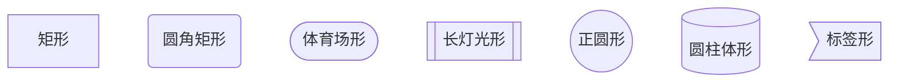

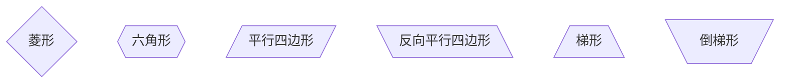


需要注意的是，如果节点的文字中包含标点符号，需要时用双引号包裹起来。
另外如果希望在文字中使用换行，请使用  `<br/>`  替换换行

## 1.4 节点间的连线

|    长度    |  1   |   2   |   3    |
| :--------: | :--: | :---: | :----: |
|    正常    | ---  | ----  | -----  |
| 普通带箭头 | -->  | --->  | ---->  |
|     粗     | ===  | ====  | =====  |
|  粗带箭头  | ==>  | ===>  | ====>  |
|    点缀    | -.-  | -..-  | -...-  |
| 点缀带箭头 | -.-> | -..-> | -...-> |


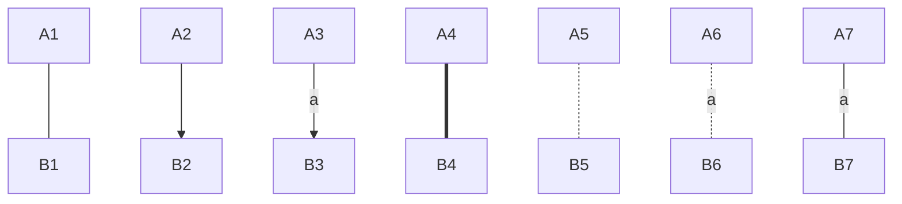

特殊连线

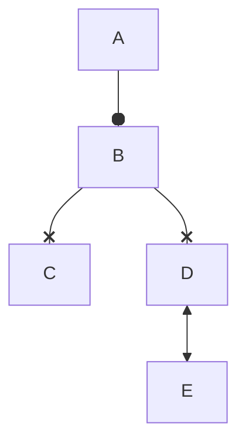


## 1.5 子图表

使用以下语法添加子图表

```text
subgraph 子图表名称
	子图表中的描述语句。。。
end
```


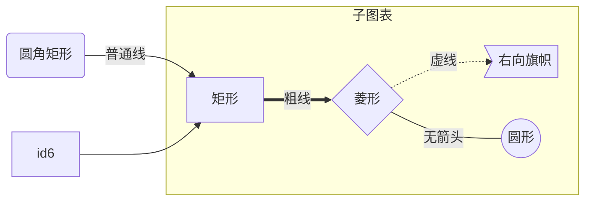


## 1.6 图表类型及示例

目前typora支持以下类型

### 1.6.1 时序图——sequenceDiagram

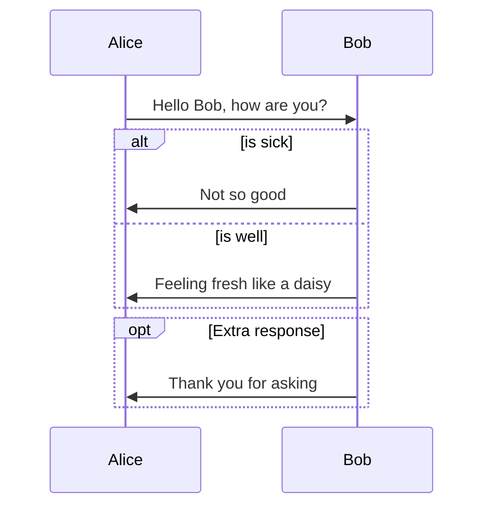

| Type | Description                                      |
| ---- | ------------------------------------------------ |
| ->   | Solid line without arrow                         |
| -->  | Dotted line without arrow                        |
| ->>  | Solid line with arrowhead                        |
| -->> | Dotted line with arrowhead                       |
| -x   | Solid line with a cross at the end               |
| --x  | Dotted line with a cross at the end.             |
| -)   | Solid line with an open arrow at the end (async) |
| --)  | Dotted line with a open arrow at the end (async) |

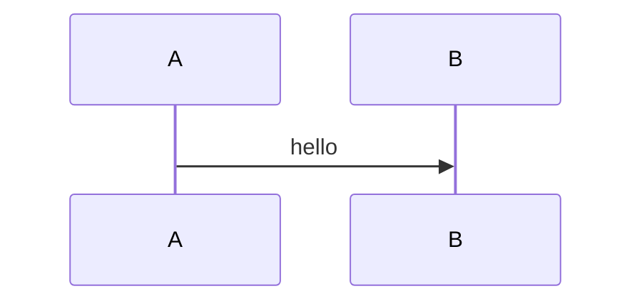


### 1.6.2 流程图——flowchart

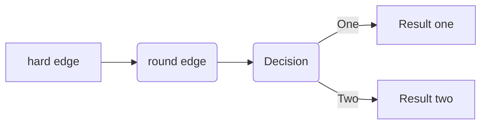


### 1.6.3 Gantt

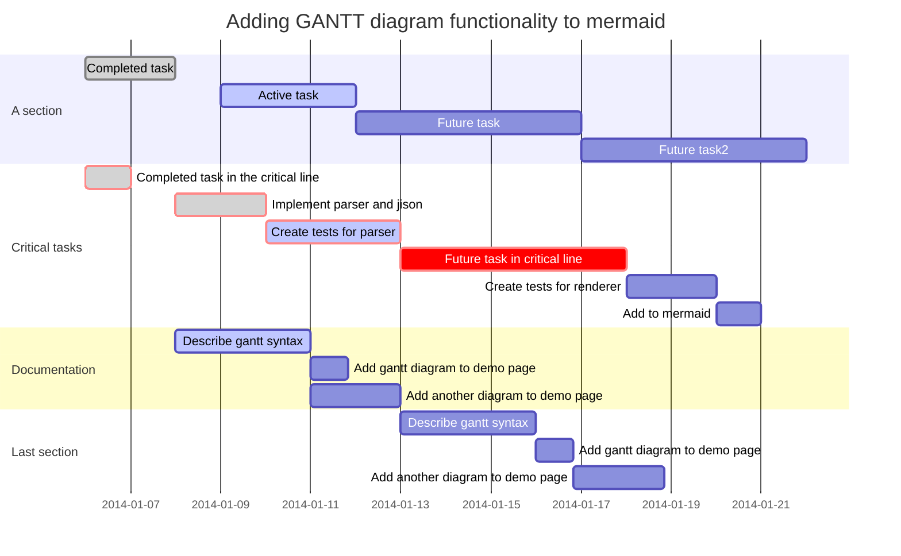


### 1.6.4 类图——classDiagram

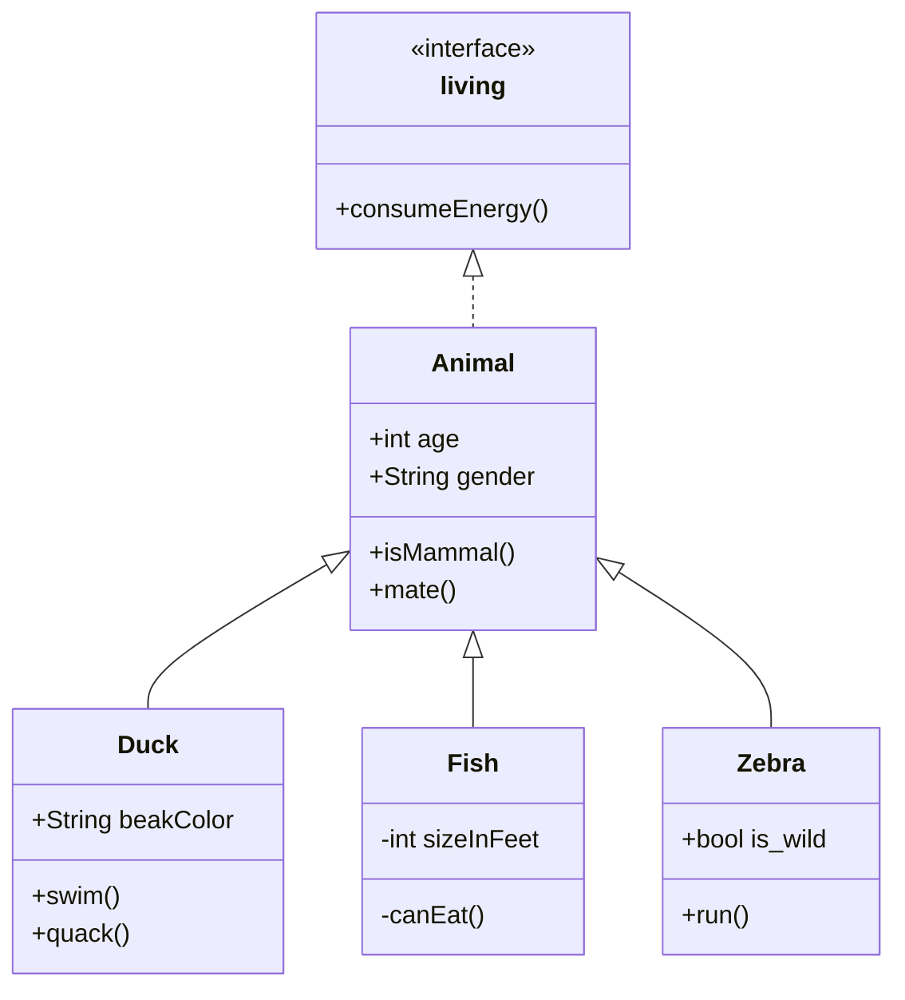


relationship

| Type  | Description   |
| ----- | ------------- |
| <\|-- | Inheritance   |
| *--   | Composition   |
| o--   | Aggregation   |
| -->   | Association   |
| --    | Link (Solid)  |
| ..>   | Dependency    |
| ..\|> | Realization   |
| ..    | Link (Dashed) |


### 1.6.5 状态图——stateDiagram

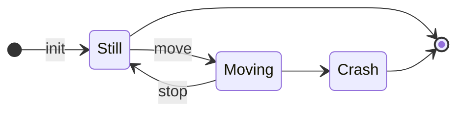


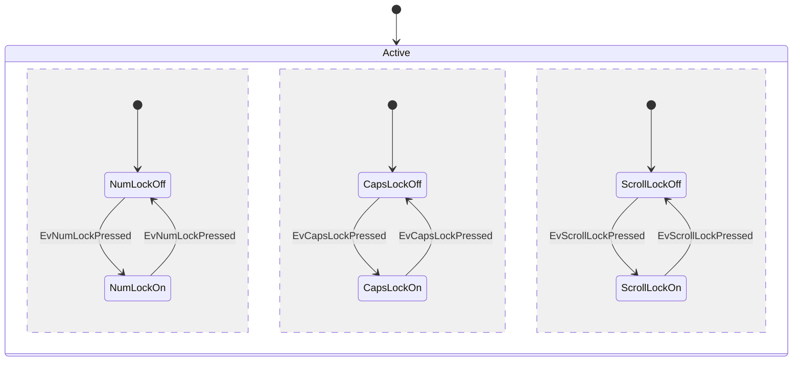


### 1.6.6 饼图——pie

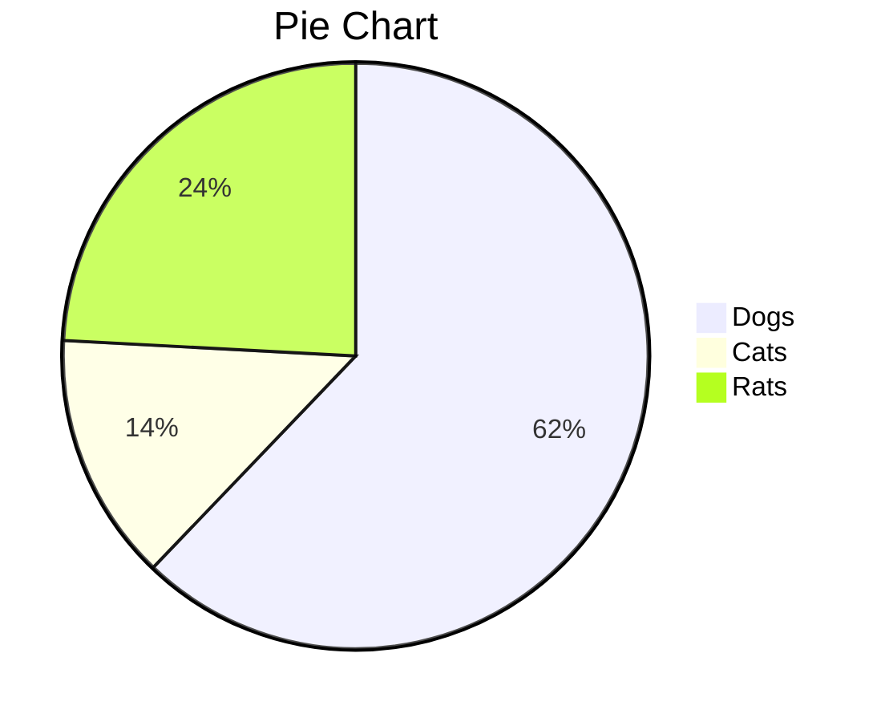


### 1.6.7 实体关系图——erDiagram

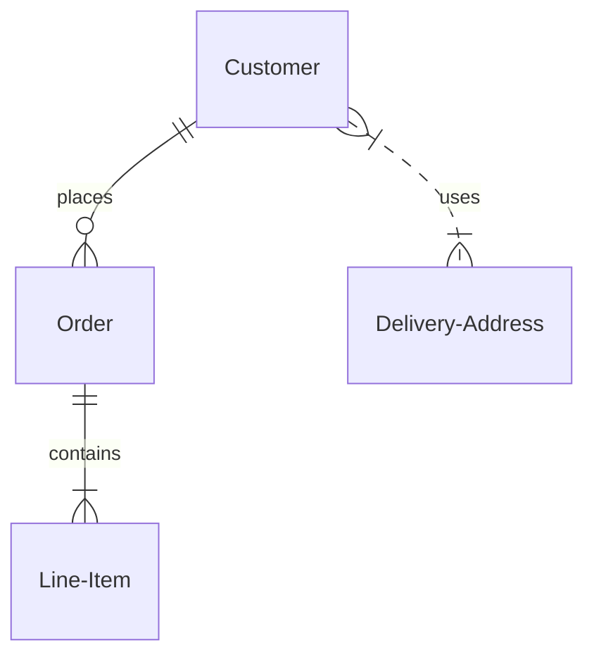


## 1.7 更新typora集成的mermaid版本

### 1.7.1 当前版本

```mermaid
info
```

### 1.7.2 升级typora自带的mermaid版本方法

参看链接： [Typora不支持最新Mermaid语法的解决办法](https://qzy.im/blog/2020/05/typora-integrate-the-latest-version-of-mermaid/#%E6%9B%BF%E6%8D%A2mermaid%E5%8E%9F%E5%85%88%E5%BC%95%E7%94%A8%E7%9A%84js%E6%96%87%E4%BB%B6) 

 [mermaid git repo]( https://github.com/mermaid-js/mermaid.git) 

操作方法：

1. 打开package.json，发现其中的scripts中有build命令
2. 使用yarn build命令，用于生成编译后的js文件，一般生成在根目录下
3. 将这个新生成的js文件替换到typora的mermaid目录下


### 1.7.3 mermaid仓库的编译方法

1. 安装`npm`或`yarn`，此处以npm`为`例

1. execute  `npm install -g npm` to upgrade npm to the latest version

2. 运行命令`npm run install`，安装必要的依赖

3. 打开工程目录下package.json文件，关键参数都写在里面，如当前版本version，输出目录exports，运行命令等。查看script等命令

   

4. 运行`npm run build`命令，生成工程文件。

5. 生成完成后在工程根目录下得到一个dist文件夹，其中`mermaid.min.js`文件就是目标文件，执行文件替换即可

