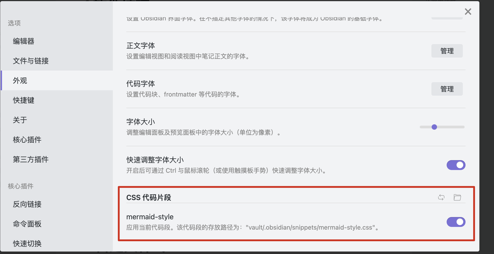
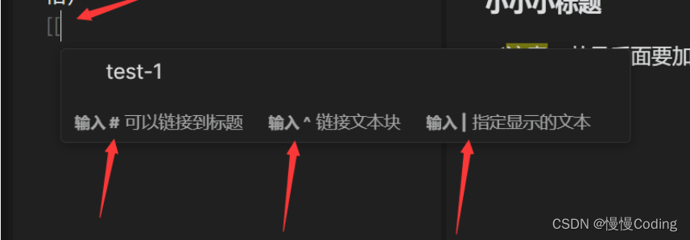

# 1 软件技巧
obsidian 的仓库配置每个是独立的，在设置仓库根目录的时候会生成`.obsidian`的目录，用于存放目录、配置等内容

# 2 常用插件
1. dataview------数据看板插件
2. number headings------给标题自动编号的插件，会实际增加数字到标题中
3. advanced tables——表格插件
4. Obsidian Git——用于将本地笔记同步到github/gitee等云端
5. customer attachment location------用于自定义附件位置
6. clear unused images------清理未使用图片，目前排除目录功能尚未弄清
7. remember cursor position——记录光标位置，切换回来时停留在之前的位置
8. Image Toolkit——点击图片可放大

# 3 配置调整

# 4 自定义样式
设置-》外观-〉

# 5 编辑技巧
## 5.1 （重要）创建链接
总体的方法是输入 `[[`，，然后按以下提示，选择想要的链接内容；

### 5.1.1 链接到指定文章
只需要输入 `[[`，并从弹出的列表里选择自己需要链接的文件即可。

### 5.1.2 链接到指定文章的指定标题
笔记文件一般都有标题。因此，除了链接整篇笔记外，也可以单独链接到某个笔记的某个标题。
操作说明: 首先还是输入 ``[[``，并通过方向键选择所需链接的笔记。当该笔记被选中（高亮）时，按下 #（即 shift-3）来代替回车键。此时，弹出的列表将显示该笔记中的标题。然后，通过上下方向键或输入关键词来选择所需链接的标题。当然，如果这个标题下还有更小的标题的话，你可以继续通过按下 # 来查看。选中后按下 Enter 完成链接。

### 5.1.3 链接到指定文章的指定文本块
操作说明: 首先还是输入`[[`文件名 来唤起弹窗，选择相应的文件后，通过输入 ^ 进入块选择界面。随后，需要继续输入关键词来选择所需要链接的块。选好后，按下回车键，对于该块的链接就创建好了。块链接会以` [[filename#^dcf64c]] `的形式出现，其中 dcf64c 则是所链接的块的 ID。

