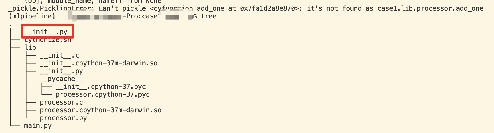
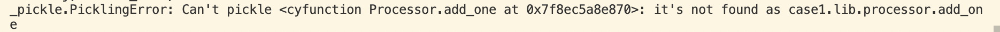
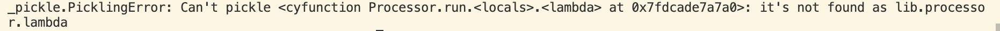
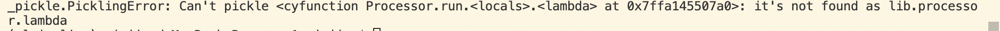

# 问题概述

在项目代码需要加密的情况下，python代码一般采取cython加密，运行加密后的so文件，可能会出现“`_pickle.PicklingError: Can't pickle <cyfunction xx at xx>: it's not found as xx`”的报错，这些报错的函数一般出现在map等spark操作中，需要通过变换函数的实现方式解决。

现对目前遇到的情况及解决方式进行归纳。

# 问题情况

## 情况1 非python包中混入`__init__.py`

### 现象

如下图所示，在执行`python main.py`后报错



### 原因

经过排查发现，当前目录原意并非为包，但是无意中混入了`__init__.py`, 致使加密后的代码出现无法正确找到函数位置

### 解决方式

删除非包目录中的`__init__.py`重新编译即可

## 情况2 类函数无法pickle

### 现象

方法定义如下：

```python
class Processor(object):
    def run(self, sc, num):
        result = num.map(self.add_one)
        result.collect()
        print("success")

    def add_one(self, n):
        a = n+1
        return a
```

报错如下

### 原因

类函数无法pickle

### 解决方式

将spark操作中的函数变为普通函数

```python
class Processor(object):
    def run(self, sc, num):
        result = num.map(add_one)
        result.collect()
        print("success")

def add_one(n):
    a = n+1
    return a
```


## 情况3 lambda函数无法pickle

### 现象

代码如下：

```python
class Processor(object):
    def run(self, sc, num):
        result = num.map(lambda x:x+1)
        result.collect()
        print("success")
```



或者

```python
class Processor(object):
    def run(self, sc, num):
        result = num.map(lambda x:add_one(x,2))
        result.collect()
        print("success")
```



### 原因

lambda函数无法pickle

解决方式

如果只需要传入一个参数，直接用普通函数替代

```python
class Processor(object):
    def run(self, sc, num):
        result = num.map(add_one)
        result.collect()
        print("success")

def add_one(n):
    a = n+1
    return a
```

如果本意借用lambda实现多个参数传递，可以借助functools.partial解决

```python
from functools import partial
class Processor(object):
    def run(self, sc, num):
        add_one_p = partial(add_one, 1)
        result = num.map(add_one_p)
        result.collect()
        print("success")

def add_one(n, b):
    a = n+b
    return a
```


## 情况4 普通函数无法pickle

todo：尚待复现